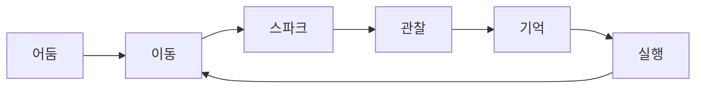

# Spark — 한 장 요약

**Unreal Engine 5.5.4 · Windows PC · 3D 퍼즐 플랫포머 · 부트캠프 최종 프로젝트**

> Move to See. Remember to Survive.

이 문서는 11개 상세 문서(01~11)를 처음 보는 사람을 위한 요약본이다.
자세한 내용은 각 문서를 참고한다.

---

## 한 줄 소개

정전으로 모든 전원이 차단된 자동화 산업 시설. 플레이어는 재가동된 유지보수 로봇이 되어,
움직임으로만 튀는 스파크에 의지해 어둠 속을 이동하며 시설 중심부의 메인 코어를 복구한다.
(→ [`01_GDD.md`](./01_GDD.md))

## Design Pillars

1. **Movement Creates Vision** — 움직여야 보인다
2. **Memory Is Gameplay** — 순간적으로 본 공간을 기억해서 판단한다
3. **Simplicity Over Complexity** — 규칙은 적게, 조합은 깊게
4. **Darkness Is Part of the Game** — 어둠은 장애물이 아니라 핵심 메커닉

## Core Loop

## Core Systems (확정)

| 항목 | 결정 |
|---|---|
| 카메라 | Third Person (ADR-006) |
| Spark 지속 시간 | 약 0.8~1.2초 |
| 체크포인트 | 촘촘하게, 퍼즐 구간마다 |
| Material 규칙 | Metal=일반 스파크 / Rubber=스파크 없음 / Cable=강한 스파크 |
| Chapter 3 난이도 | 신규 규칙 추가 없이 기존 규칙 조합으로 완만하게 마무리 |
| 캐릭터 에셋 | Marketplace 등 기존 에셋 활용 우선 (커스텀 모델링 지양) |

(→ [`01_GDD.md`](./01_GDD.md), [`02_Architecture.md`](./02_Architecture.md), [`11_ADR.md`](./11_ADR.md))

## Progression

Tutorial(규칙 학습) → Chapter 1(움직이는 기어) → Chapter 2(Rubber/Cable) → Chapter 3(규칙 조합) → Ending
(→ [`04_Level_Design.md`](./04_Level_Design.md))

## Art & Audio

차갑고 거의 검은 산업 시설, 주황빛 스파크, 높은 명암 대비, Niagara 중심 VFX.
사운드는 금속 발소리·스파크 SFX 등 환경음 중심, 최소한의 BGM.
(→ [`05_Art_Direction.md`](./05_Art_Direction.md))

## MVP Scope

- **포함**: 이동/스파크 시스템, 재질 규칙, 체크포인트, 3챕터+엔딩
- **제외**: 전투, 적 AI, 인벤토리, 스킬 트리, 멀티플레이어
(→ [`08_Roadmap.md`](./08_Roadmap.md))

## 문서 지도

| 번호 | 문서 | 내용 |
|---|---|---|
| 01 | [GDD](./01_GDD.md) | 게임 전체 기획 |
| 02 | [Architecture](./02_Architecture.md) | 시스템 구조 + 상세 설계 (구 02+03 통합) |
| 03 | [Gameplay Framework](./03_Gameplay_Framework.md) | Movement/Spark 등 실제 구현 규칙 |
| 04 | [Level Design](./04_Level_Design.md) | 레벨/퍼즐/체크포인트 설계 |
| 05 | [Art Direction](./05_Art_Direction.md) | 시각 방향성 |
| 06 | [UI/UX](./06_UI_UX.md) | 인터페이스 설계 |
| 07 | [Coding Convention](./07_Coding_Convention.md) | 코드 컨벤션 |
| 08 | [Roadmap](./08_Roadmap.md) | 개발 일정/우선순위 |
| 09 | [Asset List](./09_Asset_List.md) | 필요 에셋 목록 |
| 10 | [Dev Log](./10_Dev_Log.md) | 진행 기록, Known Issues |
| 11 | [ADR](./11_ADR.md) | 아키텍처 결정 기록 |
