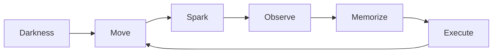

# Spark (Working Title)

## Game Design Document

- **Version:** 1.0
- **Status:** Approved
- **Engine:** Unreal Engine 5.5.4
- **Platform:** Windows (PC)

> **Move to See. Remember to Survive.**

------------------------------------------------------------------------

# Revision History

  Version   Description
  --------- --------------------
  0.1       Initial Concept
  0.5       Core Systems Draft
  0.9       Internal Review
  1.0       Approved Design

------------------------------------------------------------------------

# 1. Game Overview

Spark는 플레이어의 움직임으로 발생하는 스파크를 이용해 어둠 속을
탐험하는 3D 퍼즐 플랫포머 게임이다.

## Engine

-   Unreal Engine 5.5.4

## Platform

-   Windows

## Target Play Time

-   15~20분 (MVP)

------------------------------------------------------------------------

# 2. Design Pillars

1.  Movement Creates Vision
2.  Memory Is Gameplay
3.  Simplicity Over Complexity
4.  Darkness Is Part of the Game

------------------------------------------------------------------------

# 3. Core Gameplay Loop

------------------------------------------------------------------------

# 4. Camera

## Current Status

**Third Person으로 결정**

플랫폼 액션의 조작감과 벽 슬라이드/벽 점프 가독성을 우선한다.
1인칭·고정 카메라는 Chapter 3까지 여유가 있을 경우 실험 후보로만 남긴다.

### Evaluation Criteria

-   "움직여야 보인다"는 핵심 경험을 가장 잘 전달하는가?
-   플랫폼 액션의 조작감이 좋은가?
-   공간을 기억하는 재미를 높이는가?

------------------------------------------------------------------------

# 5. Story

정전으로 모든 전원이 차단된 자동화 산업 시설.

플레이어는 재가동된 유지보수 로봇이 되어 시설 중심부의 메인 코어를
복구한다.

------------------------------------------------------------------------

# 6. Core Systems

## Movement

-   Move
-   Jump
-   Wall Slide
-   Wall Jump

## Spark System

-   Landing Spark
-   Wall Slide Spark
-   Wall Jump Flash
-   Cable Spark

### Rules

-   플레이어 행동으로만 발생
-   지속 시간 약 0.8~1.2초 후 소멸 (짧게 유지해 "기억" 압박을 강화)
-   자동 조명 최소화

## Material Rules

  Material   Effect
  ---------- -------------
  Metal      일반 스파크
  Rubber     스파크 없음
  Cable      강한 스파크

## Checkpoint

최근 체크포인트에서 리스폰.

밀도는 촘촘하게: 구간(퍼즐 하나 단위)마다 배치한다.
실패의 손실을 낮춰 학습 곡선을 부드럽게 유지한다.

------------------------------------------------------------------------

# 7. Game Progression

-   Tutorial : 스파크 규칙 학습
-   Chapter 1 : 움직이는 기어
-   Chapter 2 : Rubber / Cable
-   Chapter 3 : 기존 규칙(재질 + 이동 기어) 조합 위주로 완만하게 마무리. 새 규칙은 추가하지 않음

------------------------------------------------------------------------

# 8. Puzzle Design Principles

1.  하나의 퍼즐은 하나의 규칙을 가르친다.
2.  새로운 규칙은 기존 규칙 위에 쌓는다.
3.  챕터 마지막은 규칙을 조합한다.
4.  실패는 학습을 유도한다.

------------------------------------------------------------------------

# 9. Art Direction

-   차가운 산업 시설
-   거의 검은 환경
-   주황색 스파크
-   높은 명암 대비
-   Niagara 중심 연출

------------------------------------------------------------------------

# 10. Audio Direction

-   금속 발소리
-   스파크 효과음
-   환경음 중심
-   최소한의 BGM

------------------------------------------------------------------------

# 11. UI / UX

-   최소 HUD
-   몰입 중심
-   불필요한 정보 제거

------------------------------------------------------------------------

# 12. Development Constraints

## MVP Includes

-   Movement
-   Spark System
-   Material Rules
-   Checkpoint
-   3 Chapters
-   Ending

## Out of Scope

-   Combat
-   Enemy AI
-   Inventory
-   Skill Tree
-   Multiplayer

------------------------------------------------------------------------

# Appendix

## Naming Convention

| Prefix | 의미 |
|---|---|
| BP_ | Blueprint Class |
| WBP_ | Widget Blueprint |
| M_ | Material |
| MI_ | Material Instance |
| SM_ | Static Mesh |
| NI_ | Niagara System |

## Document Scope

이 문서는 게임의 목표와 시스템을 정의한다.

-   구현: [`02_Architecture.md`](./02_Architecture.md), [`03_Gameplay_Framework.md`](./03_Gameplay_Framework.md)
-   레벨: [`04_Level_Design.md`](./04_Level_Design.md)
-   에셋: [`09_Asset_List.md`](./09_Asset_List.md)
-   일정: [`08_Roadmap.md`](./08_Roadmap.md)
