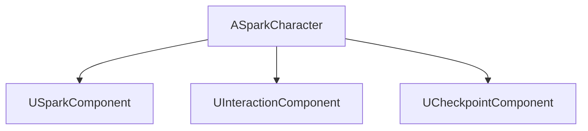
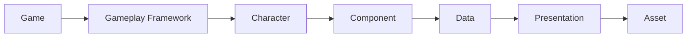
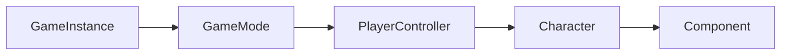
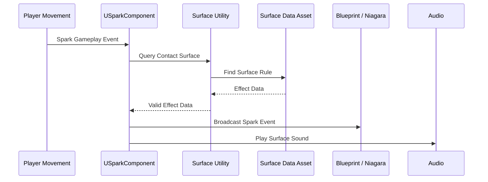
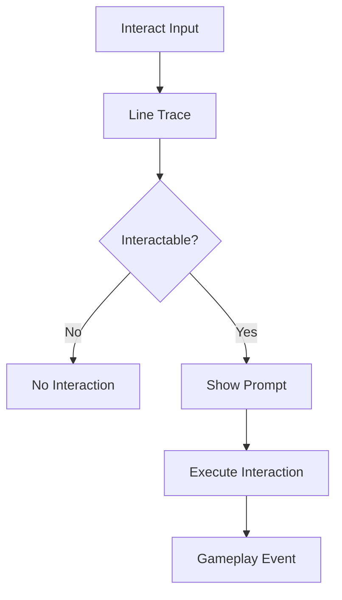
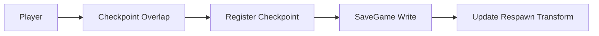
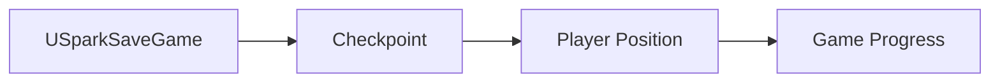
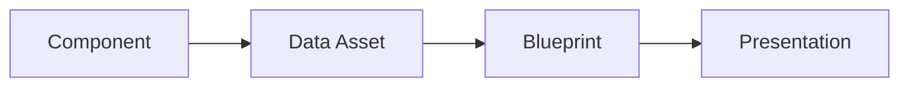

──────────────────────────────────────────────────────────────────────────────

# Spark Technical Documentation

## Volume 02

# Architecture

Version 1.0

Unreal Engine 5.5.4

──────────────────────────────────────────────────────────────────────────────

> Move to See. Remember to Survive.

본 문서는 Spark 프로젝트의 전체 기술 아키텍처와 핵심 시스템 구현 구조를 함께 정의한다.

프로젝트의 모든 시스템은 본 문서를 기준으로 설계하며,
새로운 기능을 추가하거나 기존 구조를 변경할 경우 반드시 본 문서를 먼저 수정한다.

---

# Executive Summary

이 문서를 읽으면 다음 내용을 이해할 수 있다.

- 프로젝트가 어떤 구조로 개발되는가
- 시스템 간 의존성이 어떻게 구성되는가
- Component 기반 구조를 선택한 이유
- Spark / Interaction / Checkpoint / Save / Data 시스템의 실제 구현 단위

세부 Gameplay 로직(입력, 이동 규칙 등)은 **[03_Gameplay_Framework.md]([03_Gameplay_Framework.md](./03_Gameplay_Framework.md))**에서 다룬다.
아키텍처 결정의 배경(Option 비교, Rationale)은 **[11_ADR.md]([11_ADR.md](./11_ADR.md))**에서 다룬다.

---

## Architecture Keywords

| 항목 | 내용 |
|------|------|
| Engine | Unreal Engine 5.5.4 |
| Language | C++ / Blueprint |
| Architecture | Hybrid Architecture |
| Pattern | Component Based |
| Data | Data Driven |
| Save | SaveGame |
| Interaction | Interface |

---

# Architecture Philosophy

> "작게 만들고 조합하여 확장한다."

Spark는 거대한 클래스를 만드는 대신 작은 기능을 여러 Component로 분리하여 관리한다.
새로운 기능은 기존 클래스를 수정하는 대신 새로운 Component를 추가하는 방식으로 구현한다.

## Design Principles

**Single Responsibility** — 하나의 클래스는 하나의 책임만 가진다.

| 클래스 | 책임 |
|---------|------|
| Character | 플레이어 표현 |
| SparkComponent | Spark 시스템 |
| InteractionComponent | 상호작용 |
| CheckpointComponent | 저장 |

**Composition over Inheritance** — Character는 기능을 구현하는 객체가 아니라 Component를 관리하는 객체이다.



**Data Driven Design** — 게임 밸런스와 설정값(Spark 밝기/지속시간, Surface Rule, Sound, Material Rule)은 코드가 아닌 Data Asset에서 관리한다.

**Low Coupling** — 권장: Interface, Delegate, Data Asset, Event / 지양: 반복적인 Cast, 깊은 참조 관계, Component 간 직접 의존

**Blueprint Responsibility** — Blueprint는 표현(Presentation), C++는 게임 규칙(Game Rule)을 담당한다.

| C++ | Blueprint |
|------|------------|
| Rule | UI |
| Logic | Animation |
| Save | Niagara |
| Interaction | Camera |
| Component | Sound |

---

# Layer Architecture



| Layer | 역할 |
|--------|------|
| Gameplay Framework | 게임의 기본 구조 |
| Character | 플레이어 표현 |
| Component | 게임 기능 |
| Data | 설정값 관리 |
| Presentation | 연출 |
| Asset | 리소스 |

의존성은 항상 아래 방향으로만 흐르며, 역방향 참조는 허용하지 않는다.

---

# Project Structure

## Source

```text
Source/Spark/
├── Character
├── Components
├── Core
├── Data
├── Interaction
├── Save
├── Utility
└── UI
```

## Content

```text
Content/
├── Blueprints
├── Maps
├── Materials
├── Niagara
├── Meshes
├── Audio
├── UI
├── Data
└── Textures
```

---

# Gameplay Framework Classes



| 클래스 | 역할 |
|---------|------|
| USparkGameInstance | 전역 데이터 |
| ASparkGameMode | 게임 규칙 |
| ASparkPlayerController | 입력 처리 |
| ASparkCharacter | 플레이어 |
| Components | 기능 구현 |

---

# Component Systems

Spark의 모든 게임 기능은 Actor Component로 분리하며, 각 Component는 독립적으로 동작한다.
Character는 Component를 생성하고 관리하는 역할만 수행한다.

| Component | 역할 |
|------------|------|
| USparkComponent | Spark 생성 |
| UInteractionComponent | 상호작용 |
| UCheckpointComponent | 저장 및 복원 |

## Spark System

플레이어의 움직임에 따라 Spark를 생성한다. 게임의 핵심 피드백이며 빛과 사운드를 동시에 제공한다.

**Trigger**: Landing / Wall Slide / Wall Jump / Cable Interaction



**Surface Rule** (Physical Material 기준 판정)

| Surface | Spark |
|----------|-------|
| Metal | 생성 |
| Rubber | 생성 안함 |
| Cable | 강한 Spark |

`USparkComponent`는 Spark 생성을 요청하고 `Surface Utility`가 반환한 Effect Data로 Blueprint Event를 호출한다.
Surface 판정은 `Surface Utility`가, Particle 생성은 Blueprint가 담당한다.

## Interaction System

플레이어와 월드 오브젝트(Lever, Switch, Cable, Door, Button)의 상호작용을 담당한다.



모든 상호작용 가능한 Actor는 `IInteractable` Interface(`Interact()`, `CanInteract()`, `GetInteractionText()`)를 구현한다.
새 오브젝트를 추가해도 Character는 수정하지 않는다.

## Checkpoint System

플레이어 진행 상황(위치, 진행 상태, 활성 체크포인트)을 저장한다.



게임을 다시 시작하면 Save 정보를 이용해 플레이어 위치를 복원한다.

## Save System



**Save Timing**: 자동 저장(Checkpoint 도달) / 향후 추가 가능(Stage Clear, Manual Save)

## Data Architecture

모든 설정값은 Data Asset에서 관리한다.

| Data | 설명 |
|------|------|
| Surface Data | Surface Rule |
| Spark Data | Spark Parameter |
| Audio Data | Sound |
| Material Data | Material |



---

# Communication Rules

시스템 간 통신은 아래 순서를 따른다: 1. Interface → 2. Delegate → 3. Event. 직접 참조는 최소화한다.

# Error Handling

Component는 예외 상황(Data Asset 없음, Physical Material 없음, Save 실패, Interface 미구현)을 반드시 검사한다.
오류 발생 시 게임이 종료되어서는 안 되며, 안전하게 무시하거나 로그를 출력한다.

# Performance Guideline

- **Tick 최소화**: Tick은 필요한 Component에서만 사용
- **Cast 최소화**: Interface 사용을 우선
- **Object Reference**: 가능한 약한 의존성을 유지
- **Data Cache**: 반복 조회되는 Data는 캐싱

# Naming Convention

| 대상 | 규칙 |
|------|------|
| Component | UXXXComponent |
| Character | ASparkCharacter |
| Data Asset | DASparkXXX |
| Save | SparkSaveGame |
| Interface | IInteractable |

---

# Future Extension

향후 아래 Component를 추가할 수 있다(기존 Character 수정 없이 Component만 추가).

- Inventory Component
- Ability Component
- Dialogue Component
- Analytics Component

---

# Related Documents

- [01_GDD.md](./01_GDD.md)
- [03_Gameplay_Framework.md](./03_Gameplay_Framework.md)
- [11_ADR.md](./11_ADR.md)

---

# Summary

Spark는 Component 기반 Hybrid Architecture를 채택한다.
게임 규칙은 C++, 콘텐츠와 연출은 Blueprint에서 구현하며, 기능은 Component 단위로 분리하고 설정값은 Data Asset을 통해 관리한다.
이를 통해 유지보수성과 확장성을 확보하고, 기존 구조를 변경하지 않고 새 기능을 추가할 수 있도록 설계하였다.
