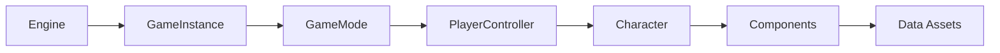
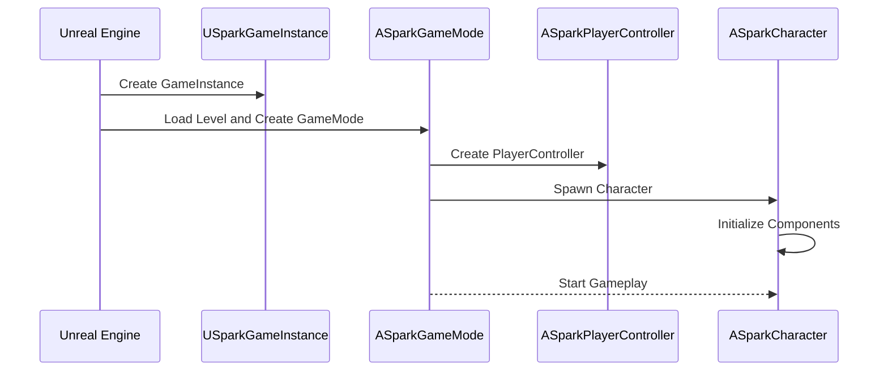
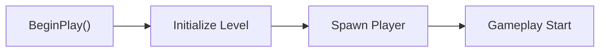
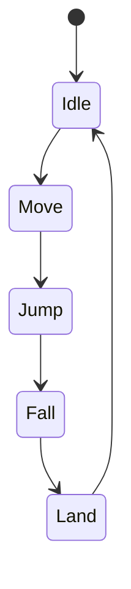
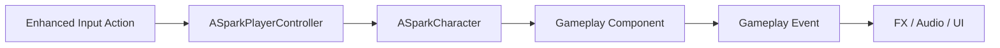
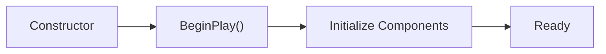
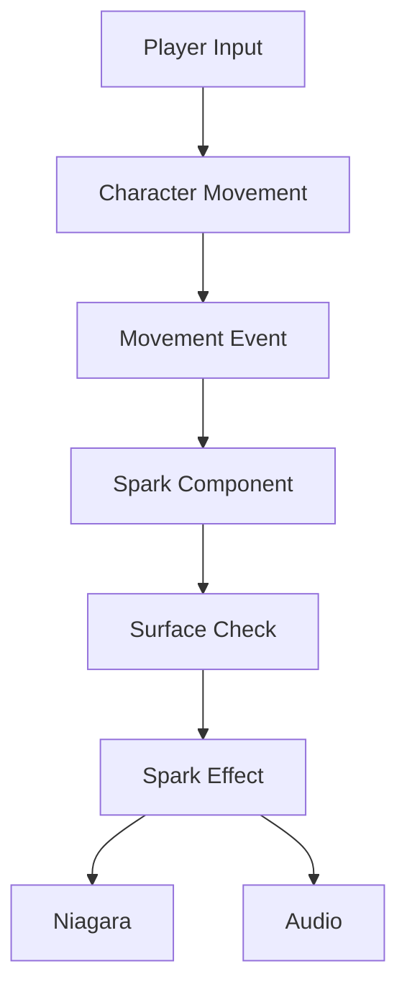
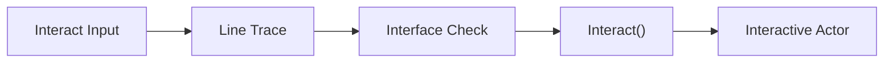
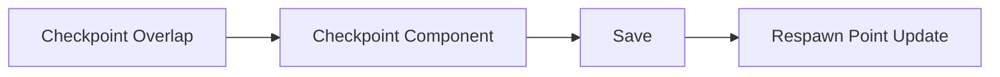

──────────────────────────────────────────────────────────────────────────────

# Spark Technical Documentation

## Volume 03

# Gameplay Framework

Version 1.0

Unreal Engine 5.5.4

──────────────────────────────────────────────────────────────────────────────

> Move to See. Remember to Survive.

본 문서는 Spark 프로젝트에서 사용하는 Unreal Engine Gameplay Framework의 역할과 객체 간의 관계를 정의한다.

Gameplay Framework는 게임의 실행 흐름을 담당하며,
각 클래스의 책임과 생명주기를 명확하게 구분하는 것을 목표로 한다.

---

# Executive Summary

## 목적

Gameplay Framework는 게임을 구성하는 핵심 객체들의 역할을 정의한다.

Spark는 Unreal Engine의 Gameplay Framework를 그대로 따르며,
각 클래스는 하나의 책임만 가진다.

본 문서에서는 다음 내용을 정의한다.

- GameInstance
- GameMode
- PlayerController
- Character
- Camera
- Input
- Gameplay Flow

---

# Gameplay Framework Overview



역방향 참조는 허용하지 않는다.

---

# Gameplay Lifecycle

게임이 실행되는 순서는 다음과 같다.



---

# Framework Responsibilities

| Class | 역할 |
|--------|------|
| GameInstance | 게임 전역 데이터 |
| GameMode | 게임 규칙 |
| PlayerController | 입력 처리 |
| Character | 플레이어 표현 |
| Component | 게임 기능 |

---

# GameInstance

## 목적

게임 전체에서 유지되는 데이터를 관리한다.

레벨이 변경되어도 GameInstance는 유지된다.

---

## Responsibility

- 게임 초기화
- 전역 데이터 관리
- Save 데이터 로드
- 게임 설정 관리

---

## 저장 데이터

- 게임 설정
- 진행 정보
- Save 슬롯
- 시스템 설정

---

# GameMode

## 목적

현재 레벨의 게임 규칙을 정의한다.

GameMode는 플레이어 입력이나 UI를 관리하지 않는다.

---

## Responsibility

- 플레이어 Spawn
- 게임 시작
- 게임 종료
- 승리 조건
- 실패 조건

---

## GameMode Flow



---

# PlayerController

## 목적

입력을 처리하고 Character에게 전달한다.

PlayerController는 이동 로직을 구현하지 않는다.

---

## Responsibility

- Input 처리
- Camera 제어
- UI 입력
- Pause 처리

Input Flow는 [Input System](#input-system) 섹션 참고.

---

# Character

## 목적

플레이어를 표현하는 Pawn이다.

Character는 게임 기능을 구현하지 않는다.

---

## Responsibility

- 이동
- 점프
- Animation
- Component 관리

---

## Character Structure

```text
ASparkCharacter

├── Camera

├── SpringArm

├── Mesh

├── SparkComponent

├── InteractionComponent

└── CheckpointComponent
```

---

## Character State



Wall Slide와 Wall Jump는 Movement Mode에 따라 처리한다.

---

# Camera

## 목적

플레이어 시점을 제공한다.

Camera는 게임 규칙을 담당하지 않는다.

---

## Responsibility

- Follow
- Camera Lag
- Shake
- Transition

---

# Input System

Spark는 Enhanced Input System을 사용한다.

---

## Input Mapping

| Action | 설명 |
|---------|------|
| Move | 이동 |
| Jump | 점프 |
| Interact | 상호작용 |

---

## Input Flow



---

# Character Initialization

Character 생성 순서는 다음과 같다.



Component는 BeginPlay 이후 사용 가능하다.

---

# Gameplay Flow

플레이어가 움직이는 전체 흐름이다.



---

# Interaction Flow



---

# Checkpoint Flow



---

# Object Communication

객체 간 통신은 다음 우선순위를 따른다.

1. Interface

2. Delegate

3. Event

4. Direct Reference

Cast는 최소화한다.

---

# Tick Policy

Tick은 필요한 객체에서만 사용한다.

원칙

- Tick 최소화
- Event 기반 처리
- Delegate 활용

---

# Error Handling

Gameplay Framework는 다음 예외 상황을 고려한다.

- Character Spawn 실패
- Data Asset 없음
- Save Load 실패
- Input Mapping 없음

예외 발생 시 게임이 종료되지 않도록 안전하게 처리한다.

---

# Best Practices

Gameplay Framework는 다음 원칙을 따른다.

- 하나의 클래스는 하나의 책임만 가진다.
- Character는 기능을 구현하지 않는다.
- Component에서 게임 기능을 구현한다.
- Blueprint는 표현을 담당한다.
- Data Asset을 적극 활용한다.
- Interface를 우선 사용한다.

---

# Related Documents

- [01_GDD.md](./01_GDD.md)
- [02_Architecture.md](./02_Architecture.md)
- [04_Level_Design.md](./04_Level_Design.md)

---

# Summary

Gameplay Framework는 Spark 프로젝트의 실행 흐름을 정의한다.

GameInstance는 전역 데이터를 관리하고,
GameMode는 게임 규칙을 정의하며,
PlayerController는 입력을 처리한다.

Character는 플레이어를 표현하고,
실제 게임 기능은 Component가 담당한다.

이를 통해 각 클래스의 책임을 명확하게 분리하고,
유지보수와 확장성을 확보한다.
