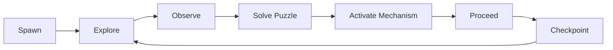
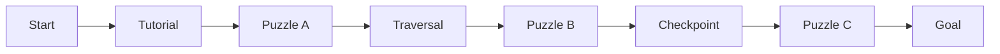
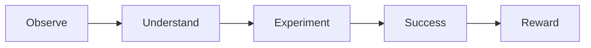
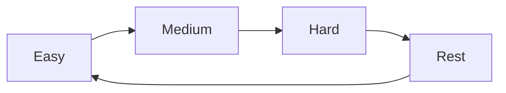
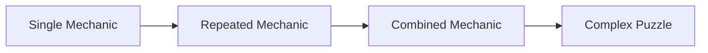

──────────────────────────────────────────────────────────────────────────────

# Spark Technical Documentation

## Volume 04

# Level Design

Version 1.0

Unreal Engine 5.5.4

──────────────────────────────────────────────────────────────────────────────

> Move to See. Remember to Survive.

본 문서는 Spark 프로젝트의 레벨 설계 원칙과 플레이 흐름을 정의한다.

레벨은 단순한 공간이 아니라 플레이어에게 새로운 메커니즘을 학습시키고,
탐험과 퍼즐을 통해 목표 지점까지 도달하도록 설계한다.

---

# Executive Summary

## 목적

Level Design은 플레이어가 경험하는 게임의 공간을 설계하는 문서이다.

본 문서는 다음 내용을 정의한다.

- 레벨 구성 원칙
- 플레이 흐름
- 퍼즐 설계
- 체크포인트 배치
- 난이도 설계
- 환경 연출

---

# Design Philosophy

Spark의 레벨은 다음 세 가지 원칙을 따른다.

## Learn

새로운 메커니즘을 안전하게 학습한다.

↓

## Challenge

학습한 내용을 활용하여 문제를 해결한다.

↓

## Mastery

여러 메커니즘을 조합하여 완전히 숙달한다.

모든 레벨은 이 구조를 반복한다.

---

# Gameplay Loop

---

# Level Structure

모든 레벨은 다음 구조를 따른다.

---

# Puzzle Design Principles

퍼즐은 다음 원칙을 따른다.

## One New Rule

한 번에 하나의 새로운 규칙만 학습시킨다.

---

## Clear Feedback

행동에는 반드시 피드백이 존재해야 한다.

예시

- Spark 발생
- Light 변화
- Sound 효과
- Door 개방

---

## No Hidden Solution

정답은 숨기지 않는다.

관찰하면 반드시 해결 방법을 유추할 수 있어야 한다.

---

## Player Driven

플레이어가 스스로 해결했다고 느끼도록 설계한다.

자동 진행을 최소화한다.

---

# Puzzle Flow

---

# Traversal Design

플랫폼 이동은 퍼즐과 동일한 비중을 가진다.

Traversal은 다음 기술을 활용한다.

- Jump
- Wall Slide
- Wall Jump
- Cable Movement

---

# Environment Design

환경은 플레이를 보조해야 한다.

환경은 다음 정보를 전달한다.

- 진행 방향
- 위험 요소
- 상호작용 가능 위치
- 목표 지점

---

# Lighting Design

Spark의 핵심은 빛이다.

조명은 다음 목적을 가진다.

- 길 안내
- 분위기 연출
- 플레이 피드백

빛은 플레이어의 행동에 의해 생성된다.

---

# Surface Design

Surface는 게임 플레이에 직접 영향을 준다.

| Surface | 효과       |
| ------- | ---------- |
| Metal   | Spark 생성 |
| Rubber  | Spark 없음 |
| Cable   | 강한 Spark |

Surface는 플레이어에게 시각적으로 구분되어야 한다.

---

# Checkpoint Design

Checkpoint는 플레이 진행을 저장한다.

배치 원칙 (촘촘하게, 구간마다)

- 퍼즐 하나 완료마다
- 긴 이동 구간 이후
- 새로운 메커니즘 학습 전

실패로 인한 손실을 낮춰 학습 곡선을 부드럽게 유지하는 것을 우선한다.

---

# Difficulty Curve

모든 레벨은 아래 구조를 따른다.

연속적인 높은 난이도는 지양한다.

---

# Failure Design

실패는 학습 기회여야 한다.

실패 시

- 빠른 리스폰
- 진행 상황 유지
- 명확한 실패 원인 제공

---

# Exploration

탐험은 플레이를 방해하지 않아야 한다.

숨겨진 공간은

- 추가 연출
- 환경 이야기
- 수집 요소

등을 제공한다.

필수 진행은 항상 명확해야 한다.

---

# Visual Guidance

플레이어는 다음 요소를 통해 방향을 인식한다.

- 조명
- 색상 대비
- 형태
- 움직임
- Spark

UI보다 환경을 우선 활용한다.

---

# Puzzle Progression

퍼즐은 다음 순서로 발전한다.

새로운 메커니즘을 갑자기 여러 개 도입하지 않는다.

---

# Reward Design

퍼즐 해결 시 플레이어는 다음 보상을 얻는다.

- 문 개방
- 새로운 길
- 시각 효과
- 사운드
- 진행 저장

보상은 즉시 제공한다.

---

# Environmental Storytelling

스토리는 환경을 통해 전달한다.

예시

- 부서진 기계
- 끊어진 케이블
- 정지된 생산 라인
- 깜빡이는 조명

긴 텍스트 설명은 최소화한다.

---

# Level Metrics

레벨 제작 시 다음 기준을 확인한다.

| 항목       | 목표      |
| ---------- | --------- |
| 진행 방향  | 명확      |
| 퍼즐 목표  | 이해 가능 |
| 체크포인트 | 적절      |
| 시야 확보  | 충분      |
| 피드백     | 즉시      |
| 난이도     | 점진적    |

---

# Playtest Checklist

레벨 테스트 시 다음 항목을 확인한다.

- [ ] 진행 방향을 쉽게 찾을 수 있는가
- [ ] 퍼즐 규칙을 이해할 수 있는가
- [ ] 피드백이 충분한가
- [ ] 불필요한 대기 시간이 없는가
- [ ] 리스폰이 빠른가
- [ ] 난이도가 자연스럽게 증가하는가
- [ ] 환경만으로 목표를 유추할 수 있는가

---

# Related Documents

- [01_GDD.md](./01_GDD.md)
- [02_Architecture.md](./02_Architecture.md)
- [03_Gameplay_Framework.md](./03_Gameplay_Framework.md)
- [05_Art_Direction.md](./05_Art_Direction.md)

---

# Summary

Spark의 레벨은 공간을 탐험하는 것이 아니라,
빛을 이용해 환경을 이해하고 퍼즐을 해결하는 경험을 제공하는 것을 목표로 한다.

모든 레벨은 새로운 메커니즘을 학습하고,
이를 활용하여 문제를 해결하며,
마지막에는 여러 메커니즘을 조합하는 구조를 따른다.

환경은 플레이를 보조하는 가장 중요한 요소이며,
조명과 Surface, 체크포인트, 퍼즐은 하나의 일관된 경험을 만들도록 설계한다.
