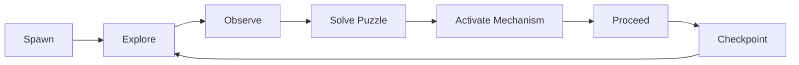
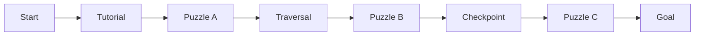
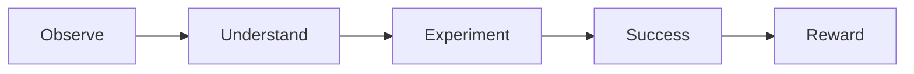
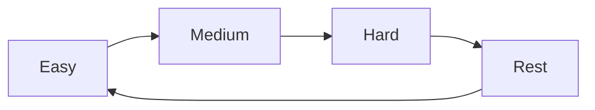
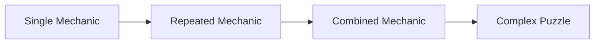
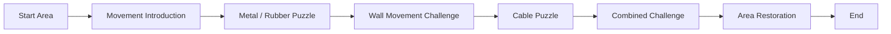

──────────────────────────────────────────────────────────────────────────────

# Spark Technical Documentation

## Volume 04

# Level Design

Version 1.0

Unreal Engine 5.5.4

──────────────────────────────────────────────────────────────────────────────

> Move to See. Remember to Survive.

본 문서는 Spark 프로젝트의 레벨 설계 원칙과 플레이 흐름을 정의한다.

레벨은 단순한 공간이 아니라 플레이어에게 새로운 메커니즘을 학습시키고,
탐험과 퍼즐을 통해 목표 지점까지 도달하도록 설계한다.

---

# Executive Summary

## 목적

Level Design은 플레이어가 경험하는 게임의 공간을 설계하는 문서이다.

본 문서는 다음 내용을 정의한다.

- 레벨 구성 원칙
- 플레이 흐름
- 퍼즐 설계
- 체크포인트 배치
- 난이도 설계
- 환경 연출

---

# Design Philosophy

Spark의 레벨은 다음 세 가지 원칙을 따른다.

## Learn

새로운 메커니즘을 안전하게 학습한다.

↓

## Challenge

학습한 내용을 활용하여 문제를 해결한다.

↓

## Mastery

여러 메커니즘을 조합하여 완전히 숙달한다.

모든 레벨은 이 구조를 반복한다.

---

# Gameplay Loop

```mermaid
flowchart LR
    A[Spawn] --> B[Explore]
    B --> C[Observe]
    C --> D[Solve Puzzle]
    D --> E[Activate Mechanism]
    E --> F[Proceed]
    F --> G[Checkpoint]
    G --> B
```

---

# Level Structure

모든 레벨은 다음 구조를 따른다.

```mermaid
flowchart LR
    A[Start] --> B[Tutorial]
    B --> C[Puzzle A]
    C --> D[Traversal]
    D --> E[Puzzle B]
    E --> F[Checkpoint]
    F --> G[Puzzle C]
    G --> H[Goal]
```

---

# Puzzle Design Principles

퍼즐은 다음 원칙을 따른다.

## One New Rule

한 번에 하나의 새로운 규칙만 학습시킨다.

---

## Clear Feedback

행동에는 반드시 피드백이 존재해야 한다.

예시

- Spark 발생
- Light 변화
- Sound 효과
- Door 개방

---

## No Hidden Solution

정답은 숨기지 않는다.

관찰하면 반드시 해결 방법을 유추할 수 있어야 한다.

---

## Player Driven

플레이어가 스스로 해결했다고 느끼도록 설계한다.

자동 진행을 최소화한다.

---

# Puzzle Flow

```mermaid
flowchart LR
    A[Observe] --> B[Understand]
    B --> C[Experiment]
    C --> D[Success]
    D --> E[Reward]
```

---

# Traversal Design

플랫폼 이동은 퍼즐과 동일한 비중을 가진다.

Traversal은 다음 기술을 활용한다.

- Jump
- Wall Slide
- Wall Jump
- Cable Movement

---

# Environment Design

환경은 플레이를 보조해야 한다.

환경은 다음 정보를 전달한다.

- 진행 방향
- 위험 요소
- 상호작용 가능 위치
- 목표 지점

---

# Lighting Design

Spark의 핵심은 빛이다.

조명은 다음 목적을 가진다.

- 길 안내
- 분위기 연출
- 플레이 피드백

빛은 플레이어의 행동에 의해 생성된다.

---

# Surface Design

Surface는 게임 플레이에 직접 영향을 준다.

| Surface | 효과       |
| ------- | ---------- |
| Metal   | Spark 생성 |
| Rubber  | Spark 없음 |
| Cable   | 강한 Spark |

Surface는 플레이어에게 시각적으로 구분되어야 한다.

---

# Checkpoint Design

Checkpoint는 플레이 진행을 저장한다.

배치 원칙 (촘촘하게, 구간마다)

- 퍼즐 하나 완료마다
- 긴 이동 구간 이후
- 새로운 메커니즘 학습 전

실패로 인한 손실을 낮춰 학습 곡선을 부드럽게 유지하는 것을 우선한다.

---

# Difficulty Curve

모든 레벨은 아래 구조를 따른다.

```mermaid
flowchart LR
    A[Easy] --> B[Medium]
    B --> C[Hard]
    C --> D[Rest]
    D --> A
```

연속적인 높은 난이도는 지양한다.

---

# Failure Design

실패는 학습 기회여야 한다.

실패 시

- 빠른 리스폰
- 진행 상황 유지
- 명확한 실패 원인 제공

---

# Exploration

탐험은 플레이를 방해하지 않아야 한다.

숨겨진 공간은

- 추가 연출
- 환경 이야기
- 수집 요소

등을 제공한다.

필수 진행은 항상 명확해야 한다.

---

# Visual Guidance

플레이어는 다음 요소를 통해 방향을 인식한다.

- 조명
- 색상 대비
- 형태
- 움직임
- Spark

UI보다 환경을 우선 활용한다.

---

# Puzzle Progression

퍼즐은 다음 순서로 발전한다.

```mermaid
flowchart LR
    A[Single Mechanic] --> B[Repeated Mechanic]
    B --> C[Combined Mechanic]
    C --> D[Complex Puzzle]
```

새로운 메커니즘을 갑자기 여러 개 도입하지 않는다.

---

# Reward Design

퍼즐 해결 시 플레이어는 다음 보상을 얻는다.

- 문 개방
- 새로운 길
- 시각 효과
- 사운드
- 진행 저장

보상은 즉시 제공한다.

---

# Environmental Storytelling

스토리는 환경을 통해 전달한다.

예시

- 부서진 기계
- 끊어진 케이블
- 정지된 생산 라인
- 깜빡이는 조명

긴 텍스트 설명은 최소화한다.

---

# Level Metrics

레벨 제작 시 다음 기준을 확인한다.

| 항목       | 목표      |
| ---------- | --------- |
| 진행 방향  | 명확      |
| 퍼즐 목표  | 이해 가능 |
| 체크포인트 | 적절      |
| 시야 확보  | 충분      |
| 피드백     | 즉시      |
| 난이도     | 점진적    |

---

# Playtest Checklist

레벨 테스트 시 다음 항목을 확인한다.

- [ ] 진행 방향을 쉽게 찾을 수 있는가
- [ ] 퍼즐 규칙을 이해할 수 있는가
- [ ] 피드백이 충분한가
- [ ] 불필요한 대기 시간이 없는가
- [ ] 리스폰이 빠른가
- [ ] 난이도가 자연스럽게 증가하는가
- [ ] 환경만으로 목표를 유추할 수 있는가

---

# Level Brief: VS-01 Power Restoration (Vertical Slice 대표 구간)

[08_Roadmap.md](./08_Roadmap.md)의 Level Brief 항목 10개를 기준으로 작성한다. 이 Brief는 Graybox(SPARK-60)에서 검증하며, 수치와 배치는 Graybox 결과에 따라 갱신한다.

## 레벨 목표

정전된 시설 구역의 전력 라인을 복구하고, 잠긴 End Door를 열어 구간을 마친다. 플레이어는 이 구간에서 Spark 규칙(Metal, Rubber, Cable)을 학습하고 마지막에 조합한다.

## 구간 흐름

```mermaid
flowchart LR
    A[Start Area] --> B[Movement Introduction] --> C[Metal / Rubber Puzzle] --> D[Wall Movement Challenge] --> E[Cable Puzzle] --> F[Combined Challenge] --> G[Area Restoration] --> H[End]
```

| 구간 | 가르치는 규칙 | 난이도 | 예상 시간 |
|------|---------------|--------|-----------|
| Start Area (Opening Sequence) | 낙하 착지 Spark로 시야가 열리는 규칙 | Easy | 1분 |
| Movement Introduction | 약한 빛을 따라 이동, Slide로만 통과하는 출구 | Easy | 2분 |
| Metal / Rubber Puzzle | Rubber에서는 Spark가 없다. 힌트로 방향을 잡고 사이 구간은 기억한다 | Medium | 3분 |
| Wall Movement Challenge | Wall Slide, Wall Jump | Hard | 3분 |
| Cable Puzzle | Cable은 강한 Spark를 내고, 연결하면 전력이 복구된다 | Medium | 3분 |
| Combined Challenge | Rubber 구간에서 Cable Spark를 길잡이로 쓰며 벽 이동까지 조합 | Hard | 3분 |
| Area Restoration | 조명 복구 연출과 End Door 개방 | Rest | 1분 |

합계 약 16분이며 Roadmap 권장 시간(10~20분)과 GDD 목표(15~20분) 안에 들어온다.

## 메커니즘

플레이어가 익혀야 하는 신규 규칙은 없다. Vertical Slice는 새 규칙을 만드는 단계가 아니라 기존 규칙의 품질을 검증하는 단계이므로, 아래는 모두 구현된 요소를 재사용한다. 다만 [Opening Sequence](#opening-sequence)에서 레벨 스크립트로 구현하는 연출(조명 점멸, 바닥 붕괴)은 새로 만들어야 한다. 이는 게임 규칙이 아니라 연출이다.

| 분류 | 요소 |
|------|------|
| 이동 | Move, Jump, Slide, Wall Slide, Wall Jump |
| Spark | Landing Spark, Slide Spark, Wall Slide Spark, Wall Jump Flash, Cable Spark |
| Surface | Metal, Rubber, Cable |
| 상호작용 | Switch, Door, Cable Plug / Socket |
| 실패 | Hazard Zone, FellOutOfWorld 복원, Failure Transition |
| 진행 | Checkpoint, Save, Pause Menu |

GDD의 "움직이는 기어"(Chapter 1)는 아직 구현되어 있지 않다. 이 Brief에는 넣지 않는다.

## Opening Sequence

첫 낙하를 통해 "움직임이 곧 시야"라는 규칙을 학습시키는 도입부이다. 별도 설명 없이 환경과 연출만으로 유도한다.

```mermaid
flowchart LR
    A[밝은 시작 방] --> B[버튼 또는 상호작용으로 방 문 열기] --> C[방 조명 점멸 후 소등] --> D[출구를 향해 이동] --> E[복도 바닥 붕괴] --> F[낙하와 큰 충격] --> G[착지 Spark로 방 전체가 드러남] --> H[약한 빛이 슬라이드 출구로 유도]
```

- 시작 방은 밝고, 문 밖으로 출구가 보인다. 플레이어는 자연스럽게 출구로 가려 한다.
- 문을 열면 방의 조명이 점멸하다가 꺼진다. 어둠으로 들어가는 순간을 플레이어가 직접 만든 것처럼 느끼게 한다.
- 이동 중 바닥이 무너지고, 낙하 착지에서 큰 Spark가 터져 아래 방의 환경이 한 번에 드러난다. 이 Spark는 플레이어의 착지 행동으로 발생하므로 "플레이어 행동으로만 Spark 발생" 규칙과 어긋나지 않는다.
- 이후 아래 방은 아주 약한 빛만 남고, 그 빛이 슬라이드로만 통과하는 출구로 유도한다.
- 시작 방의 밝은 조명과 점멸은 "거의 검은 환경" 기준의 의도된 예외이다. 밝은 상태에서 어둠으로 넘어가는 대비를 만들기 위한 연출이다.

### 치수 기준

- 큰 착지 Spark와 Heavy Landing은 낙하 속도로 결정된다. 코드 기준 Heavy Landing 임계값은 -1700, Spark 밝기는 낙하 속도 약 1500에서 최대에 도달한다.
- 낙하 높이는 약 1300으로 한다. v = √(2 x 1176 x 1300) ≈ 1750이므로 Heavy Landing 임계값을 넘고, Spark 밝기도 최대가 된다. 낙하 시간은 약 1.5초이다.
- 아래 방에는 바닥이 반드시 있어야 한다. 바닥이 없으면 Hazard Zone이나 FellOutOfWorld로 실패 처리되어 학습 구간이 아니라 실패 구간이 된다.
- 낙하 후에는 위로 돌아갈 수 없는 일방향 구간이므로, 체크포인트 CP1은 아래 방에 둔다.

## 주요 퍼즐

- **Puzzle A (Metal / Rubber)**: Rubber 구간에서는 Spark가 나오지 않는다. 플레이어는 [Rubber 구간 규칙](#rubber-구간-규칙)의 힌트로 방향을 잡고, 힌트와 힌트 사이의 지형은 기억해서 건넌다.
- **Puzzle B (Cable)**: 방전된 Cable Plug를 찾아 Socket에 연결하면 전력이 복구되어 Door가 열린다. 연결 순간 Cable Spark가 강하게 터져 주변이 드러난다.
- **Puzzle C (Combined)**: Rubber 구간의 힌트와 벽 이동을 이어 붙여 앞선 규칙을 모두 쓰게 한다.

## Rubber 구간 규칙

Rubber가 배치되는 구간에는 반드시 Cable 또는 간접조명 힌트를 하나 이상 둔다. Rubber는 시야 확보가 가장 어려운 재질이므로, 길을 잃어서 실패하는 불공정함을 레벨 쪽에서 막기 위한 규칙이다.

- 힌트는 진행 방향만 알려주고 발판 위치 전체를 보여주지 않는다. 힌트 사이 구간은 플레이어가 기억해서 건너야 한다("Memory Is Gameplay" 유지).
- 간접조명 힌트는 급격한 점멸이 아니라 천천히 밝아졌다 꺼지는 방식으로 하고, 주기는 4~6초로 길게 잡는다. 초당 3회를 넘기는 점멸은 쓰지 않는다.
- 힌트 밝기는 Spark보다 낮게 유지해 Spark가 주 광원이라는 기준을 지킨다.
- 힌트 조명은 Flash Reduction 옵션(SPARK-58)이 구현되면 적용 대상에 포함한다.
- 이 규칙은 "자동 조명 최소화"([01_GDD.md](./01_GDD.md))의 Rubber 구간 한정 예외이다.

## 이동 난이도

[Difficulty Curve](#difficulty-curve)를 따라 Easy, Medium, Hard, Rest 순서로 올라가고 마지막에 Rest로 마친다. Wall Movement Challenge와 Combined Challenge 두 곳만 Hard로 두고, 연속해서 Hard가 이어지지 않게 사이에 Cable Puzzle(Medium)을 배치한다.

## 체크포인트 위치

[Checkpoint Design](#checkpoint-design)의 "구간마다, 촘촘하게" 원칙에 따라 구간 경계마다 하나씩 둔다.

```mermaid
flowchart LR
    CP1[CP1 낙하 후 아래 방] --> CP2[CP2 Metal / Rubber 퍼즐 완료] --> CP3[CP3 Wall Challenge 진입 전] --> CP4[CP4 Wall Challenge 완료] --> CP5[CP5 Cable 퍼즐 완료] --> CP6[CP6 Combined 진입 전]
```

- 새 규칙을 학습하기 전과 Hard 구간 직전에는 반드시 체크포인트를 둔다.
- 체크포인트는 현재 복원 지점만 점등된다(이전 지점은 소등).
- 낙하 위험 구간에는 Hazard Zone을 두고, 실패 시 가장 가까운 이전 체크포인트로 복원한다.

## 환경 테마

정전된 자동화 산업 시설의 유지보수 통로. 거의 검은 환경과 높은 명암 대비를 유지하고, 주황색 Spark가 유일한 주 광원이 된다. 세부 기준은 [05_Art_Direction.md](./05_Art_Direction.md)를 따른다.

## 예상 플레이 시간

숙련자 기준 약 10분, 첫 플레이 기준 약 16분. Graybox 단계에서 실측하고 Brief에 반영한다.

## 시작 상태

- 밝은 시작 방에서 시작한다. 방 문을 열면 조명이 꺼지고 이후부터는 완전한 암흑이며 시설 전원이 차단된 상태가 된다.
- 재가동된 유지보수 로봇이 Start Area의 PlayerStart에서 시작한다.
- 활성화된 체크포인트와 세이브 데이터가 없다.

## 종료 상태

- 모든 Cable 연결이 완료되어 구역 조명이 복구되고 End Door가 열려 있다.
- 마지막 체크포인트가 저장된 상태에서 구간을 마친다.

## 잠정 확정 사항

아래 항목은 현재 기준으로 확정하되, Graybox(SPARK-60)와 Gameplay Test(SPARK-61) 결과에 따라 재검토한다.

- [x] 구간 구성과 시간 배분(약 16분)
- [x] 체크포인트 6개(구간당 약 2~3분 간격)
- [x] "움직이는 기어"는 Vertical Slice에 포함하지 않는다
- [x] Area Restoration 연출은 구역 조명 복구와 End Door 개방까지만 하고, Niagara 연출은 넣지 않는다
- [ ] Rubber 구간 간접조명 힌트의 주기와 밝기는 Graybox에서 실측해 정한다

---

# Graybox 수치 기준 (VS-01)

`SparkCharacter`의 현재 코드 값으로 계산한 레벨 치수 기준이다. 단위는 cm이며, 월드 중력을 기본값(-980)으로 가정한다.

## 캐릭터 이동 수치

| 항목 | 값 | 출처 |
|------|-----|------|
| 걷기 / 달리기 속도 | 600 / 950 | `WalkSpeed`, `SprintSpeed` |
| 점프 초속 / 중력 스케일 | 450 / 1.2 | `JumpZVelocity`, `GravityScale` |
| 캡슐 높이 / 슬라이드 시 | 176 / 88 | `DefaultCapsuleHalfHeight` 88, `SlideCapsuleHalfHeight` 44 |
| 벽 점프 힘 (수평 / 수직) | 500 / 500 | `WallJumpHorizontalImpulse`, `WallJumpVerticalImpulse` |
| 벽 슬라이드 낙하 속도 | -150 | `WallSlideSpeed` |
| 슬라이드 속도 / 지속 시간 | 1235 / 0.7초 | `SlideImpulse`, `SlideDuration` |

## 계산 결과

유효 중력은 980 x 1.2 = 1176이다.

| 동작 | 계산 | 결과 |
|------|------|------|
| 점프 최대 높이 | 450² / (2 x 1176) | 약 86 |
| 점프 체공 시간 (평지 착지) | 2 x 450 / 1176 | 약 0.77초 |
| 점프 최대 거리 (걷기) | 600 x 0.77 | 약 460 |
| 점프 최대 거리 (달리기) | 950 x 0.77 | 약 730 |
| 벽 점프 상승 높이 | 500² / (2 x 1176) | 약 106 |
| 벽 점프 수평 거리 | 500 x 0.85초 | 약 425 |
| 슬라이드 거리 | 1235 x 0.7 | 최대 약 860 |

## 레벨 치수 가이드

계산값은 이론상 한계이므로, 플레이 가능한 치수는 한계의 60~70% 이내로 잡는다. 난이도는 같은 수치를 얼마나 한계에 가깝게 쓰느냐로 조절한다.

| 항목 | Easy | Medium | Hard | 비고 |
|------|------|--------|------|------|
| 가로 틈 (걷기 점프) | 200~250 | 300~350 | 400 이내 | 한계 460 |
| 가로 틈 (달리기 점프) | 300~400 | 450~550 | 600 이내 | 한계 730 |
| 위로 오르는 단차 | 40 이하 | 60 이하 | 75 이하 | 한계 86, 기본 StepUp은 45 |
| 벽 점프 벽 간격 | 해당 없음 | 250~300 | 330 이내 | 한계 425, 서로 마주 보는 벽 기준 |
| 벽 점프 후 한 번에 오르는 높이 | 해당 없음 | 80 이하 | 100 이하 | 한계 106 |

공통 기준은 다음과 같다.

- 통로 폭은 300 이상, 천장 높이는 400 이상(카메라 여유 포함)으로 한다.
- 벽 슬라이드가 가능한 벽은 높이 400 이상, 폭 200 이상으로 하고, 벽 트레이스 거리(60)보다 가까운 곳에 위험 요소를 두지 않는다.
- 슬라이드로만 통과하는 낮은 구간의 천장은 100 이상으로 한다(슬라이드 캡슐 높이 88).
- 문 통과 폭은 250 이상, 높이는 260 이상으로 한다.
- 낙하 구간의 Hazard Zone은 실패 지점이 눈에 띄도록 발판보다 최소 500 아래에 둔다.

## 구간별 목표 길이

| 구간 | 경로 길이 | 비고 |
|------|-----------|------|
| Start Area | 약 3,000 | 직선, 위험 없음 |
| Movement Introduction | 약 4,000 | 낮은 단차와 짧은 가로 틈, 슬라이드 구간 1개 |
| Metal / Rubber Puzzle | 약 5,000 | Rubber 구간마다 힌트 배치 |
| Wall Movement Challenge | 약 4,000 | 벽 점프 3~4회, 수직 위주 |
| Cable Puzzle | 약 5,000 | Plug와 Socket 사이 거리를 길게 |
| Combined Challenge | 약 5,000 | Rubber와 벽 이동 결합 |
| Area Restoration | 약 2,000 | 이동 위주, 연출 지점 |

경로 길이의 합은 약 28,000이며 달리기(950)로 쉬지 않고 가면 약 30초다. 목표 16분의 대부분은 이동이 아니라 퍼즐 관찰, 기억, 실패 후 재도전에 쓰이는 시간이다. 경로 길이는 Graybox 플레이 후 실측 시간과 비교해 조정한다.

## 배치할 액터

| 용도 | 에셋 | 수량 |
|------|------|------|
| 시작 위치 | `PlayerStart` | 1 |
| 체크포인트 | `BP_SparkCheckpoint` (`CheckpointId`를 CP1~CP6으로 서로 다르게 설정) | 6 |
| 낙하 실패 | `ASparkHazardZone` (C++ 클래스 직접 배치) | 구간별 |
| 전력 복구 | `BP_SparkCablePlug`, `BP_SparkCableSocket` | Puzzle B에 1쌍 이상 |
| 문 | `BP_SparkDoor` (End Door 포함) | 2 이상 |
| 스위치 | `BP_SparkSwitch` | 필요 시 |

## 제작 순서

```mermaid
flowchart LR
    A[빈 레벨 생성] --> B[PlayerStart와 최소 조명] --> C[주 경로를 박스로 연결] --> D[체크포인트 6개 배치] --> E[Hazard Zone 배치] --> F[퍼즐 액터 배치] --> G[처음부터 끝까지 플레이]
```

- 먼저 주 경로 전체를 이어서 끝까지 갈 수 있게 만든 뒤 퍼즐 액터를 얹는다. 경로가 끊겨 있으면 이동 가능 여부와 체크포인트 간격을 검증할 수 없다.
- 각 구간을 만든 직후 바로 플레이해서 치수가 맞는지 확인한다.

## 검증 항목

[Graybox](./08_Roadmap.md) 단계에서는 아래 항목만 확인한다.

- [ ] 처음부터 끝까지 플레이할 수 있는가
- [ ] 점프 거리와 벽 점프가 의도한 난이도로 느껴지는가
- [ ] 카메라가 벽 이동과 좁은 통로에서 시야를 가리지 않는가
- [ ] 체크포인트 간격이 구간당 약 2~3분인가
- [ ] 실패 지점이 명확하고 복원이 빠른가
- [ ] 전체 플레이 시간이 목표(약 16분)에 근접하는가

---

# Related Documents

- [01_GDD.md](./01_GDD.md)
- [02_Architecture.md](./02_Architecture.md)
- [03_Gameplay_Framework.md](./03_Gameplay_Framework.md)
- [05_Art_Direction.md](./05_Art_Direction.md)

---

# Summary

Spark의 레벨은 공간을 탐험하는 것이 아니라,
빛을 이용해 환경을 이해하고 퍼즐을 해결하는 경험을 제공하는 것을 목표로 한다.

모든 레벨은 새로운 메커니즘을 학습하고,
이를 활용하여 문제를 해결하며,
마지막에는 여러 메커니즘을 조합하는 구조를 따른다.

환경은 플레이를 보조하는 가장 중요한 요소이며,
조명과 Surface, 체크포인트, 퍼즐은 하나의 일관된 경험을 만들도록 설계한다.
