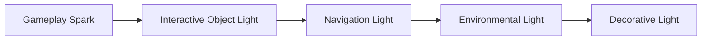
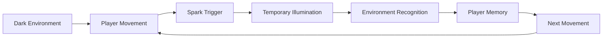
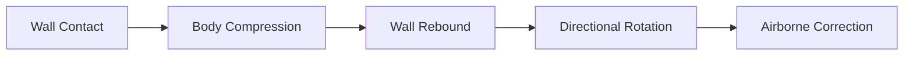
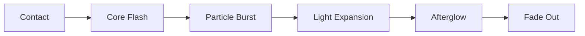
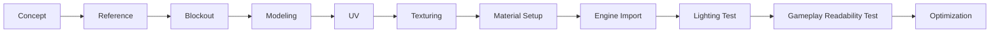

──────────────────────────────────────────────────────────────────────────────

# Spark Technical Documentation

## Volume 05

# Art Direction

Version 1.0

Unreal Engine 5.5.4

──────────────────────────────────────────────────────────────────────────────

> Move to See. Remember to Survive.

본 문서는 Spark 프로젝트의 시각적 방향성과 표현 기준을 정의한다.

Spark의 아트는 단순히 어두운 공장을 표현하는 데 목적이 있지 않다.
플레이어의 움직임으로 발생하는 Spark가 공간을 드러내고,
기억과 판단을 통해 앞으로 나아가게 만드는 게임플레이를 시각적으로 지원해야 한다.

---

# Executive Summary

## 목적

Art Direction은 Spark의 시각적 정체성과 제작 기준을 정의한다.

본 문서는 다음 내용을 다룬다.

- 전체 시각적 콘셉트
- 환경 디자인
- 조명 설계
- 색상 체계
- 재질과 Surface 표현
- 캐릭터 디자인
- VFX
- 애니메이션
- 카메라 표현
- 최적화 기준

---

## Visual Identity

Spark의 핵심 시각적 정체성은 다음 문장으로 정의한다.

> 어둠 속에서 움직임이 순간적으로 공간을 드러내는 산업 시설.

전체 화면은 제한된 가시성과 낮은 채도를 유지한다.

플레이어의 움직임, 충돌, 벽 이동, 케이블 상호작용으로 발생하는 Spark만이
일시적으로 주변 공간과 진행 정보를 보여준다.

---

## Core Visual Keywords

| 항목 | 방향 |
|------|------|
| Environment | 폐쇄된 산업 시설 |
| Mood | 어둡고 고립된 분위기 |
| Lighting | 제한적이고 일시적인 빛 |
| Color | 저채도 환경과 고채도 Spark |
| Material | 금속, 고무, 케이블, 콘크리트 |
| Shape | 단순하고 기능적인 산업 구조 |
| VFX | 짧고 명확한 전기성 피드백 |
| Storytelling | 환경 중심의 간접 전달 |

---

# Art Direction Philosophy

Spark의 아트는 다음 세 가지 역할을 수행해야 한다.

## Gameplay Readability

플레이어가 이동 가능한 공간과 위험 요소를 이해할 수 있어야 한다.

## Emotional Atmosphere

정지된 산업 시설의 고립감과 긴장감을 전달해야 한다.

## Visual Feedback

플레이어의 행동과 시스템 반응을 즉시 보여줘야 한다.

분위기를 위한 아트가 게임플레이 정보를 가려서는 안 된다.

---

# Visual Pillars

## Darkness as Information

어둠은 단순한 분위기 연출이 아니다.

플레이어가 아직 확인하지 못한 공간과
기억해야 하는 공간을 구분하는 게임플레이 요소이다.

완전한 검은색 화면보다는 형태를 구분할 수 있는 최소한의 환경광을 유지한다.

---

## Spark as Temporary Vision

Spark는 장식 효과가 아니라 플레이어의 시야를 만드는 핵심 시스템이다.

Spark가 발생하면 다음 정보가 짧은 시간 동안 드러나야 한다.

- 주변 지형의 형태
- 이동 가능한 Surface
- 벽의 위치
- 케이블 경로
- 위험 요소
- 진행 방향

---

## Industrial Functionality

환경의 모든 형태는 기능적으로 보여야 한다.

파이프, 케이블, 플랫폼, 기계, 문은 단순한 장식이 아니라
시설이 실제로 작동했을 것 같은 구조를 가져야 한다.

---

## Contrast over Detail

Spark는 세밀한 디테일보다는 명확한 대비를 우선한다.

어두운 배경과 밝은 Spark,
정적인 환경과 순간적인 움직임,
차가운 시설과 따뜻한 전기 빛의 대비를 활용한다.

---

# Mood Board Direction

Mood Board는 다음 범주를 기준으로 구성한다.

| 범주 | 참고 방향 |
|------|-----------|
| Architecture | 산업 시설, 정비 통로, 발전 설비 |
| Lighting | 비상등, 전기 스파크, 제한 조명 |
| Material | 마모된 금속, 고무, 케이블 피복 |
| Atmosphere | 먼지, 증기, 연기, 습기 |
| Color | 차가운 회색, 청색, 황색 강조 |
| Character | 소형 유지보수 로봇 |
| VFX | 전기 방전, 불꽃, 잔광 |

Mood Board는 스타일을 그대로 복제하기 위한 자료가 아니라,
형태, 분위기, 빛, 재질의 공통 방향을 추출하기 위해 사용한다.

---

# Environment Art

## Environment Concept

게임의 주요 배경은 가동이 중단된 대형 산업 시설이다.

시설은 다음 공간으로 구성될 수 있다.

- 유지보수 통로
- 발전 구역
- 생산 라인
- 냉각 시설
- 케이블 관리 구역
- 보안 구역
- 중앙 제어실

각 구역은 고유한 구조를 가지되,
전체적으로 하나의 시설이라는 일관성을 유지해야 한다.

---

## Environment Shape Language

환경 형태는 다음 기준을 따른다.

| 형태 | 의미 |
|------|------|
| 직선과 사각형 | 구조물, 플랫폼, 벽 |
| 원형 | 발전기, 회전체, 밸브 |
| 굵은 곡선 | 케이블, 파이프 |
| 삼각형 | 위험, 경고 |
| 반복 패턴 | 산업 생산 구조 |

플랫폼과 이동 가능한 구조는 단순한 실루엣을 사용한다.

배경 오브젝트는 더 복잡한 형태를 사용할 수 있지만,
이동 경로와 시각적으로 경쟁하지 않아야 한다.

---

## Modular Environment

환경은 Modular Kit을 중심으로 제작한다.

기본 모듈 예시:

- Wall
- Floor
- Ceiling
- Platform
- Pillar
- Beam
- Door Frame
- Pipe
- Cable Support
- Vent
- Railing
- Stair

모듈은 일정한 Grid 기준으로 제작하며,
레벨 블록아웃과 최종 아트 사이의 크기 차이를 최소화한다.

---

## Scale

환경의 크기는 플레이어 이동과 카메라 가독성을 기준으로 결정한다.

확인 항목:

- 캐릭터가 문과 통로에 비해 지나치게 작거나 크지 않은가
- 점프 거리가 시각적으로 예측 가능한가
- 벽 점프 공간이 충분히 읽히는가
- 카메라가 환경 구조물에 자주 가려지지 않는가
- 플랫폼 가장자리를 구분하기 쉬운가

---

# Lighting Direction

## Lighting Goal

Spark의 조명은 공간을 완전히 밝히는 것이 아니라,
짧은 순간 동안 필요한 정보만 제공해야 한다.

기본 환경은 어둡게 유지하되,
게임 진행이 불가능할 정도로 정보를 숨기지 않는다.

---

## Lighting Hierarchy

조명의 우선순위는 다음과 같다.



하위 조명이 상위 조명의 가독성을 방해해서는 안 된다.

---

## Ambient Lighting

환경광은 다음 역할만 수행한다.

- 대략적인 공간 실루엣 제공
- 캐릭터 위치 구분
- 완전한 암흑 방지
- 깊이와 거리감 유지

환경광만으로 퍼즐의 정답이나 전체 경로를 쉽게 볼 수 있어서는 안 된다.

---

## Spark Lighting

Spark는 짧고 강한 조명으로 표현한다.

핵심 속성:

| 속성 | 방향 |
|------|------|
| Intensity | 순간적으로 강함 |
| Duration | 짧음 |
| Radius | 이벤트 종류에 따라 다름 |
| Falloff | 빠르게 감소 |
| Color | 따뜻한 황색 또는 백색 |
| Shadow | 필요한 경우에만 사용 |
| Frequency | 반복 시 시각적 피로 방지 |

Landing, Wall Slide, Wall Jump, Cable Interaction은
서로 다른 강도와 범위를 가져야 한다.

---

## Lighting Flow



---

## Navigation Lighting

항상 켜져 있는 조명은 제한적으로 사용한다.

사용 가능한 위치:

- 체크포인트
- 주요 목표
- 비상 출구
- 상호작용 장치
- 안전 구역

Navigation Light는 정답을 직접 알려주기보다는
진행 가능한 방향을 암시해야 한다.

---

# Color Direction

## Base Palette

환경은 저채도의 차가운 색상을 사용한다.

권장 범주:

- Dark Gray
- Blue Gray
- Desaturated Green
- Industrial Brown
- Black
- Muted Steel

---

## Accent Palette

강조 색상은 기능별로 제한한다.

| 색상 | 용도 |
|------|------|
| Warm Yellow | 기본 Spark |
| White | 강한 전기 효과 |
| Cyan | 전력 및 케이블 |
| Red | 위험 및 실패 |
| Green | 활성화 및 완료 |
| Orange | 경고 및 열 |
| Blue | 비활성 시스템 또는 냉각 |

하나의 색상이 여러 의미를 가지지 않도록 한다.

---

## Color Hierarchy

```text
Environment
Low Saturation / Low Brightness

Gameplay Object
Medium Saturation / Medium Brightness

Spark and Critical Feedback
High Saturation / High Brightness
```

플레이어의 시선은 항상 중요한 게임플레이 정보로 먼저 이동해야 한다.

---

# Material Direction

## Material Philosophy

재질은 현실적인 표면 특성을 유지하되,
게임플레이 판독성을 위해 과장할 수 있다.

Surface 종류는 빛이 없는 상태에서도
형태와 반사 특성을 통해 어느 정도 구분되어야 한다.

---

## Metal Surface

Metal은 Spark를 생성하는 기본 Surface이다.

특징:

- 높은 반사
- 마모된 가장자리
- 스크래치
- 볼트와 패널 구조
- 제한적인 녹
- Spark 빛의 명확한 반사

지나치게 거울처럼 반사하지 않도록 Roughness를 조정한다.

---

## Rubber Surface

Rubber는 Spark가 발생하지 않는 Surface이다.

특징:

- 낮은 반사
- 높은 Roughness
- 어두운 색상
- 부드러운 형태
- 반복되는 산업 패턴
- 금속과 확실한 시각적 차이

Rubber는 단순히 검은색으로 표현하지 않는다.
환경광에서도 표면의 두께와 형태를 구분할 수 있어야 한다.

---

## Cable Surface

Cable은 강한 Spark를 발생시키는 특별한 Surface이다.

특징:

- 굵은 실루엣
- 절연 피복
- 발광 표시
- 전력 흐름 표현
- 연결 지점 강조
- 상호작용 가능 여부 구분

활성 Cable과 비활성 Cable은 Emissive, 색상, 움직임으로 구분한다.

---

## Concrete and Structure

콘크리트와 구조재는 배경의 안정적인 기준이 된다.

특징:

- 낮은 반사
- 큰 형태
- 균열과 오염
- 반복을 줄이는 Decal
- 이동 Surface보다 낮은 시각적 강조

---

## Master Material

공통 Master Material을 사용해 다음 값을 제어한다.

- Base Color
- Roughness
- Metallic
- Normal
- Emissive
- Dirt
- Edge Wear
- Color Tint
- Surface Variation

Material Instance를 활용하여 중복 Shader 제작을 줄인다.

---

# Surface Readability

Surface는 게임 규칙과 직접 연결되므로
명확하게 구분되어야 한다.

| Surface | 색상 | 반사 | 형태 | Spark 반응 |
|---------|------|------|------|------------|
| Metal | 회색 계열 | 높음 | 단단하고 각진 형태 | 기본 Spark |
| Rubber | 어두운 색 | 낮음 | 부드럽고 두꺼운 형태 | 없음 |
| Cable | Cyan 계열 강조 | 중간 | 길고 곡선 형태 | 강한 Spark |

색상만으로 Surface를 구분하지 않는다.

색각 이상을 고려해 형태, Roughness, 패턴을 함께 사용한다.

---

# Character Art

## Character Concept

플레이어 캐릭터는 산업 시설의 좁은 구조물과 벽면을 이동하며 유지보수하기 위해
제작된 소형 벽면 기동형 로봇이다.

기준 높이는 약 110cm로 두며, 견고한 외장을 유지하되 기동성을 위해
몸체를 경량화한 비전투용 유지보수 장비로 표현한다.

전투용이나 인간형 영웅처럼 보이기보다,
시설 내부를 이동하고 수리하는 기능적인 기계로 보여야 한다.
벽면 이동은 별도의 추진 장치가 아니라 접촉 패드와 피스톤 관절을 이용한
벽면 반동 도약으로 표현한다.

---

## Character Shape Language

캐릭터는 다음 형태를 사용한다.

- 세로로 길고 폭이 좁은 보호형 중심 몸체
- 노출된 피스톤과 명확한 관절을 가진 기능성 팔다리
- 벽면 접촉과 반동을 위한 손목 및 발바닥 접촉 패드
- 충격을 견디는 외장
- 작은 발광부
- 등 정비 패널과 케이블 연결 구조

상체가 지나치게 묵직해 보이지 않도록 다리와 관절의 비율을 확보한다.
실루엣만으로도 전방, 발 위치, 벽 접촉 방향과 이동 상태를 이해할 수 있어야 한다.

---

## Character Color

캐릭터는 환경에서 구분되되 지나치게 밝지 않아야 한다.

권장 구성:

- 중간 밝기의 마모된 금속 외장
- 어두운 관절
- 작은 청록색 Emissive 상태등
- 손상 및 마모
- Spark와 겹치지 않는 제한적인 포인트 색상

캐릭터의 자체 발광은 최소화하고, 주황색은 행동 Spark와 전기 피드백에 우선 사용한다.

---

## Character Readability

어두운 환경에서도 다음 요소가 보여야 한다.

- 머리 또는 전방 방향
- 발 위치
- 벽과 접촉한 방향
- 점프 상태
- 상호작용 상태

필요한 경우 Rim Light 또는 제한된 Emissive를 사용할 수 있다.

---

# Animation Direction

## Animation Philosophy

애니메이션은 로봇의 견고함과 기능성을 전달하면서도
플랫폼 게임에 필요한 즉각적인 반응성을 유지해야 한다.

현실적인 동작보다 입력과 화면 반응의 일치를 우선한다.

---

## Core Animation Set

필수 애니메이션:

- Idle
- Start Move
- Run
- Stop
- Jump Start
- Jump Loop
- Fall
- Landing
- Wall Slide
- Wall Jump
- Interact
- Checkpoint Activate
- Failure
- Respawn

---

## Movement Animation

이동 애니메이션은 다음 기준을 따른다.

- 입력 시작에 빠르게 반응
- 이동 속도와 발 움직임 일치
- 급정지 시 짧은 관성 표현
- 방향 전환 시 과도한 지연 금지
- 점프 전 긴 준비 동작 금지

---

## Wall Slide

Wall Slide는 다음 정보를 명확히 보여야 한다.

- 벽에 접촉하고 있음
- 아래로 미끄러지고 있음
- 점프 가능한 상태
- Spark가 발생하는 접촉 지점

손목 또는 발바닥 접촉 패드 중 하나 이상이 벽을 지지하는 모습을 보여준다.
몸체는 벽에 지나치게 멀어지지 않게 유지하며,
손, 발, 몸체의 방향을 통해 벽 접촉 상태를 표현한다.

---

## Wall Jump

Wall Jump는 사람이 뛰어오르는 동작이 아니라
접촉 패드와 피스톤 관절을 이용한 벽면 반동 도약으로 표현한다.

동작 순서는 다음과 같다.



필수 피드백:

- 접촉 패드가 벽을 지지하는 모습
- 짧은 몸체 압축과 피스톤 반동
- 벽 반대 방향으로 몸 회전
- Spark Burst
- Camera Feedback
- 명확한 점프 궤적

추진기, 제트팩, 벽 달리기처럼 별도 이동 기능으로 보이는 장치는 사용하지 않는다.

---

## Landing

Landing은 Spark 발생의 주요 원인이므로
애니메이션과 효과 타이밍을 정확하게 맞춰야 한다.

착지 강도에 따라 다음을 조절할 수 있다.

- 몸체 압축
- Spark 크기
- 사운드 크기
- 카메라 흔들림
- 먼지 효과

---

# VFX Direction

## VFX Philosophy

VFX는 화려함보다 정보 전달을 우선한다.

모든 효과는 다음 질문에 답해야 한다.

- 어떤 행동이 발생했는가
- 어디에서 발생했는가
- 얼마나 강한 행동이었는가
- 주변 환경에 어떤 영향을 주었는가

---

## Spark VFX

Spark는 여러 층으로 구성한다.

```text
Core Flash
      +
Electric Particles
      +
Short Light
      +
Surface Reflection
      +
Optional Smoke or Dust
```

---

## Spark Types

| 이벤트 | 크기 | 지속시간 | 범위 | 특징 |
|--------|------|----------|------|------|
| Landing | 중간 | 짧음 | 중간 | 바닥 중심 확산 |
| Wall Slide | 작음 | 반복 | 좁음 | 접촉 지점을 따라 이동 |
| Wall Jump | 중간 | 매우 짧음 | 좁음 | 방향성이 강함 |
| Cable Interaction | 큼 | 비교적 김 | 넓음 | 전기 흐름 강조 |

---

## VFX Timing

Spark는 입력이나 충돌보다 늦게 발생하면 안 된다.

권장 순서:



전체 효과는 짧고 명확해야 한다.

---

## Particle Density

입자 수가 많아 환경 형태를 가리지 않도록 한다.

벽 점프나 착지 시
플레이어의 위치와 다음 이동 방향이 반드시 보여야 한다.

---

## Environmental VFX

사용 가능한 환경 효과:

- Dust
- Steam
- Smoke
- Electrical Arc
- Dripping Water
- Floating Particle
- Small Debris

환경 효과는 이동 경로나 상호작용 오브젝트보다 낮은 우선순위를 가진다.

---

# Audio-Visual Synchronization

시각 효과와 사운드는 동일한 이벤트를 기준으로 동기화한다.

```text
Gameplay Event
      ├── Animation
      ├── VFX
      ├── Light
      ├── Sound
      └── Camera Feedback
```

각 시스템이 개별적으로 타이밍을 추측해서는 안 된다.

하나의 Gameplay Event를 기준으로 모든 피드백을 실행한다.

---

# Camera Presentation

카메라 방식은 최종 확정 전까지
Third Person, First Person, Fixed Camera 가능성을 유지한다.

그러나 아트 제작은 다음 공통 기준을 따른다.

- 캐릭터와 이동 공간이 명확하게 보여야 한다.
- Spark가 화면 전체를 과도하게 덮지 않아야 한다.
- 벽 점프 구간의 높이와 폭을 판단할 수 있어야 한다.
- 배경 디테일이 이동 경로를 방해하지 않아야 한다.
- 중요 오브젝트는 카메라 거리에서도 구분되어야 한다.

---

## Third Person Considerations

- 캐릭터 실루엣 중요
- 카메라 가림 방지 구조 필요
- 벽과 플레이어 사이 간격 확보
- Spark가 캐릭터 뒤에서 가려지지 않도록 조정

---

## First Person Considerations

- 손 또는 도구 표현 필요 여부 검토
- 빠른 Spark로 인한 눈부심 방지
- 벽 이동 시 멀미 최소화
- 화면 중심 정보 과밀 방지

---

## Fixed Camera Considerations

- 공간 구도와 이동 경로 우선
- 카메라 전환 지점 명확화
- 전환 중 방향 혼란 방지
- Spark 범위가 화면 구성에 맞게 보여야 함

---

# Environmental Storytelling

Spark의 서사는 긴 설명보다 환경을 통해 전달한다.

사용 가능한 요소:

- 멈춘 생산 설비
- 바닥에 남은 작업 흔적
- 임시 수리 자국
- 끊어진 전력선
- 폐쇄된 구역
- 오래된 경고 표지
- 손상된 유지보수 로봇
- 복구 중인 시스템
- 단계적으로 켜지는 시설

---

## Storytelling Rule

환경 요소는 다음 중 하나 이상의 역할을 가져야 한다.

- 과거 사건 설명
- 현재 시설 상태 전달
- 진행 방향 안내
- 퍼즐 규칙 암시
- 플레이어 목표 강화

의미 없는 장식은 최소화한다.

---

# Signage and Graphic Design

산업 시설 내부의 그래픽 요소는 일관된 규칙을 따른다.

사용 요소:

- 구역 번호
- 방향 표시
- 경고 표지
- 전력 상태 표시
- 안전선
- 기계 상태 UI
- 유지보수 마킹

---

## Signage Rules

- 멀리서도 큰 형태를 인식할 수 있어야 한다.
- 텍스트 없이도 색상과 기호로 의미를 전달한다.
- 실제 진행 방향과 충돌하는 표시는 사용하지 않는다.
- 지나치게 많은 표지로 화면을 복잡하게 만들지 않는다.
- 플레이어가 볼 수 없는 위치에는 핵심 정보를 배치하지 않는다.

---

# Asset Production Pipeline



각 단계는 단순한 시각 품질뿐 아니라
게임플레이 가독성을 기준으로 검토한다.

---

# Asset Quality Levels

## Hero Asset

주요 목표나 중요한 상호작용에 사용한다.

예시:

- 중앙 발전기
- 대형 제어 장치
- 핵심 체크포인트
- 주요 케이블 장치

높은 디테일과 고유한 실루엣을 가진다.

---

## Gameplay Asset

플레이어가 직접 사용하는 오브젝트이다.

예시:

- Platform
- Door
- Switch
- Cable
- Checkpoint
- Wall Slide Surface

형태와 기능의 명확성이 가장 중요하다.

---

## Background Asset

공간의 분위기와 규모를 표현한다.

예시:

- 배경 파이프
- 기계 구조물
- 환풍구
- 원거리 설비

Gameplay Asset보다 낮은 대비와 디테일을 사용한다.

---

# LOD and Optimization

## Mesh Optimization

- 반복 오브젝트는 Instancing 사용
- 보이지 않는 면 제거
- 적절한 LOD 제작
- Nanite 적용 가능성 검토
- 충돌 Mesh 단순화
- 작은 장식 Mesh 남용 금지

---

## Material Optimization

- Master Material 사용
- Material Instance 활용
- Shader Complexity 확인
- 불필요한 Transparency 최소화
- Texture Channel Packing 활용
- 반복되는 효과는 공통 함수 사용

---

## Lighting Optimization

- 동적 조명 수 제한
- Spark Light의 수명 최소화
- 그림자 필요 여부 개별 검토
- 원거리 조명 비활성화
- 겹치는 Light 범위 최소화
- Lumen 비용 측정

---

## VFX Optimization

- Particle Count 제한
- 화면 크기 기반 Spawn 조절
- Off-screen Effect 중지
- Collision 사용 최소화
- GPU Particle 사용 여부 검토
- 반복 Spark의 최대 동시 개수 제한

---

# Accessibility

아트는 다양한 플레이어가 게임 정보를 인식할 수 있도록 설계한다.

기준:

- 색상만으로 정보를 구분하지 않는다.
- 형태와 패턴을 함께 사용한다.
- Spark의 밝기를 조절할 수 있도록 고려한다.
- 빠른 점멸 효과를 제한한다.
- 중요한 오브젝트에 명확한 실루엣을 제공한다.
- 위험 요소와 안전 요소를 형태로도 구분한다.

---

# Art Review Checklist

## Environment

- 공간의 목적이 시각적으로 드러나는가
- 진행 가능한 경로가 배경과 구분되는가
- 반복 모듈이 지나치게 눈에 띄지 않는가
- 스케일이 일관적인가
- 카메라 가림 문제가 없는가

## Lighting

- Spark 없이도 최소한의 위치 파악이 가능한가
- Spark 발생 시 필요한 공간 정보가 보이는가
- 중요한 오브젝트가 우선적으로 보이는가
- 과도한 눈부심이나 점멸이 없는가
- 조명 색상이 게임 규칙과 일치하는가

## Material

- Metal, Rubber, Cable을 쉽게 구분할 수 있는가
- 재질이 게임플레이 규칙과 일치하는가
- 반사가 경로를 가리지 않는가
- Texture 해상도가 적절한가
- 반복이 과도하게 보이지 않는가

## Character

- 어두운 환경에서 캐릭터가 보이는가
- 이동 방향을 이해할 수 있는가
- 벽 접촉 상태가 명확한가
- 애니메이션이 입력과 즉시 연결되는가
- 환경과 크기 비율이 자연스러운가

## VFX

- 행동 발생 위치가 명확한가
- Spark 종류를 구분할 수 있는가
- 화면을 과도하게 가리지 않는가
- 사운드 및 애니메이션과 동기화되는가
- 성능 비용이 허용 범위 내인가

---

# Art Direction Rules

Spark의 모든 아트는 다음 규칙을 따른다.

- 게임플레이 가독성을 분위기보다 우선한다.
- Spark는 가장 높은 시각적 우선순위를 가진다.
- 색상만으로 게임 정보를 전달하지 않는다.
- 환경은 기능적으로 설계한다.
- 배경은 이동 경로와 경쟁하지 않는다.
- Surface는 재질과 형태로 구분한다.
- VFX는 짧고 명확하게 표현한다.
- 반복 Asset은 Modular 방식으로 제작한다.
- 조명과 효과는 성능을 고려하여 설계한다.
- 시각 요소는 하나 이상의 목적을 가져야 한다.

---

# Related Documents

- [01_GDD.md](./01_GDD.md)
- [02_Architecture.md](./02_Architecture.md)
- [03_Gameplay_Framework.md](./03_Gameplay_Framework.md)
- [04_Level_Design.md](./04_Level_Design.md)
- [06_UI_UX.md](./06_UI_UX.md)

---

# Summary

Spark의 Art Direction은 어두운 산업 시설과
플레이어의 움직임으로 발생하는 일시적인 빛의 대비를 중심으로 구성한다.

환경은 낮은 채도와 제한된 조명을 사용하며,
Spark는 플레이어의 행동과 공간 정보를 전달하는 가장 중요한 시각적 요소가 된다.

Metal, Rubber, Cable은 색상뿐 아니라 반사, 형태, 패턴으로 구분하며,
캐릭터와 VFX, 조명, 환경은 모두 게임플레이 가독성을 우선하여 제작한다.

Spark의 아트는 단순한 배경이 아니라
플레이어가 공간을 보고, 기억하고, 판단하도록 돕는 게임 시스템의 일부이다.
