──────────────────────────────────────────────────────────────────────────────

# Spark Technical Documentation

## Volume 06

# UI / UX

Version 1.0

Unreal Engine 5.5.4

──────────────────────────────────────────────────────────────────────────────

> Move to See. Remember to Survive.

본 문서는 Spark 프로젝트의 사용자 인터페이스와 사용자 경험 설계 기준을 정의한다.

Spark는 환경 관찰과 공간 기억이 핵심인 게임이므로,
화면을 가리는 UI를 최소화하고 게임 월드 자체가 정보를 전달하도록 설계한다.

UI는 플레이어에게 필요한 정보를 명확하게 제공해야 하지만,
퍼즐의 해답이나 탐험의 긴장감을 대신해서는 안 된다.

---

# Executive Summary

## 목적

UI / UX는 플레이어가 게임의 규칙과 상태를 자연스럽게 이해하고,
불필요한 혼란 없이 게임을 조작할 수 있도록 설계한다.

본 문서는 다음 내용을 정의한다.

- UI 설계 철학
- 정보 우선순위
- HUD
- Main Menu
- Pause Menu
- Settings
- Interaction UI
- Checkpoint Feedback
- Failure 및 Respawn UX
- Navigation Flow
- 입력 장치 지원
- 접근성
- UI 구현 구조
- 테스트 기준

---

## UX Goal

Spark의 UX 목표는 다음과 같다.

> 플레이어가 UI를 읽는 대신, 환경과 자신의 행동을 통해 게임을 이해하도록 한다.

UI는 항상 보이는 정보판이 아니라,
필요한 순간에만 나타나는 보조 수단으로 사용한다.

---

## Core UX Keywords

| 항목 | 방향 |
|------|------|
| HUD | 최소화 |
| Guidance | 환경 중심 |
| Feedback | 즉각적이고 명확함 |
| Interaction | 상황 기반 |
| Navigation | 단순하고 일관됨 |
| Text | 짧고 직접적 |
| Animation | 빠르고 방해되지 않음 |
| Accessibility | 설정 가능하고 구분 가능함 |

---

# UI / UX Philosophy

Spark의 UI / UX는 다음 원칙을 따른다.

## World First

가능한 정보는 UI보다 게임 월드에서 전달한다.

예시:

- 진행 방향은 조명과 구조로 안내한다.
- 활성 장치는 Emissive와 애니메이션으로 표시한다.
- Surface 종류는 재질과 형태로 구분한다.
- 체크포인트 활성화는 월드 연출로 보여준다.

---

## Contextual UI

UI는 항상 표시하지 않고 필요한 상황에만 표시한다.

예시:

- 상호작용 가능한 오브젝트 근처에서 Interaction Prompt 표시
- 설정 변경 시에만 안내 메시지 표시
- 체크포인트 활성화 시 짧은 알림 표시
- 실패 시 Respawn 정보 표시

---

## Immediate Feedback

플레이어의 행동에는 즉각적인 피드백이 필요하다.

피드백은 다음 요소를 조합한다.

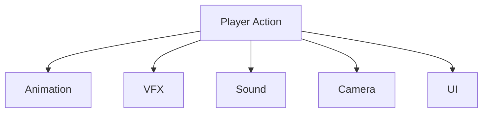

UI는 다른 피드백을 보완하며,
게임플레이 이벤트보다 늦게 표시되어서는 안 된다.

---

## Minimal Interruption

메뉴와 알림은 플레이 흐름을 불필요하게 중단하지 않는다.

- 짧은 메시지를 사용한다.
- 확인 창을 남용하지 않는다.
- 반복되는 안내를 최소화한다.
- 플레이 중 긴 설명문을 표시하지 않는다.
- 튜토리얼은 행동 가능한 상태에서 제공한다.

---

## Consistency

같은 입력과 같은 시각 요소는 항상 같은 의미를 가져야 한다.

예시:

- 동일한 색상의 버튼은 동일한 상태를 의미한다.
- Back 입력은 항상 이전 화면으로 이동한다.
- Confirm 입력은 항상 선택을 실행한다.
- 비활성 요소는 모든 메뉴에서 같은 방식으로 표시한다.

---

# Information Hierarchy

Spark의 정보 우선순위는 다음과 같다.

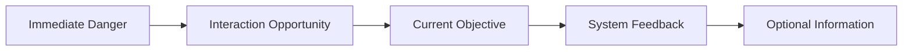

높은 우선순위의 정보는 낮은 우선순위 정보보다 먼저 보여야 한다.

---

## Priority Definition

| 우선순위 | 정보 | 예시 |
|----------|------|------|
| Critical | 즉각적인 행동 필요 | 위험, 실패, 입력 차단 |
| High | 현재 행동과 직접 관련 | 상호작용, 체크포인트 |
| Medium | 진행 상태 | 목표 갱신, 구역 진입 |
| Low | 선택 정보 | 도움말, 수집 정보 |

---

# HUD Strategy

## HUD Principle

Spark는 상시 HUD를 최소화한다.

기본 플레이 화면에서는 가능하면 다음 요소를 표시하지 않는다.

- 체력 바
- 미니맵
- 방향 나침반
- 지속적인 목표 목록
- 점수
- 불필요한 아이콘

게임에 실제로 존재하지 않는 정보는 표시하지 않는다.

---

## Default Gameplay Screen

기본 화면은 게임 월드와 캐릭터만 보여주는 것을 목표로 한다.

```text
┌──────────────────────────────────────────────┐
│                                              │
│                                              │
│                  Game World                  │
│                                              │
│                                              │
│                        [Interaction Prompt]  │
└──────────────────────────────────────────────┘
```

Interaction Prompt 역시 상호작용 가능한 상황에서만 나타난다.

---

## HUD Elements

플레이 중 사용할 수 있는 HUD 요소는 다음과 같다.

| 요소 | 표시 조건 | 표시 시간 |
|------|-----------|-----------|
| Interaction Prompt | 상호작용 가능 | 조건 유지 중 |
| Checkpoint Notice | 체크포인트 활성화 | 짧게 |
| Objective Notice | 목표 변경 | 짧게 |
| Tutorial Prompt | 새로운 조작 학습 | 완료 전 또는 제한 시간 |
| Failure Message | 플레이어 실패 | Respawn까지 |
| Saving Indicator | 저장 중 | 저장 완료까지 |

---

# Screen Safe Zone

UI는 화면 가장자리에 지나치게 가깝게 배치하지 않는다.

고려 사항:

- 다양한 해상도
- 화면 비율
- TV Overscan
- 자막 영역
- 플랫폼 시스템 메시지
- 스트리밍 또는 녹화 환경

핵심 정보는 Safe Zone 내부에 배치한다.

---

# Interaction UI

## 목적

Interaction UI는 플레이어가 현재 상호작용할 수 있는 대상과
필요한 입력을 알려준다.

---

## Interaction Prompt Structure

```text
[Input Icon]  Interaction Text
```

예시:

```text
[E] 전원 연결
```

```text
[X] 장치 활성화
```

입력 장치가 변경되면 아이콘도 즉시 변경되어야 한다.

---

## Display Conditions

Interaction Prompt는 다음 조건을 모두 만족할 때 표시한다.

- 대상이 Interaction Range 안에 있음
- 대상이 `IInteractable`을 구현함
- `CanInteract()`가 참임
- 플레이어 입력이 가능한 상태임
- 다른 높은 우선순위 UI가 입력을 점유하지 않음

---

## Interaction Flow

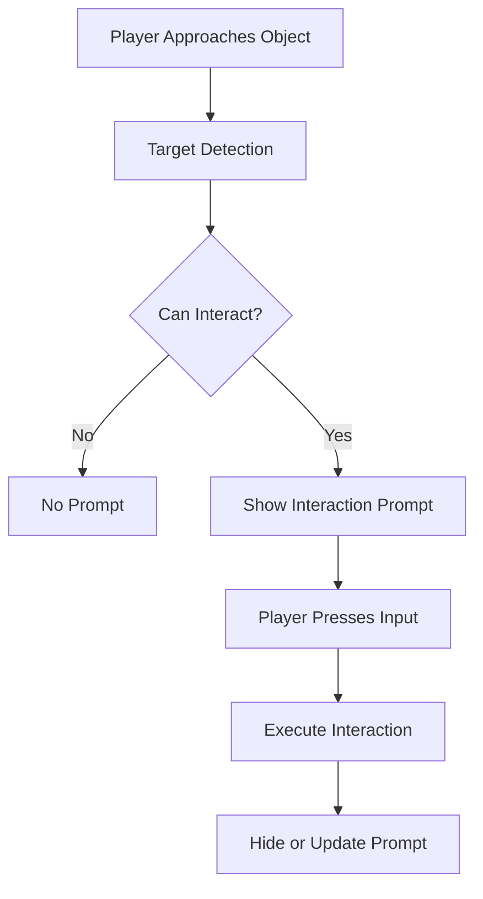

---

## Interaction Text Rules

Interaction Text는 행동 중심으로 작성한다.

권장:

- 전원 연결
- 문 열기
- 스위치 작동
- 케이블 분리
- 장치 조사

지양:

- 이 오브젝트와 상호작용하려면 버튼을 누르세요
- 현재 이 장치는 플레이어가 사용할 수 있습니다
- 여기를 눌러 다음 행동을 실행하세요

짧은 동사형 표현을 사용한다.

---

## Unavailable Interaction

상호작용할 수 없는 대상은 기본적으로 Prompt를 표시하지 않는다.

플레이어에게 이유를 알려야 하는 경우에만 제한적으로 표시한다.

예시:

```text
전력이 필요합니다
```

```text
반대편에서 잠겨 있습니다
```

동일한 실패 메시지를 반복해서 표시하지 않는다.

---

# Tutorial UX

## Tutorial Philosophy

튜토리얼은 설명보다 행동을 통해 학습하도록 설계한다.

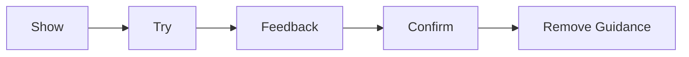

---

## Tutorial Rules

- 한 번에 하나의 조작만 소개한다.
- 안전한 공간에서 학습시킨다.
- Prompt가 표시된 상태에서도 플레이어가 움직일 수 있어야 한다.
- 입력에 성공하면 즉시 Prompt를 제거한다.
- 이미 이해한 내용을 반복하지 않는다.
- 실패해도 빠르게 다시 시도할 수 있어야 한다.

---

## Tutorial Prompt Examples

| 상황 | Prompt |
|------|--------|
| 첫 이동 | 이동하여 주변을 확인하세요 |
| 첫 점프 | 점프하여 플랫폼을 건너세요 |
| 첫 Wall Slide | 벽에 붙어 천천히 내려가세요 |
| 첫 Wall Jump | 벽에서 반대 방향으로 점프하세요 |
| 첫 Interaction | 장치를 활성화하세요 |

튜토리얼 문구는 실제 입력 아이콘과 함께 표시한다.

---

## Tutorial Completion

튜토리얼 완료 여부는 필요한 경우 저장할 수 있다.

이미 완료한 튜토리얼은 다시 표시하지 않는 것을 기본으로 한다.

설정에서 튜토리얼 초기화 기능을 제공할 수 있다.

---

# Checkpoint UX

## 목적

체크포인트 활성화를 플레이어가 명확히 인식하도록 한다.

체크포인트는 UI 메시지만으로 전달하지 않고,
월드 연출과 함께 보여준다.

---

## Checkpoint Feedback

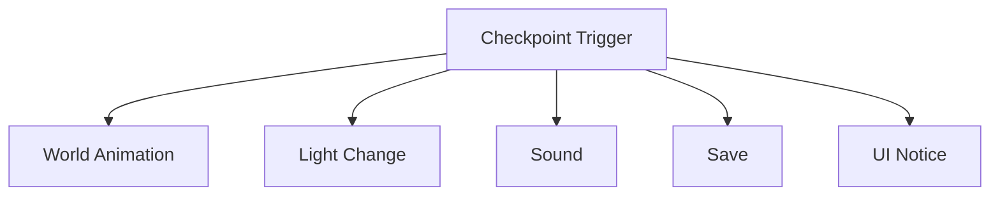

---

## Checkpoint Notice

권장 문구:

```text
체크포인트 활성화
```

또는

```text
진행 상황 저장됨
```

표시 시간은 짧게 유지한다.

화면 중앙을 장시간 가리지 않으며,
플레이어 조작을 중단하지 않는다.

---

## Saving Indicator

저장이 즉시 끝나지 않는 경우,
화면 모서리에 작은 Saving Indicator를 표시한다.

```text
저장 중...
```

저장 완료 후 자연스럽게 사라져야 한다.

저장 중에는 게임 종료 또는 레벨 이동으로 데이터가 손상되지 않도록 처리한다.

---

# Objective UX

## Objective Principle

Spark는 지속적인 목표 목록보다
환경을 통한 진행 이해를 우선한다.

목표 UI는 다음 상황에서만 사용한다.

- 새로운 주요 목표가 설정됨
- 기존 목표가 변경됨
- 장시간 진행 방향을 잃을 가능성이 높음
- 스토리 진행에 필수적인 상태 변화가 발생함

---

## Objective Message

목표는 짧고 행동 가능하게 작성한다.

권장:

- 보조 전원을 복구하세요
- 중앙 제어실로 이동하세요
- 끊어진 케이블을 연결하세요
- 생산 라인을 재가동하세요

지양:

- 현재 플레이어가 수행해야 하는 임무는 중앙 구역에 위치한 장치를 찾아 활성화하는 것입니다

---

## Objective Display Flow

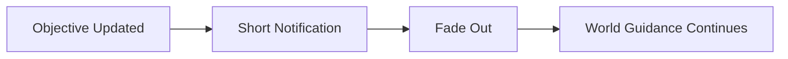

플레이어가 필요할 때 현재 목표를 다시 확인할 수 있는 기능을 제공할 수 있다.

---

# Main Menu

## Menu Goals

Main Menu는 다음 기능에 빠르게 접근할 수 있어야 한다.

- Continue
- New Game
- Load Game
- Settings
- Credits
- Quit

플랫폼 또는 프로젝트 범위에 따라 일부 항목은 제외할 수 있다.

---

## Main Menu Layout

```text
SPARK

Continue
New Game
Load Game
Settings
Credits
Quit
```

가장 자주 사용하는 항목을 위에 배치한다.

저장 데이터가 없으면 Continue와 Load Game은 비활성화한다.

---

## Main Menu Background

Main Menu 배경은 게임의 시각적 정체성을 보여준다.

권장 방향:

- 어두운 시설의 정적인 장면
- 멀리서 간헐적으로 발생하는 Spark
- 낮은 강도의 기계 소음
- 느린 카메라 움직임
- 과도하지 않은 환경 애니메이션

배경이 메뉴 텍스트의 가독성을 방해해서는 안 된다.

---

## New Game Confirmation

기존 저장 데이터가 존재하는 상태에서 New Game을 선택하면
덮어쓰기 가능성을 명확히 안내한다.

예시:

```text
새 게임을 시작하면 현재 진행 상황이 초기화됩니다.

계속하시겠습니까?
```

선택 항목:

```text
계속
취소
```

기본 선택은 `취소`로 설정한다.

---

## Continue

Continue는 가장 최근의 유효한 저장 데이터를 불러온다.

저장 데이터가 손상되었거나 불러올 수 없는 경우,
오류를 표시하고 Main Menu로 안전하게 복귀한다.

---

# Pause Menu

## Purpose

Pause Menu는 플레이를 중단하고
필요한 설정과 메뉴 기능에 접근하도록 한다.

---

## Pause Menu Items

```text
Resume
Restart from Checkpoint
Settings
Controls
Return to Main Menu
Quit Game
```

---

## Pause Menu Flow

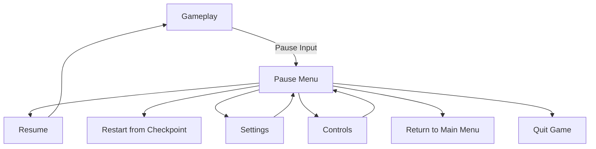

---

## Pause Behavior

Pause 상태에서는 다음 기준을 따른다.

- 게임플레이 입력 차단
- 메뉴 입력 활성화
- 필요한 경우 World Time 정지
- UI Animation은 계속 재생 가능
- 현재 선택 항목 명확하게 표시
- Pause 해제 시 기존 플레이 상태 복원

---

## Restart from Checkpoint

선택 시 마지막 체크포인트에서 다시 시작한다.

실수로 선택하지 않도록 확인 단계를 제공할 수 있다.

예시:

```text
마지막 체크포인트에서 다시 시작하시겠습니까?
```

---

## Return to Main Menu

저장되지 않은 진행 정보가 존재할 수 있다면 경고한다.

자동 저장이 완료된 상태라면 불필요한 경고를 표시하지 않는다.

---

# Settings Menu

## Settings Categories

설정은 다음 범주로 구성한다.

```text
Gameplay
Video
Audio
Controls
Accessibility
Language
```

프로젝트 범위에 따라 범주를 통합할 수 있다.

---

# Gameplay Settings

| 설정 | 설명 |
|------|------|
| Tutorial Prompts | 튜토리얼 표시 여부 |
| Camera Sensitivity | 카메라 감도 |
| Camera Invert X | 수평 반전 |
| Camera Invert Y | 수직 반전 |
| Camera Shake | 카메라 흔들림 강도 |
| Vibration | 컨트롤러 진동 |
| Auto Respawn | 실패 후 자동 Respawn |

카메라 방식이 확정되면 관련 설정을 조정한다.

---

# Video Settings

| 설정 | 설명 |
|------|------|
| Display Mode | Fullscreen / Windowed |
| Resolution | 화면 해상도 |
| Resolution Scale | 렌더링 비율 |
| Frame Rate Limit | 최대 프레임 |
| VSync | 수직 동기화 |
| Overall Quality | 전체 품질 |
| Shadow Quality | 그림자 품질 |
| Effects Quality | 효과 품질 |
| Post Processing | 후처리 품질 |
| Motion Blur | 모션 블러 |
| Brightness | 밝기 |

---

## Brightness Calibration

Spark는 어둠이 게임플레이에 직접 영향을 주므로
초기 실행 시 Brightness Calibration을 제공하는 것을 권장한다.

```text
왼쪽 이미지는 보이지 않고,
가운데 이미지는 희미하게 보이며,
오른쪽 이미지는 명확하게 보이도록 조정하세요.
```

밝기 설정으로 퍼즐 전체가 쉽게 보이거나
반대로 플레이가 불가능해지지 않도록 허용 범위를 제한한다.

---

# Audio Settings

| 설정 | 설명 |
|------|------|
| Master Volume | 전체 음량 |
| Music Volume | 음악 |
| SFX Volume | 효과음 |
| Ambience Volume | 환경음 |
| UI Volume | UI 사운드 |
| Voice Volume | 음성 |
| Mute When Unfocused | 비활성 창 음소거 |

Spark 효과음은 게임플레이 피드백이므로,
SFX가 너무 낮을 때도 필요한 정보를 다른 방식으로 인식할 수 있어야 한다.

---

# Control Settings

## Supported Devices

- Keyboard and Mouse
- Gamepad

입력 장치가 변경되면 UI 아이콘을 자동으로 변경한다.

---

## Input Remapping

가능한 경우 주요 Gameplay Action의 재지정을 지원한다.

| Action | 기본 입력 예시 |
|--------|----------------|
| Move | WASD / Left Stick |
| Look | Mouse / Right Stick |
| Jump | Space / Face Button |
| Interact | E / Face Button |
| Pause | Escape / Menu Button |

시스템 예약 키나 중복 입력을 적절히 처리한다.

---

## Rebinding Flow

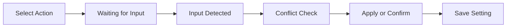

---

## Input Conflict

이미 사용 중인 입력을 선택하면 다음 중 하나를 제공한다.

- 기존 입력과 교체
- 중복 허용
- 취소

프로젝트에서는 입력 충돌을 자동으로 숨기지 않는다.

---

# Accessibility

## Accessibility Goal

플레이어가 시각, 청각, 입력 방식의 차이로 인해
핵심 게임 정보를 놓치지 않도록 한다.

---

## Visual Accessibility

권장 설정:

- Brightness
- Spark Intensity
- Flash Reduction
- Motion Blur
- Camera Shake
- UI Scale
- High Contrast Interaction
- Color Filter 또는 색상 대체
- Subtitle Size

---

## Spark Accessibility

Spark는 짧고 밝은 효과이므로 다음 설정을 고려한다.

| 설정 | 기능 |
|------|------|
| Spark Brightness | 밝기 조절 |
| Spark Duration | 잔광 시간 조절 |
| Flash Reduction | 순간 섬광 감소 |
| Particle Density | 입자 수 감소 |
| Camera Feedback | 흔들림 감소 또는 비활성화 |

설정 변경이 게임 규칙 자체를 변경하지 않도록 한다.

---

## Color Accessibility

게임 정보를 색상만으로 구분하지 않는다.

추가 구분 요소:

- 아이콘
- 형태
- 패턴
- 밝기
- 애니메이션
- 사운드

Metal, Rubber, Cable은 색상 외에도
재질과 실루엣으로 구분되어야 한다.

---

## Audio Accessibility

중요한 사운드 정보에는 시각적 피드백을 함께 제공한다.

예시:

- 장치 활성화
- 체크포인트 저장
- 위험 발생
- 상호작용 가능
- 퍼즐 성공
- 문 개방

---

## Input Accessibility

고려할 기능:

- 입력 재지정
- Hold와 Toggle 선택
- 반복 입력 최소화
- 스틱 감도 조절
- Dead Zone 조절
- 진동 강도 조절
- 빠른 입력 요구 완화

---

# Subtitle and Text

## Subtitle Rules

음성 또는 중요한 시스템 안내가 있는 경우 자막을 제공한다.

자막은 다음 기준을 따른다.

- 충분한 배경 대비
- 읽을 수 있는 크기
- 한 번에 과도한 문장 표시 금지
- 화자 구분
- 효과음 자막 지원 가능
- UI Safe Zone 준수

---

## Text Style

텍스트는 짧고 명확하게 작성한다.

문체 기준:

- 행동 중심
- 능동형
- 일관된 용어
- 불필요한 전문 용어 최소화
- 버튼 명칭과 실제 입력 일치

---

## Terminology

프로젝트에서 동일한 개념은 항상 동일한 용어로 표기한다.

| 개념 | 표준 표현 |
|------|-----------|
| 저장 지점 | 체크포인트 |
| 상호작용 | 상호작용 |
| 전력 복구 | 전원 복구 |
| 다시 시작 | 체크포인트에서 다시 시작 |
| 설정 | 설정 |
| 종료 | 게임 종료 |

용어는 전체 문서와 게임 UI에서 통일한다.

---

# Failure UX

## Failure Principle

실패는 플레이 흐름을 오래 중단하지 않아야 한다.

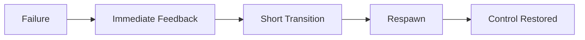

---

## Failure Feedback

실패 시 다음 요소를 사용할 수 있다.

- 캐릭터 Animation
- Spark 소멸
- 짧은 Sound
- 화면 Fade
- 간단한 Failure Message

과도하게 긴 연출이나 반복되는 문구는 사용하지 않는다.

---

## Failure Message

가능한 문구:

```text
신호 손실
```

```text
시스템 정지
```

```text
체크포인트에서 복구 중
```

일반적인 `Game Over`보다 세계관에 맞는 표현을 우선할 수 있다.

---

## Respawn UX

Respawn은 빠르고 예측 가능해야 한다.

권장 흐름:

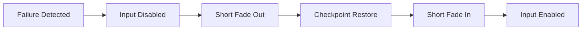

플레이어가 실패한 이유를 파악할 수 있을 정도의 시간은 제공하되,
불필요한 대기 시간은 최소화한다.

---

# Loading UX

## Loading Screen

로딩 화면은 다음 정보를 제공할 수 있다.

- 게임 로고
- 구역 이름
- 진행 상태
- 조작 팁
- 세계관 문구
- 간단한 애니메이션

---

## Loading Tips

팁은 현재 진행 단계와 관련된 내용을 우선한다.

예시:

- 금속 표면은 움직임에 반응하여 Spark를 생성합니다.
- 고무 표면에서는 Spark가 발생하지 않습니다.
- 벽에서 미끄러지는 동안 주변 공간을 확인할 수 있습니다.
- 케이블은 다른 표면보다 강한 빛을 만듭니다.

아직 학습하지 않은 퍼즐 해답을 직접 알려주지 않는다.

---

## Seamless Transition

가능한 경우 다음 전환은 짧은 Fade로 처리한다.

- Level Start
- Respawn
- Checkpoint Restore
- Main Menu Return
- Major Area Transition

---

# Navigation Flow

## Global Navigation

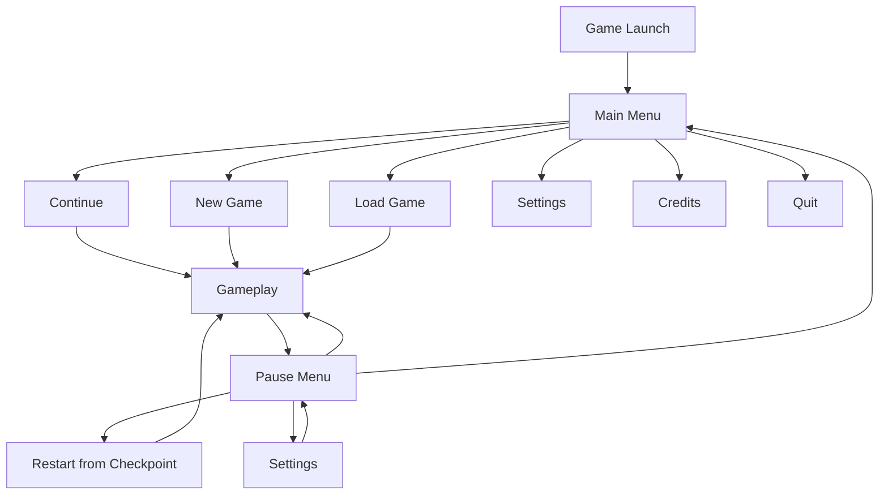

---

## Menu Navigation Rules

- 위아래 이동으로 항목을 선택한다.
- Confirm으로 선택한다.
- Back으로 이전 화면에 돌아간다.
- 현재 선택 항목은 명확하게 강조한다.
- 첫 번째 유효 항목에 기본 포커스를 둔다.
- 마우스와 Gamepad 전환 시 포커스가 사라지지 않도록 한다.
- 비활성 항목은 선택할 수 없음을 명확히 표현한다.

---

# Focus and Selection

## Focus State

UI 요소는 최소한 다음 상태를 가진다.

| 상태 | 설명 |
|------|------|
| Normal | 기본 상태 |
| Hovered | 마우스가 올라간 상태 |
| Focused | 키보드 또는 Gamepad 선택 상태 |
| Pressed | 입력 중 |
| Disabled | 사용할 수 없음 |

각 상태는 색상만이 아니라
크기, 테두리, 밝기, 움직임 등으로 함께 구분한다.

---

## Default Focus

메뉴 진입 시 반드시 유효한 기본 Focus가 존재해야 한다.

Focus가 화면 밖으로 이동하거나
비활성 버튼에 남지 않도록 관리한다.

---

# UI Visual Direction

## UI Style

Spark UI는 산업 시설의 제어 시스템을 기반으로 한다.

시각적 특징:

- 간결한 패널
- 얇은 선
- 제한된 색상
- 기계적 아이콘
- 상태 표시등
- 작은 전기 노이즈
- 높은 텍스트 가독성

UI를 지나치게 손상되거나 읽기 어렵게 표현하지 않는다.

---

## UI Color

| 용도 | 방향 |
|------|------|
| Background | 반투명 Dark Gray |
| Default Text | White 또는 Light Gray |
| Focus | Warm Yellow 또는 Cyan |
| Confirm | Green |
| Warning | Orange |
| Error | Red |
| Disabled | Low Contrast Gray |

게임 월드의 강조 색상과 충돌하지 않도록 조정한다.

---

## Typography

폰트는 다음 기준을 따른다.

- 작은 크기에서도 읽을 수 있음
- 한글과 영문 모두 지원
- 숫자와 기호 구분이 명확함
- 지나치게 장식적이지 않음
- 산업적 분위기와 어울림

제목과 본문은 크기와 굵기로 계층을 구분한다.

---

## Iconography

아이콘은 단순한 형태와 일관된 선 굵기를 사용한다.

필요한 아이콘:

- Keyboard Key
- Mouse Button
- Gamepad Button
- Save
- Settings
- Audio
- Video
- Controls
- Accessibility
- Warning
- Checkpoint
- Interaction

아이콘만으로 의미가 불명확하면 텍스트를 함께 표시한다.

---

# UI Animation

## Animation Principle

UI Animation은 상태 변화를 알려주기 위해 사용한다.

권장 효과:

- 짧은 Fade
- 작은 Slide
- Focus Scale
- Border Pulse
- Progress Rotation

지양:

- 긴 화면 전환
- 과도한 흔들림
- 반복되는 강한 점멸
- 입력을 늦추는 애니메이션
- 정보 가독성을 떨어뜨리는 Glitch

---

## Timing

UI는 빠르게 반응해야 한다.

| Animation | 방향 |
|-----------|------|
| Button Focus | 즉시 또는 매우 짧게 |
| Panel Open | 짧게 |
| Notification | 빠르게 등장 후 유지 |
| Menu Transition | 짧게 |
| Error Feedback | 즉시 |
| Fade Transition | 상황에 따라 제한적으로 사용 |

애니메이션이 끝나기 전에도 가능한 경우 입력을 받을 수 있어야 한다.

---

# Notification System

## Notification Types

| 종류 | 예시 |
|------|------|
| System | 저장 완료 |
| Progress | 목표 갱신 |
| Tutorial | 새로운 조작 |
| Warning | 저장 실패 |
| Interaction | 전력이 필요함 |

---

## Notification Priority

동시에 여러 메시지가 발생하면 우선순위에 따라 처리한다.

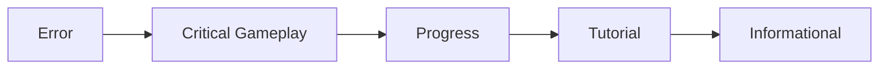

낮은 우선순위 메시지는 대기하거나 생략할 수 있다.

---

## Notification Rules

- 동일 메시지 반복 표시 제한
- 화면 중앙 점유 최소화
- 짧고 명확한 문구 사용
- 중요한 오류는 사용자가 인식할 시간을 제공
- 일반 알림은 자동으로 사라짐
- 서로 겹치지 않도록 Queue 관리

---

# Confirmation Dialog

확인 창은 되돌리기 어려운 행동에만 사용한다.

필요한 경우:

- 저장 데이터 초기화
- Main Menu로 이동
- 게임 종료
- 설정 초기화
- 저장 슬롯 삭제

불필요한 경우:

- Pause 해제
- 설정 화면 열기
- 메뉴 항목 이동
- 일반 상호작용

---

## Dialog Structure

```text
Title

Description

Primary Action
Secondary Action
```

위험한 행동에서는 안전한 선택을 기본 Focus로 설정한다.

---

# Error UX

## Error Principle

오류 메시지는 문제와 가능한 해결 방법을 함께 제공한다.

나쁜 예:

```text
Error 1034
```

좋은 예:

```text
저장 데이터를 불러올 수 없습니다.
새 게임을 시작하거나 다시 시도하세요.
```

---

## Error Categories

| 오류 | 처리 |
|------|------|
| Save Load Failure | 재시도 또는 새 게임 |
| Save Write Failure | 경고 후 플레이 지속 |
| Missing Input Mapping | 기본 입력 복원 |
| Invalid Settings | 기본값 적용 |
| Level Load Failure | Main Menu 복귀 |
| Disconnected Controller | 입력 장치 안내 |

오류로 인해 UI가 조작 불가능한 상태에 빠지지 않도록 한다.

---

# UI Architecture

## Architecture Overview

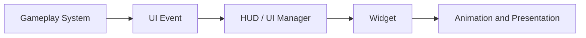

Gameplay Logic이 Widget을 직접 제어하는 구조를 최소화한다.

---

## Responsibility

| 객체 | 책임 |
|------|------|
| PlayerController | UI 입력 모드 관리 |
| HUD 또는 UI Manager | Widget 생성과 화면 전환 |
| Widget | 정보 표시와 사용자 입력 전달 |
| Gameplay System | 실제 게임 상태 관리 |
| Settings System | 설정 저장 및 적용 |

---

## Widget Structure

```text
UI

├── HUD
│   ├── Interaction Prompt
│   ├── Notification
│   ├── Tutorial Prompt
│   └── Saving Indicator
│
├── Menu
│   ├── Main Menu
│   ├── Pause Menu
│   ├── Settings
│   ├── Controls
│   ├── Credits
│   └── Confirmation Dialog
│
└── Transition
    ├── Loading Screen
    ├── Fade
    └── Failure Screen
```

---

## Communication Rules

UI와 Gameplay System은 다음 방식으로 통신한다.

1. Delegate
2. Event
3. Interface
4. 제한적인 직접 참조

Widget이 Gameplay System의 내부 상태를 지속적으로 Polling하지 않도록 한다.

---

## Event-Based UI

권장 흐름:

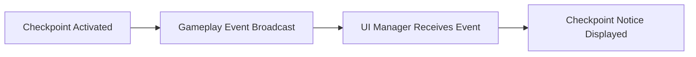

지양하는 흐름:

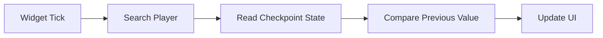

---

# Input Mode

## Gameplay Mode

- Character 입력 활성화
- Camera 입력 활성화
- UI Cursor 비활성화
- 필요한 Contextual UI만 표시

---

## Menu Mode

- Gameplay 입력 차단
- UI 입력 활성화
- 기본 Focus 설정
- 필요 시 Mouse Cursor 활성화

---

## Mixed Mode

상황에 따라 Gameplay와 UI 입력을 동시에 사용할 수 있다.

예시:

- Interaction Prompt
- Tutorial Prompt
- 짧은 Objective Notice

Mixed Mode에서는 UI가 이동 입력을 차단하지 않는다.

---

# Settings Persistence

설정 데이터는 게임 진행 데이터와 분리하여 관리할 수 있다.

저장 항목:

- Video
- Audio
- Controls
- Gameplay
- Accessibility
- Language

설정 변경은 가능한 경우 즉시 적용한다.

적용에 재시작이 필요한 설정은 명확하게 안내한다.

---

# Localization

UI Text는 Localization을 고려하여 작성한다.

기준:

- 문자열을 Widget에 직접 고정하지 않는다.
- Text 길이가 증가할 공간을 확보한다.
- 문장 조각을 코드에서 조합하지 않는다.
- 숫자와 날짜 형식을 지역에 맞게 처리한다.
- Font가 대상 언어를 지원하는지 확인한다.
- 버튼 크기를 고정 텍스트 길이에만 맞추지 않는다.

---

# Responsive Layout

UI는 다양한 해상도와 화면 비율에서 동작해야 한다.

검토 대상:

- 16:9
- 16:10
- 21:9
- Windowed Mode
- 낮은 해상도
- 높은 DPI

Anchor와 Scale Box를 적절히 사용하고,
절대 좌표 중심의 배치를 지양한다.

---

# UX Flow by Gameplay Event

Interaction, Checkpoint, Failure Event의 흐름은 각각
[Interaction UI](#interaction-ui), [Checkpoint UX](#checkpoint-ux),
[Failure UX](#failure-ux) 섹션 참고.

## Spark Gameplay Event

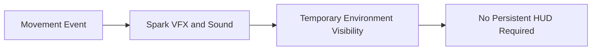

Spark 정보는 UI보다 월드 피드백으로 전달한다.

---

# Wireframe Overview

## Gameplay HUD

```text
┌────────────────────────────────────────────────────────────┐
│                                                            │
│                                                            │
│                         GAME WORLD                         │
│                                                            │
│                                                            │
│                                   [E] 전원 연결            │
│                                                            │
│  저장 중...                                                │
└────────────────────────────────────────────────────────────┘
```

---

## Main Menu

```text
┌────────────────────────────────────────────────────────────┐
│                                                            │
│                           SPARK                            │
│                                                            │
│                         Continue                           │
│                         New Game                           │
│                         Load Game                          │
│                         Settings                           │
│                         Credits                            │
│                         Quit                               │
│                                                            │
└────────────────────────────────────────────────────────────┘
```

---

## Pause Menu

```text
┌────────────────────────────────────────────────────────────┐
│                                                            │
│                          PAUSED                            │
│                                                            │
│                          Resume                            │
│                 Restart from Checkpoint                    │
│                         Settings                           │
│                         Controls                           │
│                    Return to Main Menu                     │
│                        Quit Game                           │
│                                                            │
└────────────────────────────────────────────────────────────┘
```

---

## Settings

```text
┌────────────────────────────────────────────────────────────┐
│ Settings                                                   │
├───────────────┬────────────────────────────────────────────┤
│ Gameplay      │ Camera Sensitivity        [────●────]      │
│ Video         │ Camera Shake              [ On / Off ]     │
│ Audio         │ Tutorial Prompts          [ On / Off ]     │
│ Controls      │ Auto Respawn              [ On / Off ]     │
│ Accessibility│                                            │
│ Language      │                                            │
├───────────────┴────────────────────────────────────────────┤
│ Back                                      Apply            │
└────────────────────────────────────────────────────────────┘
```

---

# UI Performance

## Performance Rules

- 사용하지 않는 Widget은 제거하거나 비활성화한다.
- 불필요한 Tick을 사용하지 않는다.
- Binding 함수의 지속적인 실행을 최소화한다.
- Event 기반으로 UI를 갱신한다.
- 복잡한 Material Effect를 제한한다.
- 큰 Blur 영역을 남용하지 않는다.
- 반복 생성되는 Widget은 재사용을 검토한다.
- Animation 동시 실행 수를 관리한다.

---

## Widget Update Policy

자주 변경되지 않는 값은 이벤트가 발생할 때만 갱신한다.

예시:

| 정보 | 갱신 시점 |
|------|-----------|
| Interaction Text | 대상 변경 시 |
| Checkpoint Notice | 활성화 시 |
| Objective | 목표 변경 시 |
| Input Icon | 입력 장치 변경 시 |
| Settings Value | 사용자가 변경 시 |
| Save Indicator | 저장 시작 및 종료 시 |

---

# UX Test Plan

## First-Time User Test

확인 항목:

- 설명 없이 이동 방법을 이해하는가
- Spark가 시야를 제공한다는 것을 이해하는가
- Metal과 Rubber의 차이를 인식하는가
- Interaction Prompt를 이해하는가
- 체크포인트 활성화를 알아차리는가
- 실패 후 무엇이 일어났는지 이해하는가

---

## Menu Navigation Test

- Keyboard만으로 모든 메뉴를 조작할 수 있는가
- Gamepad만으로 모든 메뉴를 조작할 수 있는가
- Mouse와 Gamepad 전환이 자연스러운가
- Focus가 사라지는 구간이 없는가
- Back 입력이 일관적으로 동작하는가
- 비활성 메뉴가 명확히 구분되는가

---

## Accessibility Test

- 색상 없이도 상태를 구분할 수 있는가
- Flash Reduction 설정이 적용되는가
- Camera Shake를 줄이거나 끌 수 있는가
- 작은 텍스트를 확대할 수 있는가
- 중요한 사운드가 시각적으로도 표현되는가
- 입력 재지정 후 모든 Prompt가 갱신되는가

---

## Resolution Test

- UI가 화면 밖으로 벗어나지 않는가
- 텍스트가 잘리지 않는가
- 버튼이 겹치지 않는가
- Safe Zone을 준수하는가
- Ultra-Wide에서 과도하게 벌어지지 않는가
- Window 크기 변경에 대응하는가

---

# UX Review Checklist

## Gameplay HUD

- 기본 화면이 불필요한 UI로 가려지지 않는가
- 필요한 순간에 Prompt가 나타나는가
- Prompt가 잘못된 대상을 가리키지 않는가
- 입력 아이콘이 현재 장치와 일치하는가
- 알림이 플레이를 방해하지 않는가

## Menu

- 현재 선택 항목이 명확한가
- 모든 화면에서 Back이 동작하는가
- 위험한 행동에 확인 단계가 있는가
- 기본 Focus가 올바르게 설정되는가
- 메뉴 이동 속도가 적절한가

## Feedback

- 행동 결과를 즉시 이해할 수 있는가
- 성공과 실패 상태가 구분되는가
- 저장 상태를 알 수 있는가
- 오류 메시지가 해결 방법을 제공하는가
- 반복 메시지가 과도하지 않은가

## Accessibility

- 색상 외의 구분 수단이 있는가
- 밝기와 Flash를 조절할 수 있는가
- Camera Feedback을 줄일 수 있는가
- UI Scale을 조절할 수 있는가
- Keyboard와 Gamepad를 모두 지원하는가

---

# UI / UX Rules

Spark의 모든 UI와 UX는 다음 규칙을 따른다.

- 게임 월드를 UI보다 우선한다.
- HUD는 필요한 순간에만 표시한다.
- 플레이어 행동에는 즉각적인 피드백을 제공한다.
- UI가 퍼즐의 해답을 대신하지 않는다.
- 메뉴 입력과 Gameplay 입력을 명확히 구분한다.
- 모든 메뉴에 유효한 Focus를 제공한다.
- 텍스트는 짧고 행동 중심으로 작성한다.
- 입력 장치에 맞는 아이콘을 표시한다.
- 색상만으로 정보를 전달하지 않는다.
- 중요한 설정은 저장하여 다음 실행에도 유지한다.
- 오류 발생 후에도 사용자가 안전하게 이전 화면으로 돌아갈 수 있어야 한다.
- Widget Tick과 지속적인 Binding을 최소화한다.
- UI Animation은 정보 전달을 돕고 입력을 방해하지 않아야 한다.
- 다양한 해상도와 화면 비율을 지원한다.
- 접근성 옵션은 핵심 게임 규칙을 훼손하지 않는 범위에서 제공한다.

---

# Related Documents

- [01_GDD.md](./01_GDD.md)
- [02_Architecture.md](./02_Architecture.md)
- [03_Gameplay_Framework.md](./03_Gameplay_Framework.md)
- [04_Level_Design.md](./04_Level_Design.md)
- [05_Art_Direction.md](./05_Art_Direction.md)
- [07_Coding_Convention.md](./07_Coding_Convention.md)

---

# Summary

Spark의 UI / UX는 화면에 많은 정보를 표시하는 대신,
게임 월드와 플레이어 행동을 통해 상태를 이해하도록 설계한다.

기본 HUD는 최소화하고,
상호작용, 체크포인트, 목표 변경, 실패와 같이
플레이어의 판단에 필요한 순간에만 UI를 표시한다.

메뉴는 Keyboard, Mouse, Gamepad에서 일관되게 동작해야 하며,
명확한 Focus와 단순한 Navigation Flow를 제공해야 한다.

Spark의 UI는 플레이를 설명하는 별도의 화면이 아니라,
빛과 환경을 관찰하고 기억하는 핵심 경험을 방해하지 않으면서
필요한 정보만 전달하는 보조 시스템이다.
