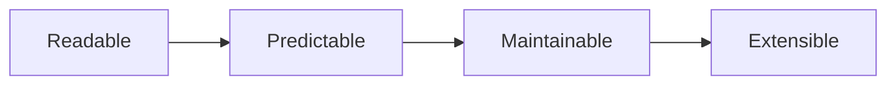
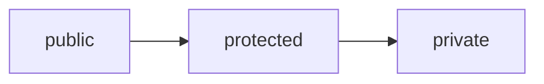
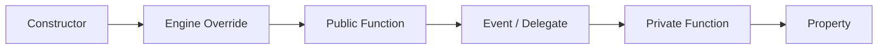
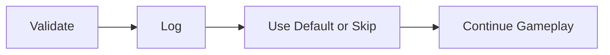
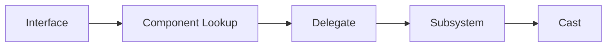
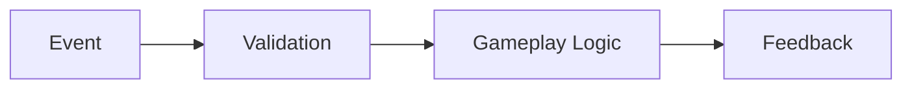
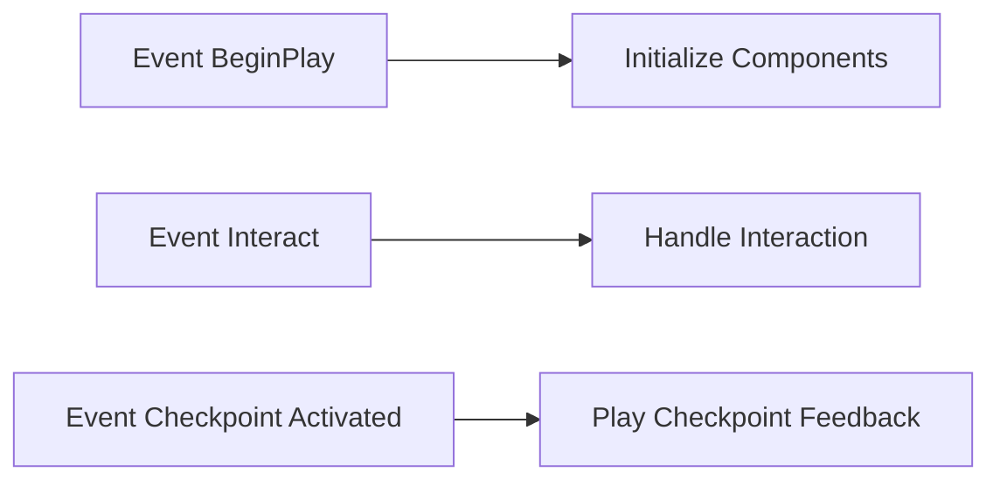
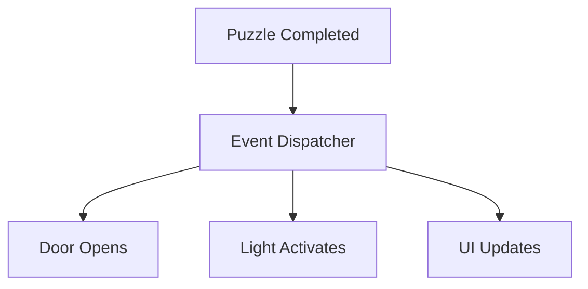
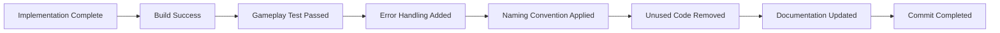

──────────────────────────────────────────────────────────────────────────────

# Spark Technical Documentation

## Volume 07

# Coding Convention

Version 1.0

Unreal Engine 5.5.4

──────────────────────────────────────────────────────────────────────────────

> Move to See. Remember to Survive.

본 문서는 Spark 프로젝트에서 사용하는 C++, Blueprint, Asset, Folder, Git 작성 규칙을 정의한다.

Coding Convention의 목적은 단순히 이름을 통일하는 것이 아니다.

모든 코드와 Asset이 동일한 기준으로 작성되도록 하여
가독성, 유지보수성, 검색 편의성, 협업 효율을 확보하는 것을 목표로 한다.

---

# Executive Summary

## 목적

본 문서는 Spark 프로젝트의 개발 규칙을 정의한다.

주요 범위는 다음과 같다.

- C++ Naming Convention
- C++ Code Style
- Header와 Source 구성
- Unreal Engine 클래스 작성 규칙
- Component 작성 규칙
- Blueprint Naming Convention
- Blueprint Graph 작성 규칙
- Asset Naming Convention
- Folder Structure
- Logging
- Error Handling
- Comment와 Documentation
- Git Convention
- Code Review Checklist

---

## Core Principle

Spark의 Coding Convention은 다음 원칙을 따른다.



코드는 작성자만 이해할 수 있어서는 안 된다.

이름과 구조만 보더라도 역할을 예측할 수 있어야 한다.

---

# General Rules

모든 코드와 Asset은 다음 기준을 따른다.

- 이름만으로 역할을 이해할 수 있어야 한다.
- 약어 사용을 최소화한다.
- 하나의 클래스는 하나의 책임만 가진다.
- 함수는 하나의 동작만 수행한다.
- 중복 코드를 줄인다.
- 직접 참조를 최소화한다.
- Tick보다 Event 기반 처리를 우선한다.
- Blueprint보다 C++에 핵심 규칙을 작성한다.
- 임시 코드는 명확히 표시하거나 제거한다.
- 사용하지 않는 코드와 Asset을 남기지 않는다.

---

# Language Policy

## Code

코드 식별자는 영어를 사용한다.

대상:

- Class
- Function
- Variable
- Enum
- Struct
- Interface
- Delegate
- Folder
- Asset

예시:

```cpp
GenerateSpark();
ActivateCheckpoint();
CurrentSurfaceType;
```

---

## Comment

주석은 영어 또는 한국어를 사용할 수 있다.

단, 하나의 파일에서는 가능하면 같은 언어를 유지한다.

공개 API와 기술적 설명은 영어를 권장한다.

---

## UI Text

플레이어에게 표시되는 문구는 Localization Text로 관리한다.

코드에 사용자 표시 문자열을 직접 작성하지 않는다.

---

# C++ Naming Convention

Unreal Engine의 기본 Naming Convention을 따른다.

---

## Class Prefix

| 대상         | Prefix | 예시                             |
| ------------ | ------ | -------------------------------- |
| Actor        | A      | `ASparkCharacter`                |
| UObject      | U      | `USparkComponent`                |
| Slate Widget | S      | `SSparkWidget`                   |
| Interface    | I / U  | `IInteractable`, `UInteractable` |
| Enum         | E      | `ESparkSurfaceType`              |
| Struct       | F      | `FSparkEffectData`               |
| Template     | T      | `TArray`                         |
| Boolean      | b      | `bIsWallSliding`                 |

---

## Project Class Naming

프로젝트 클래스는 역할을 명확하게 포함한다.

권장:

```cpp
ASparkCharacter
ASparkGameMode
ASparkPlayerController
USparkComponent
UInteractionComponent
UCheckpointComponent
USparkGameInstance
USparkSaveGame
```

지양:

```cpp
APlayer
AMainCharacter
UManager
UHelper
UFunctionComponent
```

범용적인 이름보다 구체적인 책임을 표현한다.

---

# Variable Naming

## Member Variable

멤버 변수는 PascalCase를 사용한다.

```cpp
float SparkIntensity;
FVector LastCheckpointLocation;
TObjectPtr<USparkComponent> SparkComponent;
```

---

## Local Variable

지역 변수도 PascalCase를 사용한다.

```cpp
const FVector TraceStart = GetActorLocation();
const bool bCanGenerateSpark = SurfaceData != nullptr;
```

---

## Boolean

Boolean은 `b` Prefix를 사용한다.

```cpp
bool bIsGrounded;
bool bCanInteract;
bool bCheckpointActivated;
```

상태를 나타내는 이름을 사용한다.

권장:

```cpp
bIsWallSliding
bHasValidSurface
bCanRespawn
```

지양:

```cpp
bWall
bCheck
bState
```

---

## Pointer and Reference

변수 이름에 `Ptr`, `Pointer`, `Ref`를 불필요하게 포함하지 않는다.

권장:

```cpp
USparkComponent* SparkComponent;
AActor* InteractionTarget;
```

지양:

```cpp
USparkComponent* SparkComponentPtr;
AActor* InteractionTargetPointer;
```

단, Weak Pointer나 Soft Reference처럼 의미가 필요한 경우에는 구분할 수 있다.

```cpp
TWeakObjectPtr<AActor> CachedTarget;
TSoftObjectPtr<UNiagaraSystem> SparkEffect;
```

---

## Collection

Collection은 복수형을 사용한다.

```cpp
TArray<AActor*> InteractionTargets;
TMap<ESparkSurfaceType, FSparkEffectData> SurfaceEffects;
```

지양:

```cpp
TArray<AActor*> ActorList;
TArray<AActor*> Data;
```

---

# Function Naming

함수는 동사로 시작한다.

```cpp
GenerateSpark();
FindInteractionTarget();
ActivateCheckpoint();
LoadSaveData();
```

---

## Getter

값을 반환하는 함수는 `Get`을 사용한다.

```cpp
GetCurrentSurfaceType();
GetInteractionText();
GetLastCheckpointLocation();
```

단순 Boolean 확인은 `Is`, `Has`, `Can`, `Should`를 사용한다.

```cpp
IsWallSliding();
HasValidCheckpoint();
CanInteract();
ShouldGenerateSpark();
```

---

## Setter

값을 설정하는 함수는 `Set`을 사용한다.

```cpp
SetSparkIntensity();
SetInteractionTarget();
SetCheckpointLocation();
```

---

## Event Handler

Event Handler는 발생 원인을 명확하게 표현한다.

```cpp
HandleLanded();
HandleWallJump();
HandleCheckpointActivated();
HandleInteractionTargetChanged();
```

Unreal Delegate에 연결되는 함수도 같은 규칙을 사용한다.

---

## Blueprint Event

Blueprint에서 구현할 Event는 의미를 명확히 한다.

```cpp
UFUNCTION(BlueprintImplementableEvent)
void PlaySparkEffect(const FSparkEffectData& EffectData);
```

```cpp
UFUNCTION(BlueprintNativeEvent)
void OnCheckpointActivated();
```

`DoSomething`, `Event1`, `ExecuteFX`처럼 모호한 이름을 사용하지 않는다.

---

# Enum Convention

Enum은 `E` Prefix를 사용한다.

```cpp
UENUM(BlueprintType)
enum class ESparkSurfaceType : uint8
{
    None,
    Metal,
    Rubber,
    Cable
};
```

---

## Enum Value

Enum Value에는 Enum 이름을 반복하지 않는다.

권장:

```cpp
enum class ESparkSurfaceType : uint8
{
    None,
    Metal,
    Rubber,
    Cable
};
```

지양:

```cpp
enum class ESparkSurfaceType : uint8
{
    SparkSurface_None,
    SparkSurface_Metal,
    SparkSurface_Rubber
};
```

---

## Invalid Value

필요한 경우 명시적인 기본값을 제공한다.

```cpp
None
Invalid
Unknown
```

기본 상태를 안전하게 처리할 수 있어야 한다.

---

# Struct Convention

Struct는 `F` Prefix를 사용하고 데이터의 목적을 이름에 포함한다.

```cpp
USTRUCT(BlueprintType)
struct FSparkEffectData
{
    GENERATED_BODY()

    UPROPERTY(EditDefaultsOnly, BlueprintReadOnly)
    float Intensity = 1.0f;

    UPROPERTY(EditDefaultsOnly, BlueprintReadOnly)
    float Radius = 200.0f;

    UPROPERTY(EditDefaultsOnly, BlueprintReadOnly)
    TObjectPtr<UNiagaraSystem> Effect;
};
```

Struct는 관련된 데이터를 하나의 의미 있는 단위로 묶을 때 사용한다.

---

# Interface Convention

Interface는 기능 또는 능력을 표현한다.

```cpp
UINTERFACE(BlueprintType)
class UInteractable : public UInterface
{
    GENERATED_BODY()
};

class IInteractable
{
    GENERATED_BODY()

public:
    virtual bool CanInteract() const = 0;
    virtual void Interact(AActor* InstigatorActor) = 0;
};
```

---

## Interface Naming

권장:

```cpp
IInteractable
ISparkReceiver
ICheckpointProvider
```

지양:

```cpp
IObjectInterface
IGameplayInterface
IActorFunction
```

Interface 이름만으로 어떤 기능을 제공하는지 알 수 있어야 한다.

---

# Delegate Convention

Delegate는 발생한 사건을 표현한다.

```cpp
DECLARE_DYNAMIC_MULTICAST_DELEGATE(FOnCheckpointActivated);
DECLARE_DYNAMIC_MULTICAST_DELEGATE_OneParam(
    FOnInteractionTargetChanged,
    AActor*,
    NewTarget
);
```

---

## Delegate Variable

Delegate 변수는 `On`으로 시작한다.

```cpp
UPROPERTY(BlueprintAssignable)
FOnCheckpointActivated OnCheckpointActivated;
```

```cpp
UPROPERTY(BlueprintAssignable)
FOnInteractionTargetChanged OnInteractionTargetChanged;
```

---

# Header File Structure

Header 파일은 다음 순서를 권장한다.

```cpp
#pragma once

#include "CoreMinimal.h"
#include "Components/ActorComponent.h"
#include "SparkComponent.generated.h"

class UNiagaraSystem;
class USparkSurfaceData;

UCLASS(...)
class SPARK_API USparkComponent : public UActorComponent
{
    GENERATED_BODY()

public:
    USparkComponent();

protected:
    virtual void BeginPlay() override;

private:
    void GenerateSparkInternal();

private:
    UPROPERTY(...)
    TObjectPtr<USparkSurfaceData> SurfaceData;
};
```

---

## Header Include Rule

Header에는 필요한 최소 Include만 작성한다.

가능한 경우 Forward Declaration을 사용한다.

권장:

```cpp
class UNiagaraSystem;
class UAudioComponent;
```

Source 파일에서 실제 Header를 Include한다.

```cpp
#include "NiagaraSystem.h"
#include "Components/AudioComponent.h"
```

---

## Include Order

Source 파일 Include 순서는 다음을 권장한다.

```cpp
#include "SparkComponent.h"

#include "NiagaraSystem.h"
#include "PhysicalMaterials/PhysicalMaterial.h"

#include "Data/SparkSurfaceData.h"
#include "Utility/SparkSurfaceLibrary.h"
```

순서:

1. 자신의 Header
2. Unreal Engine Header
3. Plugin Header
4. Project Header

---

# Access Modifier Order

Class 내부에서는 다음 순서를 권장한다.



각 Access Modifier 안에서는 다음 순서로 구성한다.



---

# UPROPERTY Rules

Unreal Object Reference는 가능한 경우 `TObjectPtr`을 사용한다.

```cpp
UPROPERTY(VisibleAnywhere, BlueprintReadOnly, Category = "Spark")
TObjectPtr<USparkComponent> SparkComponent;
```

---

## Property Specifier

Property의 사용 목적에 맞는 Specifier를 선택한다.

| 목적           | Specifier             |
| -------------- | --------------------- |
| 기본값 편집    | `EditDefaultsOnly`    |
| Instance 편집  | `EditInstanceOnly`    |
| 모두 편집      | `EditAnywhere`        |
| Blueprint 읽기 | `BlueprintReadOnly`   |
| Blueprint 쓰기 | `BlueprintReadWrite`  |
| 내부 표시      | `VisibleAnywhere`     |
| Delegate 연결  | `BlueprintAssignable` |

불필요하게 `EditAnywhere`와 `BlueprintReadWrite`를 사용하지 않는다.

---

## Category

Category는 시스템 이름을 기준으로 작성한다.

```cpp
UPROPERTY(EditDefaultsOnly, Category = "Spark|Effect")
float SparkIntensity;
```

```cpp
UPROPERTY(EditDefaultsOnly, Category = "Interaction|Trace")
float InteractionDistance;
```

Category가 지나치게 깊어지지 않도록 한다.

---

## Default Value

가능한 Property는 선언 시 기본값을 지정한다.

```cpp
float SparkIntensity = 1.0f;
float InteractionDistance = 300.0f;
bool bAutoActivate = false;
```

초기화되지 않은 값을 사용하지 않는다.

---

# UFUNCTION Rules

Blueprint에 노출할 필요가 있는 함수만 노출한다.

```cpp
UFUNCTION(BlueprintCallable, Category = "Spark")
void GenerateSpark(ESparkSurfaceType SurfaceType);
```

내부 전용 함수에는 `UFUNCTION`을 사용하지 않는다.

---

## BlueprintPure

상태를 변경하지 않고 값만 반환하는 경우에만 사용한다.

```cpp
UFUNCTION(BlueprintPure, Category = "Interaction")
bool CanInteract() const;
```

비용이 큰 연산에는 BlueprintPure 사용을 피한다.

Pure Function은 Blueprint Graph에서 반복 호출될 수 있다.

---

## Const Correctness

상태를 변경하지 않는 함수는 `const`로 작성한다.

```cpp
bool CanInteract() const;
FVector GetLastCheckpointLocation() const;
```

입력 데이터를 변경하지 않는 Parameter는 `const` Reference로 전달한다.

```cpp
void ApplySparkData(const FSparkEffectData& EffectData);
```

---

# Class Responsibility

하나의 클래스는 하나의 주요 책임만 가진다.

---

## Character

`ASparkCharacter`는 다음 책임만 가진다.

- Character 구성
- 기본 이동
- 점프
- Component 소유
- Movement Event 전달

Character가 직접 담당하지 않는 항목:

- Spark Effect 설정
- Save Data 직렬화
- Interaction 대상 로직
- Checkpoint 저장
- UI Widget 생성

---

## Component

Component는 하나의 Gameplay 기능을 담당한다.

| Component                  | 책임                          |
| -------------------------- | ----------------------------- |
| SparkComponent             | Spark 생성 요청과 효과 이벤트 |
| InteractionComponent       | 대상 탐지와 상호작용 요청     |
| CheckpointComponent        | Checkpoint 상태와 복원 정보   |
| CharacterMovementComponent | 이동 상태와 물리              |

Surface 판정은 `Surface Utility`가 담당하며, `SparkComponent`는 판정 결과만 사용한다.

---

## Manager

`Manager` 이름의 클래스 생성을 최소화한다.

Manager가 필요하다면 다음을 명확히 정의해야 한다.

- 관리 대상
- 생명주기
- 소유 객체
- 데이터 저장 위치
- 다른 시스템과의 통신 방식

`GameManager`, `SystemManager`, `DataManager`처럼 지나치게 광범위한 클래스는 만들지 않는다.

---

# Function Size

함수는 하나의 동작을 수행하도록 작게 유지한다.

지양:

```cpp
void USparkComponent::UpdateSpark()
{
    // Surface trace
    // Data load
    // Effect spawn
    // Audio play
    // Camera shake
    // Save update
    // UI notification
}
```

권장:

```cpp
void USparkComponent::GenerateSpark()
{
    const ESparkSurfaceType SurfaceType = DetectSurfaceType();
    const FSparkEffectData* EffectData = FindEffectData(SurfaceType);

    if (EffectData == nullptr)
    {
        return;
    }

    BroadcastSparkEvent(*EffectData);
}
```

---

# Early Return

중첩 조건문보다 Early Return을 우선한다.

지양:

```cpp
if (Owner != nullptr)
{
    if (SurfaceData != nullptr)
    {
        if (bCanGenerateSpark)
        {
            GenerateSpark();
        }
    }
}
```

권장:

```cpp
if (Owner == nullptr)
{
    return;
}

if (SurfaceData == nullptr)
{
    return;
}

if (!bCanGenerateSpark)
{
    return;
}

GenerateSpark();
```

---

# Null Validation

Pointer를 사용하기 전에 유효성을 확인한다.

```cpp
if (!IsValid(InteractionTarget))
{
    return;
}
```

필수 객체가 없을 경우 로그를 남길 수 있다.

```cpp
if (!IsValid(SurfaceData))
{
    UE_LOG(
        LogSpark,
        Warning,
        TEXT("SurfaceData is not assigned in %s."),
        *GetNameSafe(this)
    );

    return;
}
```

---

# Assertions

복구 가능한 상황에는 `ensure`를 사용할 수 있다.

```cpp
if (!ensure(SparkComponent != nullptr))
{
    return;
}
```

절대로 발생해서는 안 되는 개발 오류에만 `check`를 사용한다.

```cpp
check(CharacterMovementComponent);
```

Shipping Build에서 복구가 필요한 상황에 `check`를 사용하지 않는다.

---

# Logging Convention

프로젝트 전용 Log Category를 사용한다.

```cpp
DECLARE_LOG_CATEGORY_EXTERN(LogSpark, Log, All);
```

```cpp
DEFINE_LOG_CATEGORY(LogSpark);
```

---

## Log Level

| Level   | 용도               |
| ------- | ------------------ |
| Verbose | 매우 상세한 디버깅 |
| Log     | 일반 실행 정보     |
| Display | 중요한 상태 표시   |
| Warning | 복구 가능한 문제   |
| Error   | 기능 실패          |
| Fatal   | 복구 불가능한 오류 |

---

## Log Message

로그에는 대상과 원인을 포함한다.

권장:

```cpp
UE_LOG(
    LogSpark,
    Warning,
    TEXT("Failed to generate spark: SurfaceData is null. Owner: %s"),
    *GetNameSafe(GetOwner())
);
```

지양:

```cpp
UE_LOG(LogTemp, Warning, TEXT("Error"));
```

`LogTemp`는 임시 디버깅 외에는 사용하지 않는다.

---

# Error Handling

오류는 가능한 경우 안전하게 복구한다.

---

## Recoverable Error

예시:

- Data Asset 없음
- 저장 실패
- Interaction Target 없음
- Physical Material 없음
- Effect Asset 없음

처리 방식:



---

## Non-Recoverable Error

개발 중 반드시 수정해야 하는 구조적 오류는 명확하게 표시한다.

예시:

- 필수 Component 생성 실패
- 잘못된 Class 설정
- 필수 Subsystem 없음
- 불가능한 State 진입

---

# Tick Policy

Tick은 기본적으로 비활성화한다.

```cpp
PrimaryComponentTick.bCanEverTick = false;
```

필요한 경우에만 활성화한다.

---

## Tick 사용 가능 사례

- Wall Slide 중 지속 Surface 판정
- Camera Follow 보간
- 시간 기반 연출
- 짧은 상태 추적

---

## Tick 대체 방법

Tick보다 다음 방식을 우선한다.

- Delegate
- Timer
- Overlap Event
- Movement Event
- Input Event
- Animation Notify
- Gameplay Event

---

## Tick Function

Tick을 사용한다면 함수 내부 비용을 최소화한다.

```cpp
void UInteractionComponent::TickComponent(
    float DeltaTime,
    ELevelTick TickType,
    FActorComponentTickFunction* ThisTickFunction
)
{
    Super::TickComponent(DeltaTime, TickType, ThisTickFunction);

    UpdateInteractionTarget();
}
```

매 Tick마다 불필요한 Object 검색이나 Asset Load를 수행하지 않는다.

---

# Casting Rules

Cast 사용을 최소화한다.

우선순위:



---

## Acceptable Cast

소유 관계가 명확하고 Class가 고정된 경우 사용할 수 있다.

```cpp
ASparkCharacter* Character = Cast<ASparkCharacter>(GetOwner());
```

반복 Cast가 필요한 경우 결과를 캐싱한다.

---

## Prohibited Pattern

```cpp
GetAllActorsOfClass()
```

를 일반 Gameplay 흐름이나 Tick에서 사용하지 않는다.

필요한 객체는 Spawn 또는 BeginPlay 시 Reference를 확보하거나
Subsystem, Interface, Delegate를 활용한다.

---

# Object Reference Rules

## Hard Reference

항상 필요한 핵심 Class와 Asset에 사용한다.

예시:

- Character Component
- 기본 Data Asset
- 필수 Animation Blueprint

---

## Soft Reference

선택적이거나 큰 Asset에 사용한다.

예시:

- Niagara Effect
- Optional Sound
- Level Asset
- Cinematic Asset

```cpp
TSoftObjectPtr<UNiagaraSystem> SparkEffect;
```

---

## Weak Reference

소유하지 않는 임시 Actor 참조에 사용한다.

```cpp
TWeakObjectPtr<AActor> CurrentInteractionTarget;
```

---

# Data Asset Convention

Data Asset은 데이터 종류를 명확하게 표현한다.

Class 예시:

```cpp
USparkSurfaceData
USparkEffectData
USparkAudioData
```

Asset 예시:

```text
DA_Surface_Metal
DA_Surface_Rubber
DA_Surface_Cable
```

---

## Data Ownership

데이터는 가능한 한 Data Asset에 저장한다.

코드에 직접 작성하지 않는 항목:

- Effect Asset
- Sound Asset
- Surface별 Intensity
- Surface별 Radius
- UI 표시 문구
- 조정 가능한 Gameplay 값

---

# Blueprint Naming Convention

Blueprint Asset은 Prefix를 사용한다.

| Asset                      | Prefix | 예시                 |
| -------------------------- | ------ | -------------------- |
| Blueprint Actor            | BP_    | `BP_Checkpoint`      |
| Blueprint Component        | BPC_   | `BPC_PuzzleTrigger`  |
| Blueprint Interface        | BPI_   | `BPI_Interactable`   |
| Widget Blueprint           | WBP_   | `WBP_PauseMenu`      |
| Animation Blueprint        | ABP_   | `ABP_SparkCharacter` |
| Blueprint Function Library | BPFL_  | `BPFL_UIUtility`     |
| Blueprint Macro Library    | BPML_  | `BPML_Gameplay`      |
| Enumeration                | E_     | `E_PuzzleState`      |
| Structure                  | S_     | `S_PuzzleData`       |

C++에 대응되는 Blueprint는 C++ Class 역할을 반복하지 않는다.

---

## Blueprint Child

C++ Class의 Blueprint Child는 역할을 명확히 한다.

```text
BP_SparkCharacter
BP_SparkGameMode
BP_Checkpoint
BP_Lever
BP_Cable
```

지양:

```text
BP_Character_New
BP_Test2
BP_Final
BP_FinalReal
BP_Copy
```

---

# Blueprint Variable Naming

Blueprint 변수도 C++과 동일한 의미 기준을 따른다.

권장:

```text
SparkIntensity
InteractionTarget
bIsActivated
CheckpointLocation
```

지양:

```text
Var1
Temp
Test
Boolean
ActorRef
```

---

## Blueprint Category

변수와 함수는 Category로 정리한다.

```text
Spark
Spark|Effect
Spark|Audio
Interaction
Interaction|Trace
Checkpoint
Checkpoint|Save
```

---

# Blueprint Graph Rules

## Graph Direction

Execution Flow는 왼쪽에서 오른쪽으로 작성한다.



노드가 역방향으로 연결되지 않도록 한다.

---

## Node Alignment

- 실행 노드를 정렬한다.
- 데이터 노드는 가까운 위치에 배치한다.
- 긴 Wire가 Graph 전체를 가로지르지 않도록 한다.
- Reroute Node를 사용해 흐름을 정리한다.
- 관련 노드는 Comment Box로 묶는다.

---

## Graph Size

하나의 Graph가 지나치게 커지면 Function 또는 Macro로 분리한다.

권장 기준:

- 하나의 화면 안에서 주요 흐름 확인 가능
- 하나의 Function은 하나의 동작 수행
- 반복 로직은 Function으로 추출
- 상태별 로직은 별도 Function으로 분리

---

## Event Graph

Event Graph에는 전체 흐름만 남긴다.

권장:



복잡한 구현은 Function으로 분리한다.

---

## Blueprint Function

함수 이름은 동사로 시작한다.

```text
UpdateInteractionPrompt
PlayCheckpointEffect
SetPuzzleState
RefreshInputIcon
```

함수 내부에서 예상하지 못한 외부 상태를 과도하게 변경하지 않는다.

---

## Pure Function

상태를 변경하지 않는 간단한 계산에만 사용한다.

Pure Function에서 다음을 수행하지 않는다.

- Actor Spawn
- Save
- 상태 변경
- Event Broadcast
- Widget 생성
- 긴 Trace
- 복잡한 반복문

---

## Macro

Macro 사용을 최소화한다.

Macro는 실행 흐름을 단순화하는 짧은 반복 패턴에 사용한다.

일반 Gameplay Logic은 Function을 우선한다.

---

# Blueprint Communication

Blueprint 간 통신 우선순위는 다음과 같다.

1. Blueprint Interface
2. Event Dispatcher
3. Component
4. Direct Reference
5. Cast

---

## Event Dispatcher

소유자가 Event를 알리고 여러 객체가 반응해야 할 때 사용한다.

예시:



---

## Blueprint Interface

상호작용 대상처럼 공통 행동이 필요한 경우 사용한다.

```text
CanInteract
Interact
GetInteractionText
```

---

# Blueprint Tick Policy

Blueprint Tick 사용을 최소화한다.

매 Tick에서 다음 노드를 사용하지 않는다.

- Get All Actors of Class
- Spawn Actor
- Load Asset
- Create Widget
- Find Object
- 큰 For Loop
- 반복 Cast

Tick이 필요하다면 해당 조건에서만 활성화한다.

---

# Asset Naming Convention

모든 Asset은 Prefix를 사용한다.

---

## Common Prefix

| Asset Type         | Prefix | 예시                   |
| ------------------ | ------ | ---------------------- |
| Static Mesh        | SM_    | `SM_FactoryWall_A`     |
| Skeletal Mesh      | SK_    | `SK_SparkRobot`        |
| Material           | M_     | `M_MasterMetal`        |
| Material Instance  | MI_    | `MI_Metal_Rusted`      |
| Material Function  | MF_    | `MF_EdgeWear`          |
| Texture            | T_     | `T_Metal_BaseColor`    |
| Normal Texture     | T_     | `T_Metal_Normal`       |
| Niagara System     | NS_    | `NS_Spark_Landing`     |
| Niagara Emitter    | NE_    | `NE_Spark_Core`        |
| Sound Wave         | S_     | `S_Spark_Landing`      |
| Sound Cue          | SC_    | `SC_Spark_Landing`     |
| MetaSound          | MS_    | `MS_Spark_Surface`     |
| Animation Sequence | A_     | `A_Robot_WallSlide`    |
| Animation Montage  | AM_    | `AM_Robot_Interact`    |
| Blend Space        | BS_    | `BS_Robot_Locomotion`  |
| Physics Asset      | PHYS_  | `PHYS_SparkRobot`      |
| Data Asset         | DA_    | `DA_Surface_Metal`     |
| Data Table         | DT_    | `DT_SurfaceSettings`   |
| Curve              | Curve_ | `Curve_SparkIntensity` |
| Level              | L_     | `L_Factory_01`         |
| Level Sequence     | LS_    | `LS_Intro`             |
| Render Target      | RT_    | `RT_SparkMask`         |
| Input Action       | IA_    | `IA_Jump`              |
| Input Mapping Context | IMC_ | `IMC_Default`         |

---

## Asset Suffix

필요한 경우 변형을 Suffix로 구분한다.

```text
SM_Pipe_Straight_A
SM_Pipe_Corner_A
SM_Pipe_Straight_B
```

```text
MI_Metal_Clean
MI_Metal_Rusted
MI_Metal_Burned
```

`New`, `Final`, `Copy`, `Backup`을 이름에 사용하지 않는다.

---

# Texture Naming

Texture의 용도를 이름에 포함한다.

| Texture           | Suffix  |
| ----------------- | ------- |
| Base Color        | `_BC`   |
| Normal            | `_N`    |
| Roughness         | `_R`    |
| Metallic          | `_M`    |
| Ambient Occlusion | `_AO`   |
| Emissive          | `_E`    |
| Mask              | `_Mask` |
| Packed Map        | `_ORM`  |

예시:

```text
T_MetalPanel_BC
T_MetalPanel_N
T_MetalPanel_ORM
```

---

# Folder Structure

프로젝트 Content Folder는 기능과 Asset 종류를 기준으로 구성한다.

```text
Content/

├── Spark/
│   ├── Art/
│   │   ├── Characters/
│   │   ├── Environment/
│   │   ├── Materials/
│   │   ├── Textures/
│   │   └── VFX/
│   │
│   ├── Audio/
│   │   ├── Music/
│   │   ├── SFX/
│   │   └── MetaSounds/
│   │
│   ├── Blueprints/
│   │   ├── Characters/
│   │   ├── Components/
│   │   ├── Interactions/
│   │   ├── Puzzles/
│   │   └── Framework/
│   │
│   ├── Input/
│   │   ├── Actions/
│   │   └── Contexts/
│   │
│   ├── Data/
│   │   ├── Surface/
│   │   ├── Spark/
│   │   └── Settings/
│   │
│   ├── Levels/
│   │   ├── Blockout/
│   │   ├── Gameplay/
│   │   └── Lighting/
│   │
│   ├── UI/
│   │   ├── HUD/
│   │   ├── Menu/
│   │   ├── Icons/
│   │   └── Fonts/
│   │
│   └── Developer/
│
└── ThirdParty/
```

---

## Folder Rules

- 모든 프로젝트 Asset은 `Content/Spark` 아래에 둔다.
- Marketplace Asset은 별도 Folder에 유지한다.
- 프로젝트 Asset과 외부 Asset을 섞지 않는다.
- Root Folder에 Asset을 직접 배치하지 않는다.
- 개인 테스트 Asset은 `Developer` Folder를 사용한다.
- 사용하지 않는 Empty Folder는 제거한다.

---

# C++ Folder Structure

```text
Source/Spark/

├── Character/
│   ├── SparkCharacter.h
│   └── SparkCharacter.cpp
│
├── Components/
│   ├── SparkComponent.h
│   ├── InteractionComponent.h
│   └── CheckpointComponent.h
│
├── Framework/
│   ├── SparkGameMode.h
│   ├── SparkPlayerController.h
│   └── SparkGameInstance.h
│
├── Interaction/
│   └── Interactable.h
│
├── Save/
│   └── SparkSaveGame.h
│
├── Data/
│   ├── SparkEffectData.h
│   └── SparkSurfaceData.h
│
├── Utility/
│   └── SparkSurfaceLibrary.h
│
└── Spark.h
```

폴더는 Namespace 역할을 하므로 지나치게 깊게 만들지 않는다.

---

# Comment Convention

Function과 Class 위에는 무엇을 하는 코드인지 요약하는 주석을 남긴다.

```cpp
// Character의 착지, Wall Slide, Wall Jump 이벤트를 받아 Spark를 생성한다.
void USparkComponent::HandleMovementEvent(...)
```

코드 내부 개별 라인 주석은 무엇을 하는지보다
왜 그렇게 작성했는지를 설명한다. 코드를 그대로 읽으면 알 수 있는 내용을
줄 단위로 반복해서 설명하지 않는다.

지양:

```cpp
// Set intensity
SparkIntensity = 1.0f;
```

권장:

```cpp
// Keep the minimum intensity above zero so the landing feedback
// remains visible in low-brightness accessibility settings.
SparkIntensity = FMath::Max(NewIntensity, MinimumIntensity);
```

---

## TODO

TODO에는 이유와 작업 내용을 포함한다.

```cpp
// TODO: Replace the temporary trace with cached wall contact data
// after the custom movement mode is implemented.
```

가능하면 Issue 번호를 연결한다.

```cpp
// TODO(SPARK-42): Add async loading for optional Niagara assets.
```

완료되지 않은 TODO를 무기한 남기지 않는다.

---

## Public API Documentation

공개 함수에는 역할, Parameter, Return Value를 설명한다.

```cpp
/**
 * Attempts to generate a spark using the current contact surface.
 *
 * @param ContactLocation World position where the spark is generated.
 * @return True when valid spark data was found and the event was emitted.
 */
bool TryGenerateSpark(const FVector& ContactLocation);
```

---

# Code Formatting

## Braces

중괄호는 새 줄에 작성한다.

```cpp
if (bCanInteract)
{
    Interact();
}
```

한 줄 조건문도 중괄호를 사용한다.

---

## Indentation

Tab 또는 프로젝트 Editor 설정을 일관되게 사용한다.

파일마다 들여쓰기 방식이 달라지지 않도록 한다.

---

## Line Length

지나치게 긴 줄은 여러 줄로 분리한다.

```cpp
const FSparkEffectData* EffectData =
    SurfaceData->FindEffectData(CurrentSurfaceType);
```

함수 Parameter가 많다면 세로로 정렬한다.

```cpp
void GenerateSpark(
    ESparkSurfaceType SurfaceType,
    const FVector& Location,
    const FVector& Normal,
    float Strength
);
```

---

## Auto

타입이 명확하거나 반복이 긴 경우에만 `auto`를 사용한다.

권장:

```cpp
const auto* EffectData = SurfaceData->FindEffectData(SurfaceType);
```

지양:

```cpp
auto Value = GetValue();
```

반환 타입을 알기 어려운 경우 명시적으로 작성한다.

---

# Magic Number

의미 없는 숫자를 코드에 직접 사용하지 않는다.

지양:

```cpp
if (Velocity.Z < -600.0f)
{
    GenerateSpark(2.0f);
}
```

권장:

```cpp
constexpr float HeavyLandingVelocity = -600.0f;

if (Velocity.Z < HeavyLandingVelocity)
{
    GenerateSpark(HeavyLandingStrength);
}
```

조정 가능한 값은 Property 또는 Data Asset으로 관리한다.

---

# Performance Convention

다음 작업은 반복 실행 구간에서 피한다.

- Actor 전체 검색
- Asset 동기 로드
- Widget 반복 생성
- 불필요한 Dynamic Material 생성
- 큰 Array 복사
- 반복 Cast
- 문자열 조합
- 복잡한 Blueprint Binding
- 과도한 Collision Query

---

## Cache Rule

반복 조회되는 객체는 안전하게 캐싱한다.

```cpp
void USparkComponent::BeginPlay()
{
    Super::BeginPlay();

    OwnerCharacter = Cast<ASparkCharacter>(GetOwner());
}
```

캐싱된 객체가 파괴될 수 있다면 Weak Pointer 또는 유효성 검사를 사용한다.

---

# Save Data Convention

Save 데이터는 Runtime Object Reference를 직접 저장하지 않는다.

저장 가능한 값 예시:

- Transform
- Name
- Enum
- Integer
- Boolean
- Gameplay ID
- Level Name
- Checkpoint ID

지양:

```cpp
UPROPERTY()
AActor* SavedCheckpointActor;
```

권장:

```cpp
UPROPERTY()
FName CheckpointId;

UPROPERTY()
FTransform CheckpointTransform;
```

---

# ID Convention

저장 또는 퍼즐 상태에 사용되는 ID는 안정적이어야 한다.

예시:

```text
Checkpoint_Factory_A_01
Puzzle_PowerRoom_01
Door_ControlRoom_Main
```

Actor Label이나 자동 생성 이름에 의존하지 않는다.

---

# Git Convention

## Branch Naming

| Branch        | 형식              |
| ------------- | ----------------- |
| Feature       | `feature/<name>`  |
| Fix           | `fix/<name>`      |
| Refactor      | `refactor/<name>` |
| Documentation | `docs/<name>`     |
| Asset         | `asset/<name>`    |

예시:

```text
feature/wall-jump
fix/checkpoint-respawn
refactor/spark-component
docs/gameplay-framework
asset/factory-modular-kit
```

---

## Commit Message

Commit은 하나의 의미 있는 변경 단위로 작성한다.

형식:

```text
Type: Summary
```

예시:

```text
Feature: Add wall slide spark event
Fix: Prevent invalid checkpoint respawn
Refactor: Separate surface query from SparkComponent
Docs: Add coding convention document
Asset: Add factory wall modular meshes
```

---

## Commit Type

| Type     | 용도                 |
| -------- | -------------------- |
| Feature  | 기능 추가            |
| Fix      | 버그 수정            |
| Refactor | 구조 개선            |
| Docs     | 문서                 |
| Asset    | Asset 추가 또는 수정 |
| UI       | UI 변경              |
| Audio    | Audio 변경           |
| Test     | 테스트               |
| Build    | Build 설정           |
| Chore    | 기타 관리 작업       |

---

## Commit Rules

- 하나의 Commit에는 하나의 목적만 포함한다.
- Build가 실패하는 상태로 Commit하지 않는다.
- 임시 파일을 Commit하지 않는다.
- 불필요한 Binary 변경을 포함하지 않는다.
- Commit 전 변경 파일을 확인한다.
- 대규모 Rename과 기능 변경을 가능하면 분리한다.

---

# Unreal Asset Version Control

Unreal Asset은 Binary이므로 충돌을 최소화해야 한다.

원칙:

- 같은 Blueprint를 동시에 수정하지 않는다.
- 같은 Level을 동시에 수정하지 않는다.
- 작업 시작 전 담당 Asset을 공유한다.
- Level은 필요한 경우 Sublevel로 분리한다.
- 충돌 가능성이 높은 Asset 수정은 작은 단위로 Commit한다.
- Redirector를 정리한 뒤 Commit한다.

---

# Redirector Policy

Asset 이동 또는 Rename 후 `Fix Up Redirectors`를 실행한다.

Redirector가 남은 상태로 장기간 작업하지 않는다.

이동과 Rename은 가능한 한 한 번에 계획적으로 수행한다.

---

# Temporary Asset Policy

임시 Asset은 다음 위치에서만 사용한다.

```text
Content/Spark/Developer/<UserName>/
```

임시 Asset 이름에는 용도를 명확히 한다.

```text
BP_Test_WallJump
L_Test_SparkLighting
MI_Test_RubberSurface
```

최종 Asset으로 이동할 때 Naming Convention을 적용한다.

---

# Deprecation Policy

더 이상 사용하지 않는 Class나 Function은 즉시 삭제하거나
명확한 Deprecation 절차를 따른다.

```cpp
UE_DEPRECATED(5.5, "Use GenerateSparkFromSurface instead.")
void GenerateSparkLegacy();
```

Deprecated API는 새로운 코드에서 사용하지 않는다.

---

# Blueprint Review Checklist

Blueprint 검토 시 다음 항목을 확인한다.

- Asset 이름이 Prefix 규칙을 따르는가
- Event Graph가 간결한가
- Function 이름이 역할을 설명하는가
- 긴 Wire가 정리되어 있는가
- Comment Box가 적절히 사용되었는가
- Tick을 불필요하게 사용하지 않는가
- 반복 Cast가 없는가
- Get All Actors of Class를 반복 실행하지 않는가
- 변수에 Category와 Tooltip이 있는가
- 사용하지 않는 변수와 노드가 제거되었는가
- Gameplay Rule이 Blueprint에 과도하게 구현되지 않았는가

---

# C++ Review Checklist

C++ 검토 시 다음 항목을 확인한다.

- Class 책임이 명확한가
- 함수가 하나의 동작만 수행하는가
- 이름만으로 역할을 이해할 수 있는가
- Null 검사가 필요한 위치에 존재하는가
- Error가 안전하게 처리되는가
- `const`를 적절히 사용했는가
- 불필요한 Include가 없는가
- Forward Declaration을 사용할 수 있는가
- Blueprint 노출 범위가 최소화되어 있는가
- Tick이 필요한가
- 반복 조회 값을 캐싱했는가
- Magic Number가 없는가
- Log Message가 충분한 정보를 제공하는가
- Object Reference 방식이 적절한가
- 사용하지 않는 코드가 제거되었는가

---

# Asset Review Checklist

Asset 검토 시 다음 항목을 확인한다.

- 올바른 Folder에 위치하는가
- Prefix와 이름 규칙을 따르는가
- `New`, `Final`, `Copy`가 이름에 없는가
- Material Instance를 활용하는가
- Texture 용도가 이름에 표시되는가
- Collision이 필요한 수준으로 단순화되었는가
- LOD 또는 Nanite 설정이 적절한가
- 사용하지 않는 Asset Reference가 없는가
- Redirector가 정리되었는가
- 외부 Asset과 프로젝트 Asset이 분리되어 있는가

---

# Definition of Done

기능이 완료되었다고 판단하려면 다음 기준을 만족해야 한다.



---

## Feature Completion Checklist

- 기능이 요구사항대로 동작한다.
- Editor와 Packaged Build에서 테스트한다.
- 실패 상황을 처리한다.
- 로그가 필요한 위치에 존재한다.
- Blueprint와 C++ 이름이 규칙을 따른다.
- 관련 Data Asset이 설정되어 있다.
- 사용하지 않는 Debug Code를 제거한다.
- 관련 문서를 갱신한다.
- 작은 단위의 Commit으로 정리한다.

---

# Coding Convention Rules

Spark의 모든 코드와 Asset은 다음 규칙을 따른다.

- Unreal Engine 기본 Naming Convention을 따른다.
- 모든 식별자는 역할을 명확하게 표현한다.
- 하나의 클래스와 함수는 하나의 책임만 가진다.
- 핵심 Gameplay Rule은 C++에 구현한다.
- Blueprint는 조립과 Presentation을 담당한다.
- Tick보다 Event 기반 구조를 우선한다.
- Cast와 직접 참조를 최소화한다.
- Object Reference는 생명주기에 맞는 타입을 사용한다.
- 조정 가능한 값은 Data Asset 또는 Property로 관리한다.
- Null과 실패 가능성을 항상 고려한다.
- 로그에는 대상과 실패 원인을 포함한다.
- 사용자 표시 문자열은 Localization Text로 관리한다.
- Asset에는 Prefix를 적용한다.
- 임시 이름과 불명확한 이름을 최종 Asset에 사용하지 않는다.
- 사용하지 않는 코드와 Asset은 제거한다.
- Commit은 하나의 목적을 가진 작은 단위로 작성한다.
- 문서와 실제 구현이 다르면 문서를 갱신한다.

---

# Related Documents

- [01_GDD.md](./01_GDD.md)
- [02_Architecture.md](./02_Architecture.md)
- [03_Gameplay_Framework.md](./03_Gameplay_Framework.md)
- [04_Level_Design.md](./04_Level_Design.md)
- [05_Art_Direction.md](./05_Art_Direction.md)
- [06_UI_UX.md](./06_UI_UX.md)
- [08_Roadmap.md](./08_Roadmap.md)
- [09_Asset_List.md](./09_Asset_List.md)
- [10_Dev_Log.md](./10_Dev_Log.md)
- [11_ADR.md](./11_ADR.md)

---

# Summary

Spark의 Coding Convention은 C++, Blueprint, Asset, Folder, Git 작업을
일관된 기준으로 관리하기 위해 작성되었다.

C++은 핵심 Gameplay Rule과 시스템 구조를 담당하며,
Blueprint는 레벨 조립과 시각적 표현을 담당한다.

모든 클래스와 함수는 하나의 책임을 가져야 하며,
Tick과 직접 참조보다 Event, Interface, Delegate를 우선한다.

Asset은 Prefix와 Folder 규칙을 따르고,
Git Commit은 하나의 목적을 가진 작은 변경 단위로 관리한다.

일관된 Coding Convention은 단순한 형식 규칙이 아니라
Spark 프로젝트의 유지보수성과 확장성을 지키는 개발 기준이다.
