──────────────────────────────────────────────────────────────────────────────

# Spark Technical Documentation

## Volume 08

# Development Roadmap

Version 1.0

Unreal Engine 5.5.4

──────────────────────────────────────────────────────────────────────────────

> Move to See. Remember to Survive.

본 문서는 Spark 프로젝트의 개발 단계, 마일스톤, 우선순위와 완료 기준을 정의한다.

Roadmap의 목적은 단순히 작업 목록을 나열하는 것이 아니다.

프로젝트의 핵심 경험을 가장 먼저 검증하고,
검증되지 않은 시스템과 Asset에 과도한 시간을 사용하지 않도록
개발 순서를 명확하게 관리하는 것을 목표로 한다.

---

# Executive Summary

## 목적

본 문서는 Spark 프로젝트를 완성하기 위한 전체 개발 흐름을 정의한다.

주요 범위는 다음과 같다.

- 개발 목표
- 우선순위
- 마일스톤
- 단계별 산출물
- 시스템 구현 순서
- 레벨 제작 순서
- 아트 및 UI 제작 순서
- 테스트 계획
- 리스크 관리
- 완료 기준
- 출시 준비

---

## Roadmap Goal

Spark의 개발 목표는 다음과 같다.

> 움직임으로 빛을 만들고, 드러난 공간을 기억하며 이동하는 경험을 완성한다.

모든 개발 작업은 이 핵심 경험에 기여해야 한다.

기능이 기술적으로 흥미롭더라도
핵심 경험과 직접적인 관련이 없다면 우선순위를 낮춘다.

---

# Development Philosophy

Spark의 개발은 다음 원칙을 따른다.

## Core First

핵심 게임플레이를 가장 먼저 구현하고 검증한다.

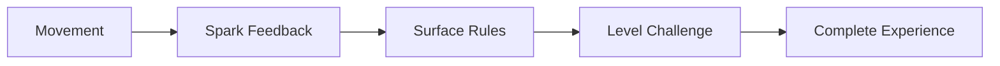

---

## Playable at Every Stage

각 개발 단계가 끝날 때마다 실행 가능한 Build를 유지한다.

완성되지 않은 기능이 있더라도
현재 구현된 범위 안에서 시작부터 종료까지 테스트할 수 있어야 한다.

---

## Validate Before Expanding

새로운 기능을 많이 추가하기 전에
기존 기능이 실제로 재미있고 이해 가능한지 검증한다.

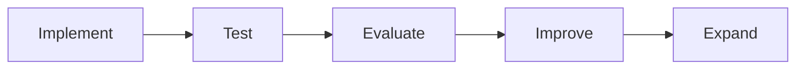

---

## Vertical Slice First

전체 게임을 넓고 얕게 제작하기보다,
짧은 구간을 완성도 높게 제작하여 전체 제작 방향을 검증한다.

Vertical Slice에는 다음 요소가 포함되어야 한다.

- 이동
- Spark
- Surface
- 퍼즐
- 체크포인트
- UI
- 환경 아트
- 조명
- 사운드
- 실패와 Respawn

---

## Scope Control

새로운 아이디어는 즉시 구현하지 않는다.

다음 질문을 먼저 확인한다.

- 핵심 경험에 필요한가
- 현재 마일스톤의 목표에 포함되는가
- 기존 시스템으로 해결할 수 없는가
- 일정에 미치는 영향은 어느 정도인가
- 제거해도 게임이 성립하는가

---

# Project Priorities

Spark의 개발 우선순위는 다음과 같다.

```text
P0 — Core Gameplay

P1 — Playable Progression

P2 — Presentation

P3 — Polish

P4 — Optional Features
```

---

## Priority Definition

| 우선순위 | 의미 | 예시 |
|----------|------|------|
| P0 | 게임 성립에 필수 | 이동, 점프, Spark |
| P1 | 진행과 완주에 필수 | 퍼즐, 체크포인트, 저장 |
| P2 | 경험 전달에 중요 | 조명, VFX, UI, 사운드 |
| P3 | 품질 향상 | 카메라 연출, 세부 애니메이션 |
| P4 | 제거 가능한 기능 | 추가 수집 요소, 선택 퍼즐 |

P0와 P1이 안정화되기 전에는
P3와 P4 작업을 우선하지 않는다.

---

# Development Phases

전체 개발은 다음 단계로 구성한다.

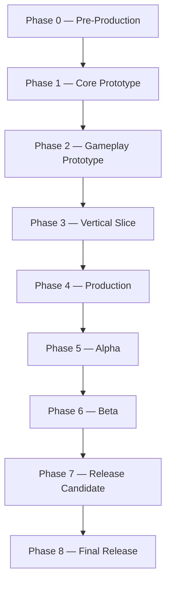

---

# Milestone Overview

| 단계 | 핵심 목표 | 결과물 |
|------|-----------|--------|
| Pre-Production | 범위와 구조 정의 | 설계 문서 |
| Core Prototype | 이동과 Spark 검증 | 핵심 프로토타입 |
| Gameplay Prototype | 퍼즐 루프 검증 | 플레이 가능한 테스트 레벨 |
| Vertical Slice | 최종 품질 기준 검증 | 완성형 짧은 구간 |
| Production | 전체 콘텐츠 제작 | 전체 레벨 |
| Alpha | 처음부터 끝까지 플레이 | Feature Complete Build |
| Beta | 안정성과 품질 개선 | Content Complete Build |
| Release Candidate | 출시 가능 상태 검증 | RC Build |
| Final Release | 최종 제출 및 배포 | Release Build |

---

# Phase 0 — Pre-Production

## 목표

프로젝트의 핵심 방향과 범위를 정의한다.

이 단계에서는 구현보다
무엇을 만들고 무엇을 만들지 않을지를 결정하는 것이 중요하다.

---

## 주요 작업

- GDD 작성
- Architecture 문서 작성
- Gameplay Framework 정의
- Level Design 원칙 정의
- Art Direction 정의
- UI / UX 기준 정의
- Coding Convention 정의
- Roadmap 작성
- Asset List 작성
- 개발 환경 설정

---

## 기술 검증 항목

- Unreal Engine 5.5.4 프로젝트 생성
- C++ 프로젝트 Build 확인
- Source Control 설정
- Enhanced Input 사용 가능 여부 확인
- Niagara 사용 가능 여부 확인
- Physical Material 및 Surface Type 테스트
- SaveGame 기본 동작 확인
- Target Platform Build 확인

---

## 범위 결정

Pre-Production 단계에서 다음 항목을 확정하거나 제한한다.

| 항목 | 결정 방향 |
|------|-----------|
| 장르 | 3D Puzzle Platformer |
| 핵심 메커니즘 | 움직임 기반 Spark |
| 주요 이동 | Move, Jump, Wall Slide, Wall Jump |
| 주요 Surface | Metal, Rubber, Cable |
| 전투 | 제외 |
| 복잡한 인벤토리 | 제외 |
| 스킬 트리 | 제외 |
| 멀티플레이 | 제외 |
| 오픈 월드 | 제외 |
| 카메라 | 프로토타입 후 확정 |

---

## 완료 기준

- 핵심 게임 콘셉트가 한 문장으로 설명 가능하다.
- 주요 시스템 책임이 정의되어 있다.
- 문서 구조가 확정되어 있다.
- 개발 우선순위가 정리되어 있다.
- 프로젝트가 정상적으로 Build된다.
- 최소 Target Platform에서 실행 가능하다.
- 제거할 기능과 보류할 기능이 구분되어 있다.

---

# Phase 1 — Core Prototype

## 목표

Spark의 가장 중요한 질문을 검증한다.

> 움직임으로 발생하는 빛이 실제로 재미있는 이동 경험을 만드는가?

아트 품질보다 조작감과 핵심 피드백을 우선한다.

---

## 구현 범위

### Character Movement

- 기본 이동
- 점프
- 공중 제어
- 착지 감지
- Wall Slide
- Wall Jump
- 실패 영역 감지
- 빠른 Respawn

---

### Spark System

- 착지 Spark
- Wall Slide Spark
- Wall Jump Spark
- 임시 Point Light
- 기본 Niagara Effect
- 기본 Sound
- 이벤트별 강도 차이

---

### Surface System

- Physical Material 설정
- Surface Type 판정
- Metal 반응
- Rubber 반응 없음
- Cable 강한 반응
- 기본 Data Asset 연결

---

### Test Level

다음 요소만 포함하는 Graybox Level을 제작한다.

- 평지 이동
- 점프 구간
- 어두운 통로
- Wall Slide 구간
- Wall Jump 구간
- Metal / Rubber 비교 구간
- Cable 테스트 구간
- 실패 영역

---

## Prototype Rules

이 단계에서는 다음 작업을 최소화한다.

- 최종 환경 모델링
- 고품질 Texture
- 복잡한 UI
- 완성형 Animation
- 스토리 연출
- 세부 Sound Design
- 추가 퍼즐 시스템

---

## 핵심 검증 질문

- 이동이 즉각적으로 반응하는가
- 점프 거리를 예측할 수 있는가
- Wall Slide 상태를 이해할 수 있는가
- Wall Jump 방향이 명확한가
- Spark가 공간 형태를 충분히 보여주는가
- Spark 지속 시간이 너무 짧거나 길지 않은가
- Surface 차이를 플레이어가 인식할 수 있는가
- 어둠이 흥미로운가, 단순히 불편한가
- 카메라가 이동을 방해하지 않는가
- 반복 Spark가 눈을 피로하게 하지 않는가

---

## 카메라 검증

Third Person, First Person, Fixed Camera 후보를 비교한다.

| 기준 | 평가 항목 |
|------|-----------|
| 이동 가독성 | 점프 거리와 착지 지점 판단 |
| 공간 기억 | Spark로 본 구조를 기억하기 쉬운가 |
| Wall Movement | 벽 접촉과 방향 전환이 보이는가 |
| 멀미 | 회전과 시야 변화가 과도하지 않은가 |
| 연출 | 환경과 캐릭터를 효과적으로 보여주는가 |
| 제작 비용 | Level과 Animation에 미치는 영향 |

Prototype 결과를 기준으로 카메라 방식을 확정한다.

---

## 완료 기준

- 기본 이동이 안정적으로 동작한다.
- Wall Slide와 Wall Jump가 일관되게 동작한다.
- 세 가지 Surface 규칙이 구분된다.
- 각 이동 Event에서 Spark가 발생한다.
- Spark로 주변 공간을 인식할 수 있다.
- 실패 후 빠르게 Respawn할 수 있다.
- 테스트 구간을 처음부터 끝까지 통과할 수 있다.
- 카메라 방식에 대한 방향이 결정된다.
- 핵심 메커니즘의 가능성을 확인했다.

---

# Phase 2 — Gameplay Prototype

## 목표

핵심 이동과 Spark를 이용한
실제 퍼즐 및 진행 구조를 검증한다.

---

## 구현 범위

### Interaction System

- 상호작용 대상 탐지
- `IInteractable`
- Interaction Prompt
- 상호작용 가능 여부 확인
- 장치 활성화
- 문 열기
- 케이블 연결

---

### Checkpoint System

- Checkpoint 등록
- 마지막 위치 저장
- 실패 후 복원
- Checkpoint Feedback
- 레벨 재시작 처리

---

### Basic Save System

- SaveGame Class
- Checkpoint ID 저장
- Level 정보 저장
- Player Transform 저장
- Save Load 실패 처리
- Continue 가능 여부 확인

---

### Puzzle Prototype

최소 세 종류의 퍼즐을 제작한다.

1. Surface Recognition Puzzle
2. Cable Activation Puzzle
3. Movement Combination Puzzle

---

## Surface Recognition Puzzle

플레이어가 Surface 차이를 관찰하고
올바른 경로를 선택하도록 설계한다.

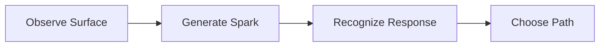

---

## Cable Activation Puzzle

강한 Spark와 전력 흐름을 이용하여
장치를 활성화한다.

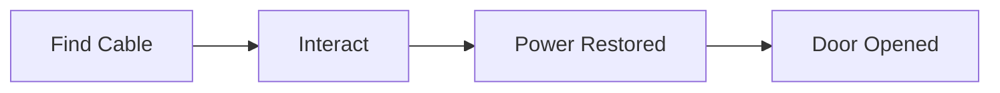

---

## Movement Combination Puzzle

Jump, Wall Slide, Wall Jump를 조합하여
하나의 구간을 통과한다.

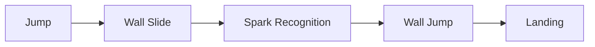

---

## UI Prototype

- Interaction Prompt
- Checkpoint Notice
- Saving Indicator
- Failure Transition
- Pause Menu
- Restart from Checkpoint

최종 UI 스타일보다 기능과 흐름을 우선한다.

---

## Gameplay Loop 검증

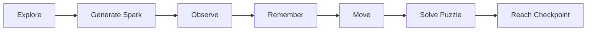

이 반복 구조가 자연스럽게 이어지는지 확인한다.

---

## 완료 기준

- Interaction System이 안정적으로 동작한다.
- Checkpoint에서 Respawn할 수 있다.
- 기본 Save와 Load가 동작한다.
- 최소 세 종류의 퍼즐이 플레이 가능하다.
- UI가 필요한 상황에만 표시된다.
- 테스트 레벨에 시작과 종료가 존재한다.
- 플레이어가 설명 없이 기본 진행을 이해할 수 있다.
- 전체 Gameplay Loop가 검증되었다.

---

# Phase 3 — Vertical Slice

## 목표

최종 게임의 품질과 제작 파이프라인을
짧은 완성형 구간에서 검증한다.

Vertical Slice는 단순한 데모가 아니라
전체 프로젝트의 품질 기준이 된다.

---

## Vertical Slice Scope

권장 플레이 시간:

```text
약 10분에서 20분
```

구성 예시:

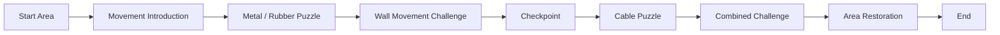

---

## 포함 시스템

- 최종에 가까운 Character Movement
- Spark System
- Surface System
- Interaction
- Checkpoint
- Save / Load
- Puzzle
- UI
- 실패 및 Respawn
- 설정 일부
- 최종 카메라
- 기본 접근성 옵션

---

## 포함 Presentation

- Modular Environment
- 최종 Material 기준
- Lighting 기준
- Niagara Effect 기준
- Character Model 기준
- Animation 기준
- Sound 기준
- UI Style 기준
- Environmental Storytelling

---

## Vertical Slice 제작 순서

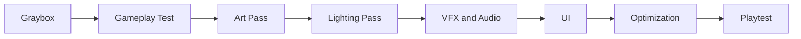

Gameplay가 검증되지 않은 상태에서
최종 Art Pass로 이동하지 않는다.

---

## Vertical Slice 검증 질문

- 게임의 핵심 콘셉트가 즉시 전달되는가
- 이동이 즐겁고 안정적인가
- 어둠과 Spark의 대비가 적절한가
- 퍼즐 규칙을 자연스럽게 학습할 수 있는가
- 환경이 진행을 안내하는가
- Checkpoint 간격이 적절한가
- 실패가 불공정하게 느껴지지 않는가
- 최종 아트 방향이 Gameplay를 방해하지 않는가
- Target Performance를 만족하는가
- 전체 게임 제작에 필요한 작업량을 예측할 수 있는가

---

## 완료 기준

- 처음부터 끝까지 완성된 짧은 구간이 존재한다.
- 핵심 시스템이 임시 코드 없이 연결되어 있다.
- 최종 Art Direction이 적용되어 있다.
- UI와 Audio가 포함되어 있다.
- Checkpoint와 Save가 안정적으로 동작한다.
- Target Platform에서 성능을 측정했다.
- 외부 플레이테스트를 진행했다.
- 주요 피드백이 문서화되어 있다.
- 전체 Production 범위를 추정할 수 있다.

---

# Phase 4 — Production

## 목표

Vertical Slice에서 검증한 기준을 사용하여
전체 게임 콘텐츠를 제작한다.

이 단계에서는 새로운 핵심 시스템을 만드는 것보다
검증된 시스템을 활용하여 레벨과 콘텐츠를 확장한다.

---

## Production Principles

- 새로운 시스템 추가를 최소화한다.
- 모든 레벨은 동일한 제작 파이프라인을 따른다.
- Graybox 검증 후 Art Pass를 진행한다.
- 완료되지 않은 레벨을 동시에 과도하게 늘리지 않는다.
- 레벨 단위로 시작부터 종료까지 완성한다.
- 반복 Asset은 Modular Kit으로 제작한다.
- 퍼즐은 Data와 Blueprint 조립으로 확장한다.

---

# Level Production Pipeline

각 레벨은 다음 단계를 따른다.

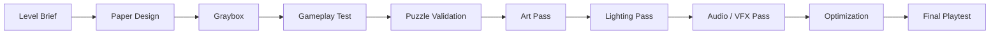

---

## Level Brief

각 레벨 제작 전 다음을 정의한다.

- 레벨 목표
- 새로운 메커니즘
- 재사용 메커니즘
- 주요 퍼즐
- 이동 난이도
- 체크포인트 위치
- 환경 테마
- 예상 플레이 시간
- 시작 상태
- 종료 상태

---

## Graybox

Graybox에서는 다음만 검증한다.

- 이동 가능 여부
- 점프 거리
- 시야
- 카메라
- 퍼즐 흐름
- 실패 지점
- 체크포인트 간격
- 전체 플레이 시간

시각적 디테일은 최소화한다.

---

## Gameplay Test

Graybox 완료 후 다음을 확인한다.

- 진행 방향이 명확한가
- 퍼즐 목표를 이해할 수 있는가
- 이동이 안정적인가
- 불필요한 대기 시간이 없는가
- 우회 또는 Sequence Break가 문제를 만드는가
- Checkpoint가 적절한가
- 반복 구간이 지루하지 않은가

---

## Art Pass

Gameplay가 승인된 구간만 Art Pass를 진행한다.

Art Pass 범위:

- Modular Mesh 배치
- Material 적용
- Background Composition
- Signage
- Environmental Storytelling
- Gameplay Surface 강조
- Collision 재확인

---

## Lighting Pass

- 기본 환경광
- Navigation Light
- Interactive Light
- Spark Visibility
- 위험 요소 강조
- Checkpoint Lighting
- 목표 지점 강조
- 성능 측정

---

## Audio and VFX Pass

- Spark Gameplay Event
- Surface별 Sound
- Environment Ambience
- Puzzle Success
- Door and Machine
- Checkpoint
- Failure
- Area Restoration

---

## Level Completion Criteria

- 시작부터 종료까지 플레이 가능하다.
- 필수 퍼즐이 모두 동작한다.
- 진행 불가능 상태가 발생하지 않는다.
- Checkpoint와 Respawn이 동작한다.
- Art와 Lighting이 적용되어 있다.
- Audio와 VFX가 적용되어 있다.
- 목표 성능을 만족한다.
- Playtest Checklist를 통과한다.
- 임시 Asset과 Debug Object가 제거되어 있다.

---

# Suggested Level Progression

전체 레벨 수는 Production 범위에 따라 조정한다.

권장 구조 예시:

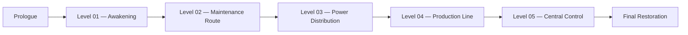

---

## Prologue

목표:

- 분위기 소개
- 기본 이동 소개
- Spark 개념 제시

메커니즘:

- Move
- Jump
- Landing Spark

---

## Level 01 — Awakening

목표:

- Metal과 Rubber 차이 학습
- 공간 기억 경험 제공

메커니즘:

- Surface Recognition
- Basic Traversal
- First Checkpoint

---

## Level 02 — Maintenance Route

목표:

- Wall Slide와 Wall Jump 학습

메커니즘:

- Vertical Movement
- Wall Spark
- Rubber Wall Variation

---

## Level 03 — Power Distribution

목표:

- Cable과 Interaction 학습

메커니즘:

- Cable Activation
- Door Control
- Power Routing

---

## Level 04 — Production Line

목표:

- 기존 메커니즘 조합
- 이동 타이밍 강화

메커니즘:

- Moving Machinery
- Combined Surface
- Multi-Step Puzzle

---

## Level 05 — Central Control

목표:

- 전체 메커니즘 숙달
- 최종 복합 퍼즐

메커니즘:

- Advanced Traversal
- Cable Network
- Multiple Checkpoints
- Facility Restoration

---

# System Production Order

시스템은 다음 순서로 구현한다.

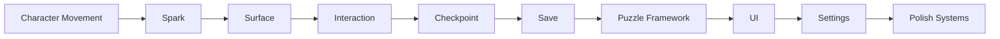

하위 시스템은 상위 시스템이 안정화된 후 확장한다.

---

# Art Production Order

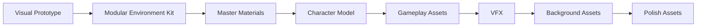

---

## Art Priority

| 우선순위 | Asset |
|----------|-------|
| P0 | Character, Platform, Surface |
| P1 | Checkpoint, Cable, Door, Puzzle Device |
| P2 | Modular Environment |
| P3 | Background Machinery |
| P4 | Decorative Props |

Gameplay Asset이 Background Asset보다 먼저 완성되어야 한다.

---

# Animation Production Order

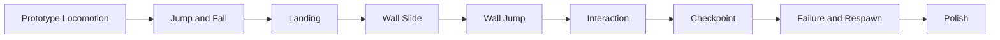

---

## Animation Priority

Animation은 다음 기준을 우선한다.

1. Gameplay State 구분
2. 입력 반응성
3. 접촉 위치 정확성
4. 무게감
5. 세부 연출

---

# UI Production Order

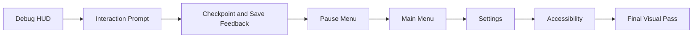

UI 스타일 작업은 주요 Navigation Flow가 검증된 후 진행한다.

---

# Audio Production Order

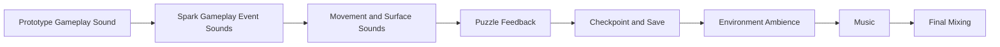

핵심 Gameplay Sound를 배경음악보다 우선한다.

---

# Phase 5 — Alpha

## 목표

게임을 처음부터 끝까지 플레이할 수 있는 상태를 만든다.

Alpha는 모든 기능이 존재하지만,
일부 콘텐츠와 품질이 완성되지 않았을 수 있다.

---

## Alpha Definition

```text
Feature Complete

but

Not Content Complete
```

---

## Alpha Requirements

- 모든 핵심 시스템 구현
- 모든 주요 레벨 존재
- 게임 시작부터 엔딩까지 진행 가능
- Checkpoint 및 Save 동작
- Main Menu와 Pause Menu 동작
- 주요 설정 동작
- 실패 및 Respawn 동작
- 임시 Asset 사용 가능
- 알려진 버그 존재 가능

---

## Alpha Focus

- 진행 불가능 버그 제거
- 시스템 연결 확인
- Save 데이터 검증
- 레벨 순서 검증
- 난이도 곡선 검증
- 전체 플레이 시간 측정
- Scope 재조정
- 누락 기능 확인

---

## Alpha Playtest

Alpha Playtest에서는 다음 데이터를 수집한다.

- 전체 완료 시간
- 레벨별 완료 시간
- 퍼즐별 실패 횟수
- 이동 구간별 실패 횟수
- Checkpoint 간 반복 횟수
- 길을 잃은 위치
- 게임 규칙 오해 지점
- UI 혼란 지점
- 성능 저하 구간
- 저장 오류 여부

---

## Alpha 완료 기준

- 게임을 처음부터 끝까지 완료할 수 있다.
- 진행을 막는 버그가 없다.
- 모든 핵심 기능이 존재한다.
- Save와 Load가 전체 흐름에서 동작한다.
- 레벨 순서와 난이도 흐름이 확인되었다.
- 제거할 기능과 유지할 기능이 확정되었다.
- 남은 작업이 콘텐츠와 품질 개선 중심이다.

---

# Phase 6 — Beta

## 목표

모든 콘텐츠를 완성하고
버그 수정, 최적화, 품질 개선에 집중한다.

---

## Beta Definition

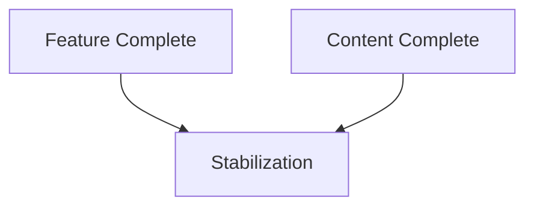

---

## Beta Requirements

- 모든 레벨 완성
- 모든 퍼즐 완성
- 최종 Character Asset 적용
- 최종 Environment Art 적용
- 최종 UI 적용
- 주요 Audio 적용
- 모든 필수 Animation 적용
- 모든 설정 적용
- 접근성 기능 적용
- 엔딩 포함

---

## Beta Focus

- Bug Fix
- Performance
- Lighting Consistency
- Audio Mixing
- UI Polish
- Animation Polish
- Collision Fix
- Save Compatibility
- Localization
- Accessibility
- Packaging

---

## Bug Priority

| 등급 | 의미 | 예시 |
|------|------|------|
| Blocker | 진행 또는 실행 불가 | Crash, Save 손상 |
| Critical | 주요 기능 실패 | Respawn 불가 |
| Major | 경험에 큰 영향 | 퍼즐 오작동 |
| Minor | 제한적인 문제 | VFX 위치 오류 |
| Trivial | 시각적 세부 문제 | 작은 정렬 오류 |

Blocker와 Critical 버그를 최우선으로 처리한다.

---

## Beta 완료 기준

- 모든 콘텐츠가 포함되어 있다.
- Blocker 버그가 없다.
- Critical 버그가 없다.
- Major 버그가 관리 가능한 수준이다.
- Target Platform에서 안정적으로 실행된다.
- Save 데이터가 반복 테스트를 통과한다.
- 주요 해상도와 입력 장치에서 UI가 동작한다.
- 접근성 옵션이 실제로 적용된다.
- 최종 플레이 시간이 목표 범위에 들어간다.

---

# Phase 7 — Release Candidate

## 목표

출시 또는 제출 가능한 Build를 확정한다.

새로운 기능과 콘텐츠를 추가하지 않는다.

---

## Feature Freeze

Release Candidate 단계에서는 다음 작업만 허용한다.

- 버그 수정
- 성능 개선
- 충돌 수정
- 오탈자 수정
- 설정 오류 수정
- Packaging 문제 수정
- 필수 접근성 문제 수정

새로운 퍼즐, 기능, 레벨, Asset을 추가하지 않는다.

---

## RC Test Scope

- Clean Install
- New Game
- Continue
- Save / Load
- 모든 Checkpoint
- 모든 Level Transition
- 모든 Puzzle
- 모든 Failure State
- Main Menu
- Pause Menu
- Settings
- Input Device Switching
- Resolution Change
- Game Exit
- Re-Launch
- Ending
- Packaged Build

---

## Compatibility Test

최소한 다음 환경을 검토한다.

- Keyboard and Mouse
- Gamepad
- Fullscreen
- Windowed
- 기본 해상도
- 낮은 Graphic Quality
- 높은 Graphic Quality
- 새 Save 데이터
- 기존 Save 데이터
- 네트워크가 없는 환경
- 첫 실행 환경

---

## RC 완료 기준

- 출시를 차단하는 버그가 없다.
- Build가 안정적으로 실행된다.
- Packaging에 불필요한 파일이 없다.
- Debug 기능이 비활성화되어 있다.
- 최종 Version 정보가 적용되어 있다.
- 최종 문서와 실제 구현이 일치한다.
- 제출 또는 배포 파일이 준비되어 있다.
- 최종 Smoke Test를 통과했다.

---

# Phase 8 — Final Release

## 목표

최종 Build와 프로젝트 자료를 제출 또는 배포한다.

---

## Final Deliverables

- Packaged Game Build
- Source Code
- Unreal Project
- Technical Documentation
- GDD
- Architecture Documents
- Gameplay Video
- Screenshots
- Portfolio Description
- README
- Credits
- License Information

---

## Release Checklist

- 최종 Build 번호 확인
- 실행 파일 동작 확인
- Save 경로 확인
- 기본 설정 확인
- 해상도 확인
- 입력 확인
- Credits 확인
- 외부 Asset License 확인
- 불필요한 개발 파일 제거
- README 작성
- 설치 및 실행 방법 작성
- 최종 압축 파일 테스트

---

# Feature Scope

## Must Have

게임 완성에 반드시 필요한 기능이다.

- Move
- Jump
- Wall Slide
- Wall Jump
- Landing Spark
- Wall Spark
- Cable Spark
- Metal / Rubber / Cable
- Interaction
- Checkpoint
- Respawn
- Save / Load
- Main Menu
- Pause Menu
- 기본 Settings
- 최소 하나 이상의 완성된 레벨
- 시작과 종료

---

## Should Have

품질과 완성도를 높이는 기능이다.

- 입력 재지정
- Brightness Calibration
- Camera Shake 설정
- Spark Accessibility
- 복수의 환경 구역
- 환경 스토리텔링
- 고유 Checkpoint 연출
- Level Transition
- 추가 퍼즐 조합
- 최종 Animation Set

---

## Could Have

일정에 여유가 있을 때 고려한다.

- 수집 요소
- 숨겨진 공간
- 추가 환경 기록
- 복수 Save Slot
- Time Trial
- Level Select
- Photo Mode
- 추가 Character Skin
- 업적
- 개발자 Commentary

---

## Won't Have

현재 범위에서는 구현하지 않는다.

- 전투 시스템
- 적 AI
- 멀티플레이
- 인벤토리
- 장비 시스템
- 스킬 트리
- 랜덤 생성 레벨
- 오픈 월드
- 실시간 온라인 기능
- 복잡한 대화 시스템

---

# MVP Definition

## Minimum Viable Product

Spark의 MVP는 핵심 경험이 성립하는 최소 범위다.

```text
One Character

+

Core Movement

+

Spark System

+

Three Surface Types

+

One Short Level

+

One Puzzle

+

One Checkpoint

+

One Goal
```

---

## MVP Requirements

- 플레이어가 이동할 수 있다.
- 점프와 Wall Movement를 사용할 수 있다.
- 이동 Event에서 Spark가 발생한다.
- Spark가 일시적으로 환경을 밝힌다.
- Metal, Rubber, Cable이 다르게 반응한다.
- 간단한 퍼즐을 해결할 수 있다.
- 실패 후 Checkpoint에서 Respawn한다.
- 시작 지점과 종료 지점이 있다.
- Packaged Build로 실행할 수 있다.

MVP가 완성되기 전에는 선택 기능을 추가하지 않는다.

---

# Vertical Slice Definition

MVP가 기능의 가능성을 검증한다면,
Vertical Slice는 최종 품질의 가능성을 검증한다.

| 구분 | MVP | Vertical Slice |
|------|-----|----------------|
| 목적 | 핵심 기능 검증 | 최종 경험 검증 |
| 아트 | 임시 가능 | 최종 수준 |
| UI | 최소 기능 | 최종 방향 |
| 사운드 | 기본 | 완성형 |
| 레벨 | 짧은 테스트 | 대표 구간 |
| 최적화 | 기본 | Target 기준 |
| 문서 | 최소 | 제작 기준 포함 |

---

# Dependency Roadmap

주요 작업의 의존 관계는 다음과 같다.

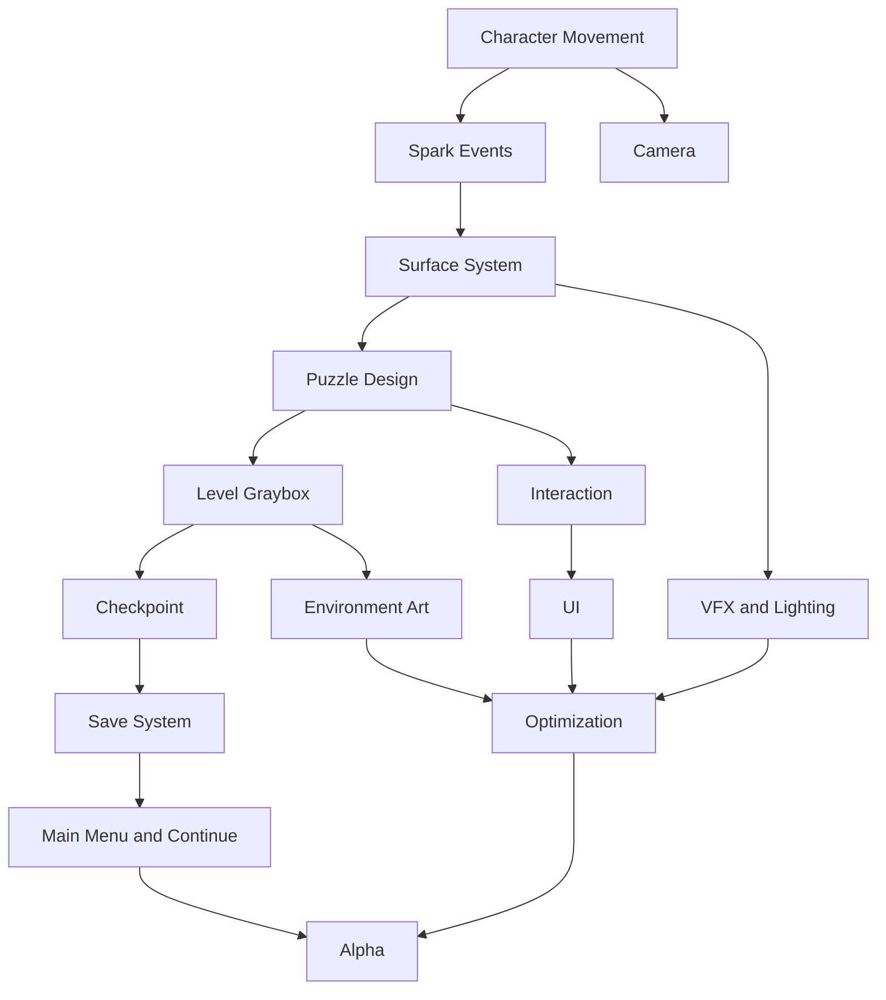

의존성이 해결되지 않은 작업을 무리하게 먼저 진행하지 않는다.

---

# Risk Management

## Major Risks

| 리스크 | 영향 | 대응 |
|--------|------|------|
| 어둠으로 인한 가독성 부족 | 핵심 경험 실패 | 밝기 범위와 Spark 조정 |
| Spark 반복으로 인한 피로 | 접근성 문제 | Flash Reduction 제공 |
| Wall Movement 조작감 부족 | 이동 재미 감소 | Prototype 반복 |
| 카메라 문제 | 멀미와 실패 증가 | 초기 비교 테스트 |
| Scope 증가 | 일정 초과 | Must / Should 분리 |
| Save 오류 | 진행 손실 | 작은 단위로 조기 구현 |
| Unreal Binary 충돌 | 작업 손실 | Asset 담당 분리 |
| Art 작업 과다 | 핵심 기능 지연 | Modular Kit 우선 |
| 성능 저하 | Target Build 실패 | 초기 Profiling |
| 퍼즐 가독성 부족 | 진행 중단 | 외부 Playtest |

---

## Risk Review

각 마일스톤 종료 시 다음을 확인한다.

- 새로운 기술 리스크가 발생했는가
- 일정이 예상보다 지연되고 있는가
- 제거 가능한 기능이 있는가
- 핵심 경험이 여전히 명확한가
- Prototype 결과와 기존 계획이 충돌하는가
- Production 비용이 예상 범위를 넘는가

---

# Scope Reduction Plan

일정이 부족한 경우 다음 순서로 범위를 줄인다.

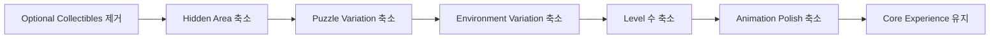

다음 항목은 가능한 한 유지한다.

- 기본 이동
- Spark
- Surface 차이
- 기억 기반 이동
- 최소 하나의 완성된 레벨
- Checkpoint
- 시작과 종료

---

# Task Management

## Task Size

작업은 가능한 한 짧은 기간 안에 완료 가능한 단위로 나눈다.

나쁜 예:

```text
Spark System 만들기
```

좋은 예:

```text
Landing Event 감지
Metal Surface 판정
Landing Niagara Spawn
Spark Point Light 생성
Landing Sound 재생
```

---

## Task Status

| 상태 | 의미 |
|------|------|
| Backlog | 아직 시작하지 않음 |
| Ready | 시작 조건 충족 |
| In Progress | 작업 중 |
| Review | 검토 또는 테스트 중 |
| Blocked | 의존성 문제 |
| Done | 완료 기준 충족 |

---

## Task Priority

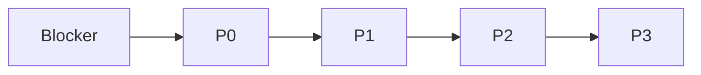

단순히 재미있어 보이는 작업보다
현재 마일스톤 완료에 필요한 작업을 우선한다.

---

# Milestone Review

각 마일스톤이 끝날 때 Review를 진행한다.

---

## Review Questions

- 마일스톤 목표를 달성했는가
- 실제 Build로 확인했는가
- 완료되지 않은 작업은 무엇인가
- 다음 단계로 넘길 작업은 무엇인가
- 제거할 기능이 있는가
- 새로운 리스크가 발생했는가
- 문서를 갱신해야 하는가
- Scope를 수정해야 하는가

---

## Milestone Deliverables

각 단계 종료 시 다음을 남긴다.

- Playable Build
- 변경 내용
- 완료 기능 목록
- 알려진 문제
- Playtest 결과
- Screenshot 또는 Video
- 다음 단계 계획
- 관련 문서 갱신

---

# Testing Roadmap

테스트는 개발 마지막 단계에만 진행하지 않는다.

```mermaid
flowchart LR
    A[Prototype Test] --> B[System Test] --> C[Level Test] --> D[Integration Test] --> E[Full Playthrough] --> F[Release Test]
```

---

## Prototype Test

검증 대상:

- 조작감
- Spark 가시성
- Surface 구분
- 카메라
- 핵심 재미

---

## System Test

검증 대상:

- Interaction
- Checkpoint
- Save
- UI Event
- Settings
- Input

---

## Level Test

검증 대상:

- 진행 방향
- 퍼즐 가독성
- 난이도
- 실패 위치
- Checkpoint
- Sequence Break

---

## Integration Test

검증 대상:

- 시스템 간 이벤트
- Save와 Level Transition
- UI와 입력 모드
- Character와 Animation
- Spark와 Surface
- VFX와 Audio

---

## Full Playthrough

다음 조건으로 반복 테스트한다.

- New Game
- Continue
- 실패 다수 발생
- 설정 변경
- 입력 장치 변경
- 게임 종료 후 재실행
- 전체 레벨 완료
- 엔딩 도달

---

# Performance Roadmap

성능 최적화는 Production 마지막에만 진행하지 않는다.

---

## Prototype

- 기본 Frame Rate 측정
- Spark Light 비용 확인
- Niagara 비용 확인

---

## Vertical Slice

- GPU Profile
- CPU Profile
- Memory 확인
- Lumen 비용 확인
- Shadow 비용 확인
- Blueprint Tick 확인

---

## Production

- 레벨별 성능 측정
- Asset 크기 확인
- Texture Memory 확인
- Shader Complexity 확인
- Collision Query 확인

---

## Beta

- 전체 게임 최적화
- Spike 제거
- Loading Time 개선
- Packaging 크기 확인
- 낮은 설정 테스트

---

# Documentation Roadmap

문서는 구현과 함께 유지한다.

| 시점 | 문서 작업 |
|------|-----------|
| Pre-Production | 전체 설계 문서 작성 |
| Prototype | 실제 구조와 차이 기록 |
| Vertical Slice | 제작 기준 확정 |
| Production | 변경 사항 갱신 |
| Alpha | 전체 구현과 문서 비교 |
| Beta | 최종 규칙과 Asset 정리 |
| Release | README 및 제출 자료 완성 |

---

## Documentation Rule

실제 구현과 문서가 다르면 다음 중 하나를 수행한다.

```text
Implementation 수정

or

Document 수정

or

ADR 작성
```

차이를 알고도 방치하지 않는다.

---

# Portfolio Roadmap

Spark는 게임뿐 아니라
개발 과정과 기술적 판단을 보여주는 포트폴리오 프로젝트다.

---

## Portfolio Materials

- 프로젝트 한 줄 소개
- Gameplay Video
- 핵심 시스템 설명
- Architecture Diagram
- Spark System Flow
- Surface System 설명
- Level Design 과정
- Before / After
- Performance 개선 사례
- 문제 해결 사례
- 최종 Screenshot
- GitHub README

---

## Capture Schedule

각 마일스톤에서 자료를 기록한다.

| 단계 | 기록 자료 |
|------|-----------|
| Prototype | 초기 이동과 Spark |
| Gameplay Prototype | 첫 퍼즐 |
| Vertical Slice | 완성형 구간 |
| Production | 레벨 제작 과정 |
| Alpha | 전체 Playthrough |
| Beta | 최종 비교 |
| Release | Trailer와 Screenshot |

완성 후 과거 과정을 다시 만들려고 하지 않는다.

---

# Definition of Done by Phase

## Prototype Done

- 핵심 기능이 실행된다.
- 테스트 공간에서 검증할 수 있다.
- 주요 실패 원인을 확인했다.
- 다음 단계 진행 여부를 결정할 수 있다.

---

## Vertical Slice Done

- 최종 품질 기준을 보여준다.
- Gameplay와 Presentation이 연결되어 있다.
- 전체 Production 비용을 예상할 수 있다.
- 외부 Playtest 결과가 반영되어 있다.

---

## Alpha Done

- 처음부터 끝까지 플레이할 수 있다.
- 모든 핵심 기능이 존재한다.
- 진행을 막는 문제가 없다.

---

## Beta Done

- 모든 콘텐츠가 완성되어 있다.
- 주요 버그가 수정되어 있다.
- 성능과 접근성 검증이 완료되어 있다.

---

## Release Done

- 최종 Build가 안정적이다.
- 제출 자료가 준비되어 있다.
- 문서와 구현이 일치한다.
- 설치부터 종료까지 검증되었다.

---

# Roadmap Rules

Spark의 개발 Roadmap은 다음 규칙을 따른다.

- 핵심 게임플레이를 가장 먼저 검증한다.
- 모든 단계에서 실행 가능한 Build를 유지한다.
- 새로운 기능보다 기존 기능의 완성도를 우선한다.
- Graybox 검증 전 최종 Art 작업을 진행하지 않는다.
- MVP 이전에는 선택 기능을 추가하지 않는다.
- Vertical Slice에서 최종 제작 기준을 확정한다.
- Production에서는 검증된 시스템을 재사용한다.
- Alpha 이후에는 Scope를 확대하지 않는다.
- Beta에서는 콘텐츠 추가보다 안정화를 우선한다.
- Release Candidate에서는 Feature Freeze를 유지한다.
- 일정이 부족하면 핵심 경험을 제외한 범위부터 줄인다.
- 각 마일스톤 종료 시 Playtest와 Review를 진행한다.
- 문서와 실제 구현의 차이를 방치하지 않는다.
- 작업 완료는 구현이 아니라 테스트와 문서 갱신까지 포함한다.
- 포트폴리오 자료는 개발 과정에서 지속적으로 기록한다.

---

# Related Documents

- [01_GDD.md](./01_GDD.md)
- [02_Architecture.md](./02_Architecture.md)
- [03_Gameplay_Framework.md](./03_Gameplay_Framework.md)
- [04_Level_Design.md](./04_Level_Design.md)
- [05_Art_Direction.md](./05_Art_Direction.md)
- [06_UI_UX.md](./06_UI_UX.md)
- [07_Coding_Convention.md](./07_Coding_Convention.md)
- [09_Asset_List.md](./09_Asset_List.md)
- [10_Dev_Log.md](./10_Dev_Log.md)
- [11_ADR.md](./11_ADR.md)

## 문서 상태 표준

문서와 기능의 진행 상태는 다음 표현을 사용한다.

| 상태 | 의미 |
|------|------|
| `Planned` | 계획되었지만 작업을 시작하지 않음 |
| `Proposed` | 설계 또는 결정이 검토 중임 |
| `Accepted` | 설계 결정이 채택됨 |
| `In Progress` | 현재 작업 중임 |
| `Completed` | 구현 또는 문서 작업이 완료됨 |
| `Out of Scope` | 현재 프로젝트 범위에서 제외됨 |

---

# Summary

Spark의 Development Roadmap은
핵심 메커니즘을 빠르게 검증하고,
검증된 시스템을 기반으로 전체 게임을 완성하기 위한 개발 계획이다.

개발은 Pre-Production, Core Prototype, Gameplay Prototype,
Vertical Slice, Production, Alpha, Beta,
Release Candidate, Final Release 단계로 진행한다.

가장 먼저 이동, Spark, Surface의 핵심 경험을 검증하고,
이후 Interaction, Checkpoint, Save, Puzzle, UI와
Presentation을 단계적으로 추가한다.

MVP는 Spark의 핵심 경험이 성립하는 최소 범위를 의미하며,
Vertical Slice는 최종 게임의 품질과 제작 비용을 검증하는 기준이 된다.

일정이 부족할 경우 선택 콘텐츠와 레벨 규모를 먼저 줄이되,
움직임으로 빛을 만들고 공간을 기억하며 이동하는
Spark의 핵심 경험은 유지해야 한다.
