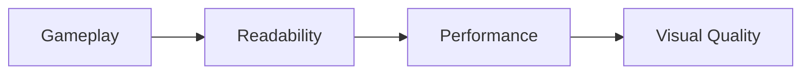
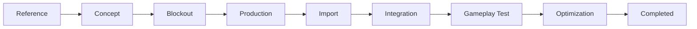
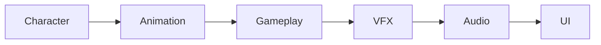

──────────────────────────────────────────────────────────────────────────────

# Spark Technical Documentation

## Volume 09

# Asset List

Version 1.0

Unreal Engine 5.5.4

──────────────────────────────────────────────────────────────────────────────

> Move to See. Remember to Survive.

본 문서는 Spark 프로젝트에서 사용되는 모든 Asset의 종류,
제작 상태, 우선순위, 사용 위치를 정의한다.

Asset List는 단순한 체크리스트가 아니라
프로젝트 제작 현황을 관리하는 기준 문서이다.

---

# Executive Summary

## 목적

본 문서는 프로젝트에서 필요한 모든 Asset을 관리한다.

포함 범위

- Character
- Environment
- Gameplay
- Puzzle
- UI
- Audio
- VFX
- Animation
- Material
- Texture
- Data Asset
- Level
- Documentation Asset

---

# Asset Production Philosophy

Asset는 다음 순서로 제작한다.



시각적으로 뛰어나더라도
Gameplay를 방해하면 실패한 Asset이다.

---

# Asset Status

모든 Asset은 다음 상태를 가진다.

| 상태 | 의미 |
|------|------|
| Planned | 제작 예정 |
| In Progress | 제작 중 |
| Review | 검토 중 |
| Completed | 완료 |
| Deprecated | 사용 중단 |

---

# Asset Priority

| 우선순위 | 의미 |
|----------|------|
| P0 | 게임 진행 필수 |
| P1 | 핵심 플레이 |
| P2 | 시각 품질 |
| P3 | 장식 |

---

# Character Assets

| Asset | 타입 | Priority | Status |
|--------|------|----------|--------|
| Spark Robot | Skeletal Mesh | P0 | Planned |
| Skeleton | Skeleton | P0 | Planned |
| Physics Asset | Physics | P0 | Planned |
| Animation Blueprint | Animation | P0 | Planned |
| Idle | Animation | P0 | Planned |
| Run | Animation | P0 | Planned |
| Jump | Animation | P0 | Planned |
| Fall | Animation | P0 | Planned |
| Landing | Animation | P0 | Planned |
| Wall Slide | Animation | P0 | Planned |
| Wall Jump | Animation | P0 | Planned |
| Interact | Animation | P1 | Planned |
| Respawn | Animation | P1 | Planned |

---

# Environment Assets

## Modular Kit

- Wall
- Floor
- Ceiling
- Platform
- Beam
- Pillar
- Pipe
- Cable Support
- Door Frame
- Stair
- Vent
- Railing

---

## Industrial Props

- Machine
- Generator
- Control Panel
- Valve
- Conveyor
- Storage Box
- Broken Machinery
- Electrical Cabinet
- Fan
- Pipe Junction

---

# Gameplay Assets

| Asset | Priority |
|--------|----------|
| Checkpoint | P0 |
| Cable | P0 |
| Switch | P0 |
| Door | P0 |
| Puzzle Trigger | P1 |
| Lift Platform | P1 |
| Goal Device | P0 |

---

# Surface Assets

## Metal

- Floor
- Wall
- Pipe
- Beam

---

## Rubber

- Platform
- Cover
- Protective Surface

---

## Cable

- Thick Cable
- Thin Cable
- Hanging Cable
- Powered Cable
- Broken Cable

---

# Puzzle Assets

- Lever
- Power Connector
- Terminal
- Pressure Switch
- Door Lock
- Puzzle Indicator

---

# UI Assets

## Menu

- Logo
- Main Menu
- Pause Menu
- Settings
- Credits

---

## HUD

- Interaction Prompt
- Saving Indicator
- Checkpoint Notice
- Objective Notice
- Tutorial Prompt

---

## Icons

- Keyboard
- Mouse
- Gamepad
- Save
- Settings
- Audio
- Video
- Accessibility
- Checkpoint
- Interaction

---

# VFX Assets

## Spark

- Landing Spark
- Wall Slide Spark
- Wall Jump Spark
- Cable Spark

---

## Environment

- Dust
- Smoke
- Steam
- Electrical Arc
- Debris
- Ambient Particle

---

# Audio Assets

## Gameplay

- Footstep Metal
- Footstep Rubber
- Landing
- Jump
- Wall Slide
- Wall Jump
- Spark
- Cable
- Checkpoint
- Door
- Interaction

---

## Environment

- Factory Ambience
- Electrical Hum
- Steam
- Machinery
- Wind

---

## UI

- Button Hover
- Button Click
- Error
- Success
- Notification

---

# Material Assets

## Master Materials

- M_Master
- M_MasterMetal
- M_MasterRubber
- M_MasterCable

---

## Material Functions

- Edge Wear
- Dirt
- Color Variation
- World Aligned Blend

---

## Material Instances

- Clean Metal
- Rusted Metal
- Burned Metal
- Black Rubber
- Old Rubber
- Powered Cable
- Broken Cable

---

# Texture Assets

## Metal

- BaseColor
- Normal
- ORM

---

## Rubber

- BaseColor
- Normal
- ORM

---

## Cable

- BaseColor
- Normal
- ORM
- Emissive

---

# Niagara Assets

- NS_Spark_Landing
- NS_Spark_WallSlide
- NS_Spark_WallJump
- NS_Spark_Cable
- NS_Dust
- NS_Steam

---

# Data Assets

- Surface Data
- Spark Effect Data
- Audio Data
- Puzzle Data

---

# Save Assets

- Save Slot
- Checkpoint Data
- Player Data

---

# Animation Assets

## Locomotion

- Idle
- Walk
- Run
- Jump Start
- Jump Loop
- Fall
- Landing

---

## Traversal

- Wall Slide
- Wall Jump
- Climb (Optional)

---

## Gameplay

- Interaction
- Activate Checkpoint
- Respawn

---

# Level Assets

- Prologue
- Level01
- Level02
- Level03
- Level04
- Final

---

# Lighting Assets

- Navigation Light
- Checkpoint Light
- Emergency Light
- Spark Light
- Cable Light

---

# Blueprint Assets

- BP_Checkpoint
- BP_Door
- BP_Cable
- BP_Lever
- BP_Switch
- BP_Generator

---

# Widget Assets

- WBP_MainMenu
- WBP_PauseMenu
- WBP_Settings
- WBP_HUD
- WBP_InteractionPrompt
- WBP_CheckpointNotice

---

# Asset Pipeline

모든 Asset은 다음 순서를 따른다.



---

# Asset Dependency



---

# Asset Review Checklist

## Character

- [ ] Scale 확인
- [ ] Animation 확인
- [ ] Collision 확인
- [ ] Material 확인

---

## Environment

- [ ] Grid Alignment
- [ ] Collision
- [ ] Navigation
- [ ] Performance

---

## Gameplay

- [ ] Interaction
- [ ] Blueprint
- [ ] Save
- [ ] Gameplay Test

---

## Material

- [ ] Shader Complexity
- [ ] Texture Size
- [ ] Instance 사용
- [ ] Naming 확인

---

## VFX

- [ ] Particle Count
- [ ] Light Cost
- [ ] Visibility
- [ ] Gameplay Readability

---

## Audio

- [ ] Volume
- [ ] Loop
- [ ] Spatialization
- [ ] Trigger Timing

---

# Asset Naming Rule

모든 Asset은 Coding Convention을 따른다.

예시

```text
SM_FactoryWall_A

MI_Metal_Rusted

NS_Spark_Landing

BP_Checkpoint

WBP_MainMenu

DA_Surface_Metal
```

---

# Asset Completion Criteria

Asset는 다음 조건을 만족해야 한다.

- Naming 완료
- Folder 정리
- Reference 확인
- Gameplay Test 완료
- Performance 확인
- Review 완료
- Documentation 갱신

---

# Asset Progress

| Category | Planned | In Progress | Completed |
|----------|----------|-------------|------------|
| Character | | | |
| Environment | | | |
| Gameplay | | | |
| UI | | | |
| Audio | | | |
| Animation | | | |
| Materials | | | |
| VFX | | | |

프로젝트 진행에 따라 지속적으로 갱신한다.

---

# Related Documents

- [01_GDD.md](./01_GDD.md)
- [02_Architecture.md](./02_Architecture.md)
- [03_Gameplay_Framework.md](./03_Gameplay_Framework.md)
- [04_Level_Design.md](./04_Level_Design.md)
- [05_Art_Direction.md](./05_Art_Direction.md)
- [06_UI_UX.md](./06_UI_UX.md)
- [07_Coding_Convention.md](./07_Coding_Convention.md)
- [08_Roadmap.md](./08_Roadmap.md)
- [10_Dev_Log.md](./10_Dev_Log.md)
- [11_ADR.md](./11_ADR.md)

---

# Summary

Asset List는 Spark 프로젝트에서 필요한 모든 Asset의 제작 범위와
우선순위를 정의하는 문서이다.

모든 Asset은 Gameplay를 우선으로 제작하며,
제작 상태와 우선순위를 지속적으로 관리한다.

이 문서는 개발 진행 상황을 추적하고,
누락된 Asset을 확인하며,
프로젝트의 완성도를 관리하기 위한 기준 문서로 사용한다.
