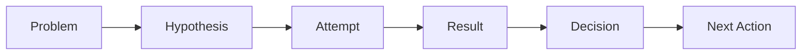
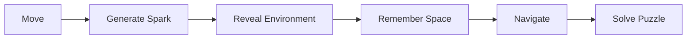
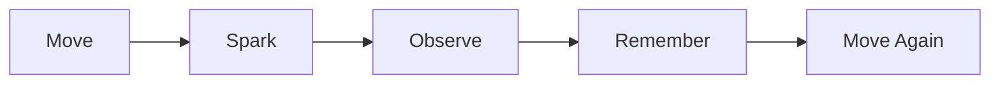
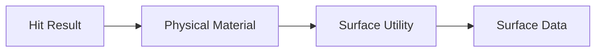
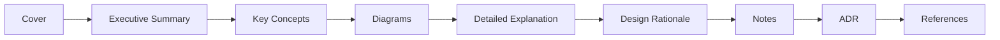
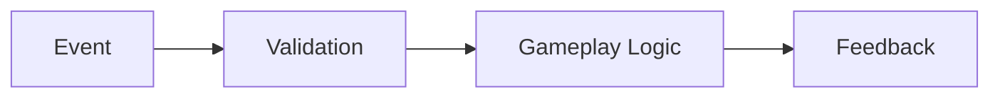

──────────────────────────────────────────────────────────────────────────────

# Spark Technical Documentation

## Volume 10

# Development Log

Version 1.0

Unreal Engine 5.5.4

──────────────────────────────────────────────────────────────────────────────

> Move to See. Remember to Survive.

본 문서는 Spark 프로젝트의 개발 과정, 기술적 판단, 문제 해결,
테스트 결과와 주요 변경 사항을 지속적으로 기록하기 위한 개발 로그이다.

Development Log는 단순한 일일 작업 기록이 아니다.

프로젝트가 어떤 과정을 거쳐 현재 구조에 도달했는지 설명하고,
잘못된 시도와 해결 과정까지 남겨 이후의 개발과 포트폴리오 제작에
활용하는 것을 목적으로 한다.

---

# Executive Summary

## 목적

본 문서는 Spark 프로젝트의 개발 이력을 관리한다.

주요 기록 범위는 다음과 같다.

- 작업 내용
- 구현 결과
- 설계 변경
- 기술적 의사결정
- 문제와 원인
- 해결 과정
- 테스트 결과
- 성능 측정
- 알려진 문제
- 다음 작업
- 마일스톤 회고
- 포트폴리오 자료

---

## Development Log Goal

Spark의 Development Log는 다음 질문에 답할 수 있어야 한다.

- 무엇을 만들었는가
- 왜 그렇게 만들었는가
- 어떤 문제가 발생했는가
- 문제의 원인은 무엇이었는가
- 어떤 방법으로 해결했는가
- 결과가 예상과 같았는가
- 다음에는 무엇을 해야 하는가

---

# Logging Philosophy

Development Log는 다음 원칙을 따른다.

## Record Decisions, Not Only Results

완성된 결과뿐 아니라
그 결과에 도달하기까지의 판단을 기록한다.



---

## Record Failures

실패한 시도도 중요한 개발 기록이다.

실패한 접근을 남기면 다음과 같은 이점이 있다.

- 같은 문제를 반복하지 않는다.
- 해결 과정의 근거를 설명할 수 있다.
- 기술적 판단 능력을 보여줄 수 있다.
- 이후 구조 변경의 이유를 이해할 수 있다.

실패한 코드를 유지할 필요는 없지만,
실패 원인과 배운 점은 기록한다.

---

## Keep Entries Actionable

로그는 감상보다 실제 개발에 도움이 되는 정보를 우선한다.

나쁜 예:

```text
오늘 Spark 시스템을 작업했다.
생각보다 어려웠지만 어느 정도 완성했다.
```

좋은 예:

```text
Landing Event에서 Physical Material을 조회하도록 구현했다.

초기에는 Character가 Surface Type을 직접 판정했으나,
이 구조에서는 Wall Slide와 Cable Interaction이 동일한 로직을
중복 구현해야 했다.

Surface 판정을 Utility로 분리하고,
SparkComponent가 결과를 조회하는 구조로 변경했다.
```

---

## Update Regularly

로그는 작업이 끝난 뒤 한꺼번에 작성하지 않는다.

권장 기록 시점:

- 작업 시작 전
- 기능 구현 후
- 구조 변경 후
- 주요 버그 해결 후
- Playtest 후
- Milestone 종료 후
- Build 또는 Release 생성 후

---

# Log Entry Structure

모든 개발 로그는 가능한 한 다음 형식을 사용한다.

```markdown
## YYYY-MM-DD — 작업 제목

### 목표

이번 작업에서 달성하려는 내용을 작성한다.

### 작업 내용

구현하거나 수정한 내용을 작성한다.

### 문제

발생한 문제와 증상을 작성한다.

### 원인

확인된 원인 또는 현재 가설을 작성한다.

### 해결

적용한 해결 방법을 작성한다.

### 결과

테스트 결과와 현재 상태를 작성한다.

### 결정

구조 또는 방향에 관한 결정을 작성한다.

### 알려진 문제

아직 해결되지 않은 문제를 작성한다.

### 다음 작업

다음 개발 단계에서 수행할 작업을 작성한다.

### 관련 자료

Commit, Screenshot, Video, Issue, 문서 링크를 작성한다.
```

모든 항목을 반드시 사용할 필요는 없지만,
`목표`, `작업 내용`, `결과`, `다음 작업`은 기본적으로 포함한다.

---

# Entry Metadata

각 로그에는 필요에 따라 다음 정보를 추가한다.

| 항목 | 설명 |
|------|------|
| Date | 작업 날짜 |
| Author | 작성자 |
| Milestone | 현재 개발 단계 |
| Category | 작업 종류 |
| Status | 완료 상태 |
| Branch | Git Branch |
| Commit | 관련 Commit |
| Build | 테스트한 Build |
| Engine | Unreal Engine Version |

---

## Metadata Example

```text
Date: YYYY-MM-DD
Milestone: Core Prototype
Category: Gameplay / Spark
Status: Completed
Branch: feature/landing-spark
Commit: Feature: Add landing spark event
Engine: Unreal Engine 5.5.4
```

---

# Log Categories

Development Log는 다음 Category를 사용한다.

| Category | 설명 |
|----------|------|
| Planning | 기획 및 범위 |
| Architecture | 시스템 구조 |
| Gameplay | 이동과 게임 규칙 |
| Character | Character 구현 |
| Spark | Spark System |
| Surface | Surface 판정 |
| Interaction | 상호작용 |
| Checkpoint | Checkpoint와 Respawn |
| Save | 저장과 불러오기 |
| Puzzle | 퍼즐 |
| Level | 레벨 제작 |
| Art | 환경 및 Character Art |
| Lighting | 조명 |
| VFX | Niagara와 시각 효과 |
| Animation | 애니메이션 |
| Audio | 사운드 |
| UI / UX | HUD와 Menu |
| Accessibility | 접근성 |
| Optimization | 성능 개선 |
| Testing | 테스트 |
| Bug Fix | 버그 수정 |
| Documentation | 문서 |
| Build | Packaging과 Build |
| Release | 배포 및 제출 |

하나의 로그에 여러 Category를 사용할 수 있다.

---

# Status Convention

| 상태 | 의미 |
|------|------|
| Planned | 작업 예정 |
| In Progress | 진행 중 |
| Blocked | 문제로 중단 |
| Review | 검토 또는 테스트 중 |
| Completed | 완료 |
| Reopened | 완료 후 문제 발견 |
| Deprecated | 더 이상 사용하지 않음 |

---

# Severity Convention

버그를 기록할 때 다음 Severity를 사용한다.

| 등급 | 의미 |
|------|------|
| Blocker | 실행 또는 진행 불가능 |
| Critical | 핵심 기능 실패 |
| Major | 플레이 경험에 큰 영향 |
| Minor | 제한적인 기능 또는 표현 문제 |
| Trivial | 작은 시각적 문제 |

---

# Development Snapshot

## Project Information

| 항목 | 내용 |
|------|------|
| Project Name | Spark |
| Engine | Unreal Engine 5.5.4 |
| Genre | 3D Puzzle Platformer |
| Core Mechanic | 움직임으로 발생하는 일시적인 Spark |
| Theme | 어두운 산업 시설 |
| Player Character | 유지보수 로봇 |
| Architecture | C++와 Blueprint의 Hybrid 구조 |
| Current Phase | Pre-Production |
| Current Documentation Version | 1.0 |

---

## Core Gameplay



---

## Current Core Features

| 기능 | 상태 |
|------|------|
| Move | Completed |
| Jump | Completed |
| Air Control | Completed |
| Wall Slide | Completed |
| Wall Jump | Completed |
| Landing Spark | Completed |
| Wall Slide Spark | Completed |
| Wall Jump Spark | Completed |
| Cable Spark | Planned |
| Metal Surface | Planned |
| Rubber Surface | Planned |
| Cable Surface | Planned |
| Interaction | Planned |
| Checkpoint | Planned |
| Respawn | Planned |
| Save / Load | Planned |
| Puzzle Framework | Planned |

---

# Documentation Development Log

## Initial Documentation Set

Spark의 기술 문서는 다음 순서로 구성했다.

```text
01_GDD.md
02_Architecture.md
03_Gameplay_Framework.md
04_Level_Design.md
05_Art_Direction.md
06_UI_UX.md
07_Coding_Convention.md
08_Roadmap.md
09_Asset_List.md
10_Dev_Log.md
```

---

## Documentation Rules

문서 작성 과정에서 다음 기준을 적용했다.

- Epic Games 기술 문서와 유사한 구조 사용
- Executive Summary 우선
- Diagram과 Table 중심 설명
- 구현 방법보다 설계 이유를 함께 기록
- 중요한 구조 변경은 ADR로 관리
- GitHub에서 읽기 쉬운 Markdown 사용
- 문서 이름과 전체 구조를 고정
- 모든 문서 작성 후 최종 일관성 검토 진행

---

# Initial Planning Records

아래 항목은 실제 구현 완료 로그가 아니라, Pre-Production 단계에서 확정한 초기 설계 기록이다. 실제 구현 결과는 이후 날짜별 Development Log에 별도로 기록한다.

기록 상태는 `Planned`, `Proposed`, `Verified`를 구분한다. 실제 테스트를 통과하지 않은 설계는 `Verified`로 표시하지 않는다.

## Entry 001 — Project Concept Definition

**Milestone:** Pre-Production  
**Category:** Planning  
**Status:** Completed

### 목표

Spark의 핵심 콘셉트와 프로젝트 범위를 정의한다.

### 작업 내용

다음 핵심 콘셉트를 확정했다.

> 움직일 때 발생하는 Spark로 어두운 공간을 잠시 확인하고,  
> 본 공간을 기억하며 앞으로 이동한다.

프로젝트의 기본 방향을 다음과 같이 정의했다.

- 3D Puzzle Platformer
- 어두운 산업 시설
- 유지보수 로봇
- 전투 없음
- 이동과 공간 기억 중심
- Metal, Rubber, Cable 기반 Surface 규칙

### 결과

프로젝트의 핵심 경험을 다음 문장으로 정리했다.

> Move to See. Remember to Survive.

### 결정

전투, 인벤토리, 스킬 트리, 멀티플레이는 현재 범위에서 제외한다.

### 다음 작업

- GDD 작성
- 핵심 이동 정의
- Spark 발생 조건 정의
- 시스템 책임 분리

---

## Entry 002 — Gameplay Ability Definition

**Milestone:** Pre-Production  
**Category:** Gameplay  
**Status:** Completed

### 목표

플레이어의 핵심 이동 능력을 정의한다.

### 작업 내용

다음 능력을 핵심 이동으로 선정했다.

- Move
- Jump
- Wall Slide
- Wall Jump

Spark 발생 Event를 다음과 같이 정의했다.

- Landing
- Wall Slide
- Wall Jump
- Cable Interaction

### 설계 이유

이동 자체가 시야를 만드는 게임이므로,
Spark는 별도의 탐색 버튼보다 이동 Event에 연결하는 것이 적합하다고 판단했다.

이를 통해 플레이어는 이동과 관찰을 별개의 행동으로 수행하지 않고,
하나의 행동으로 공간을 탐색하게 된다.

### 결과

기본 Gameplay Loop를 다음과 같이 정의했다.



### 다음 작업

- Character Movement Prototype
- Event별 Spark 강도 정의
- 이동과 Spark의 타이밍 테스트

---

## Entry 003 — Surface Rule Definition

**Milestone:** Pre-Production  
**Category:** Surface / Spark  
**Status:** Completed

### 목표

Surface별 Spark 반응을 정의한다.

### 작업 내용

다음 세 가지 Surface 규칙을 설정했다.

| Surface | 반응 |
|---------|------|
| Metal | 기본 Spark |
| Rubber | Spark 없음 |
| Cable | 강한 Spark |

### 설계 이유

Surface 차이는 단순한 시각적 변화가 아니라
퍼즐과 이동 판단에 영향을 주는 게임 규칙이어야 한다.

Metal은 기본 피드백을 제공하고,
Rubber는 정보를 차단하며,
Cable은 강한 빛과 전력 상호작용을 제공한다.

### 결정

Surface는 색상만으로 구분하지 않는다.

다음 요소를 함께 사용한다.

- Material
- Roughness
- Shape
- Pattern
- Sound
- Spark Response

### 다음 작업

- Physical Material 설정
- Surface Type 정의
- Surface Data Asset 설계
- Graybox 비교 테스트 제작

---

## Entry 004 — Hybrid Architecture Definition

**Milestone:** Pre-Production  
**Category:** Architecture  
**Status:** Completed

### 목표

C++와 Blueprint의 책임을 분리한다.

### 작업 내용

다음 Hybrid 구조를 정의했다.

#### C++

- Character
- Component
- Gameplay Framework
- Save
- Camera Manager
- Core Gameplay Rule
- Surface Query

#### Blueprint

- Puzzle Assembly
- UI
- Niagara Presentation
- Animation
- Level Script
- Environment Interaction Presentation

### 설계 이유

C++는 재사용성과 안정성이 필요한 핵심 규칙에 적합하다.

Blueprint는 빠른 반복 작업과 시각적 조립이 필요한
퍼즐, 레벨, 연출 작업에 적합하다.

### 결정

Gameplay Rule은 C++에 두고,
Blueprint는 Data 설정과 Presentation을 담당한다.

### 알려진 문제

실제 구현 과정에서 일부 기능의 책임 경계가 달라질 수 있다.

구조 변경 시 Architecture 문서와 ADR을 함께 갱신한다.

### 다음 작업

- Core Class 생성
- Component Interface 설계
- Event 통신 방식 검증

---

## Entry 005 — Character Component Revision

**Milestone:** Pre-Production  
**Category:** Architecture / Character  
**Status:** Completed

### 목표

Character가 소유할 Component를 확정한다.

### 초기 계획

```text
ASparkCharacter

├── USparkComponent
└── USurfaceComponent
```

### 문제

`USurfaceComponent`의 책임이 불명확했다.

Surface는 Character가 지속적으로 소유해야 하는 상태라기보다,
충돌이 발생한 시점에 조회해야 하는 환경 정보에 가까웠다.

또한 Checkpoint와 Interaction 기능이 Character 내부에 직접 구현될 가능성이 있었다.

### 해결

구조를 다음과 같이 변경했다.

```text
ASparkCharacter

├── USparkComponent
├── UCheckpointComponent
└── UInteractionComponent
```

Surface는 다음 흐름으로 조회한다.



### 결과

각 Component의 책임이 명확해졌다.

| Component | 책임 |
|-----------|------|
| SparkComponent | Spark 요청과 Event 발생 |
| CheckpointComponent | Checkpoint와 복원 정보 |
| InteractionComponent | 대상 탐지와 상호작용 요청 |

### 결정

Surface 상태를 저장하는 전용 Component는 현재 구조에서 사용하지 않는다.

### 다음 작업

- 실제 C++ Class Skeleton 작성
- Component 간 통신 방식 구현
- Surface Utility 테스트

---

## Entry 006 — Documentation Architecture Established

**Milestone:** Pre-Production  
**Category:** Documentation  
**Status:** Completed

### 목표

프로젝트 전체 기술 문서 구조를 확정한다.

### 작업 내용

11개의 문서로 전체 구조를 구성했다.

각 문서는 다음 공통 구조를 사용한다.



### 결정

문서 작성 중에는 다음 작업을 진행하지 않는다.

- 파일 이름 변경
- 문서 순서 변경
- 전체 구조 재설계
- 대규모 문체 수정
- Diagram 스타일 통일
- 중복 내용 정리

모든 문서 작성이 끝난 후 최종 검토 단계에서 수행한다.

### 결과

다음 문서가 작성되었다.

- GDD
- Architecture Overview
- Architecture Systems
- Gameplay Framework
- Level Design
- Art Direction
- UI / UX
- Coding Convention
- Roadmap
- Asset List
- Development Log

### 다음 작업

전체 문서 간 용어와 시스템 구조의 일관성을 검토한다.

---

# Core Prototype Development Log

## 2026-08-06 — Phase 1 Core Prototype: 이동, 점프, 공중 제어, 착지 감지, Wall Slide/Jump, 실패 감지 및 Respawn 구현

**Milestone:** Phase 1 — Core Prototype  
**Category:** Character / Gameplay / Input / Environment  
**Status:** Completed  
**Branch:** feature/movement  
**Issues:** SPARK-9, SPARK-10, SPARK-11, SPARK-12, SPARK-13, SPARK-14, SPARK-15, SPARK-16  

### 목표

- Enhanced Input 기반 3D 이동(Move, Look) 및 점프(Jump) 로직 구현
- 3D 퍼즐 플랫폼 메커니즘에 맞춘 캐릭터 조작감 및 공중 제어력(Air Control) 튜닝
- Spark 아키텍처 규칙(PlayerController -> Character)을 만족하는 생명주기 안정적 입력 바인딩 구축
- 공중 점프 후 지면 착지 순간을 판정하는 Landing Event 구현 (향후 Spark 피드백 연동 기반)
- 수직 벽면을 타고 천천히 미끄러져 내리는 Wall Slide 및 사선 반사 솟구침 Wall Jump 메커니즘 구현
- 실패 구역 오버랩 감지 트리거(`ASparkHazardZone`) 구현 및 순간이동 + 카메라 페이드 연동 빠른 Respawn 구축

### 작업 내용

1. **`ASparkCharacter` 구현**:
   - `USpringArmComponent` 및 `UCameraComponent` 캡슐화 및 생성자 세팅
   - `bOrientRotationToMovement = true` 및 시점 기반 지면 수평 이동 벡터 계산(`FRotationMatrix(YawRotation)`)
   - 캐릭터 키 100cm 스펙에 맞춘 점프 높이(`JumpZVelocity = 450.0f`), 중력 스케일(`1.2f`), 반응형 가속도(`MaxAcceleration = 4096.0f`) 및 공중 제어력(`AirControl = 0.85f`) 튜닝
   - 언리얼 엔진 `Landed(const FHitResult& Hit)` 오버라이드 및 `HandleLanded(Hit)` 이벤트 핸들러 분리 구현 (착지 시 Wall Jump 쿨다운 및 1회 제한 상태 초기화)
   - 전방 수직 벽면 감지(`TraceForWall()`), 감속 슬라이드(`ClampFallSpeedForWallSlide()`), 슬라이드 진입 조건 검사(`CanEnterWallSlide()`) 모듈화 리팩토링 구현
   - `Jump()` 오버라이드를 통한 Wall Slide 중 Wall Jump 분기 처리: 감지된 벽 법선 벡터(`CurrentWallNormal`) 기준 반사 수평 힘(`500.0f`) + 수직 솟구침 힘(`500.0f`)을 합성하여 `LaunchCharacter` 물리 적용
   - `ECC_GameTraceChannel1` 전용 트레이스 채널 사용 및 수직 벽면 필터링(`Abs(ImpactNormal.Z) < 0.3f`), 0.4초 쿨다운(`WallJumpCooldownDuration`) 및 착지 전 1회 제한(`bHasWallJumpedSinceGrounded`) 안전 플래그 구현
   - `FellOutOfWorld()` 오버라이드 (부모 액터 파괴 방지) 및 `RespawnAtLastCheckpoint()` 구현: 시작 위치(`RespawnLocation`)로 즉시 위치 이동 후 `PlayerCameraManager->StartCameraFade(1.0f, 0.0f)` 카메라 페이드 인 연출 연동
2. **`ASparkHazardZone` 구현**:
   - `Source/Spark/Interaction/` 규격 위치에 C++ 실패 영역 액터 생성
   - `UBoxComponent` 루트 지정 및 오버랩 전용 `Trigger` 프로필 설정
   - `OnOverlapBegin` 이벤트 발생 시 진입한 `ASparkCharacter`에 `FellOutOfWorld(*GetDefault<UDamageType>())` 전달
3. **`ASparkPlayerController` 구현**:
   - `BeginPlay()` 시점 `UEnhancedInputLocalPlayerSubsystem`을 통한 `IMC_Default` 등록
   - `OnPossess(APawn* InPawn)` 타이밍에 빙의된 캐릭터 캐스팅 및 안전한 Input Action (`IA_Move`, `IA_Look`, `IA_Jump`) 바인딩 연결
   - `OnUnPossess()` 시점에 액션 바인딩 해제(`ClearActionBindings`) 처리
4. **`ASparkGameMode` 구현**:
   - C++ 생성자에서 기본 `DefaultPawnClass`(`ASparkCharacter`) 및 `PlayerControllerClass`(`ASparkPlayerController`) 타입 지정

### 문제 및 해결 (Troubleshooting)

- **문제 1: `SetupInputComponent()`에서 입력 바인딩 시 `GetPawn()`이 `nullptr`을 반환하여 바인딩 스킵 및 조작 불가**
  - **원인**: PlayerController 생성 직후 실행되는 `SetupInputComponent()` 타이밍에는 아직 컨트롤러가 캐릭터 Pawn에 빙의(Possess)되지 않은 상태임.
  - **해결**: 캐릭터 빙의가 확정되는 생명주기 시점인 `OnPossess(InPawn)`으로 바인딩 로직을 이관하여 타이밍 이슈 해결.
- **문제 2: 마우스 좌우 회전 반대 및 W/A/S/D 90도 틀어짐**
  - **원인**: `IMC_Default` 에셋의 Modifiers 축 설정 불일치 (W/S가 X축, D/A가 Y축으로 들어가며 90도 회전) 및 마우스 Negate의 X축 수직/수평 반전 문제.
  - **해결**: `IMC_Default` 매핑 정정 (W: Swizzle, S: Swizzle+Negate, D: 없음, A: Negate, IA_Look: Negate X축 해제).
- **문제 3: `FHitResult`에서 `GetName()` 호출 시 심볼 해소 불가 에러**
  - **원인**: `FHitResult` 구조체 자체에는 `GetName()` 멤버 함수가 존재하지 않음.
  - **해결**: 착지한 충돌 대상 액터 `Hit.GetActor()`의 유효성 검증 후 `GetActor()->GetName()`으로 안전하게 접근하도록 수정.
- **문제 4: `FellOutOfWorld(*UDamageType::StaticClass())` 호출 시 UClass ➔ const UDamageType& 변환 불가 컴파일 에러**
  - **원인**: `StaticClass()`는 `UClass*`를 반환하므로 객체 참조 인수를 요구하는 `FellOutOfWorld` 함수와 타입 불일치.
  - **해결**: `GetDefault<UDamageType>()`을 사용해 기본 객체(Default Object) 인스턴스 참조를 전달하여 해결.

### 결과

- 3D 퍼즐 플랫폼 조작감 검증 완료 (즉각적인 가속, 가변 점프, 정교한 공중 위치 수정 가능)
- 지면 착지 순간(Landing Event) 감지 및 착지 대상 액터 이름(예: `Floor_0`) 로그 출력 성공
- 공중에서 벽면에 밀착 시 일정한 속도(-150cm/s)로 제어되며 감속 미끄러지는 Wall Slide 및 벽 반대편 상단 사선으로 튕겨 오르는 Wall Jump 동작 실기 검증 완료
- `ASparkHazardZone` 실패 영역 오버랩 진입 시 캐릭터 파괴 없이 초기 스폰 위치로 정교하게 순간이동하며, 검은 화면에서 서서히 밝아지는 카메라 페이드 연출 연동 성공

### 관련 Commit 및 Issue

- **Commit**: `SPARK-9 기본 이동 및 카메라 조작 구현 및 EOL(CRLF) 적용`, `SPARK-10 점프 구현 및 3D 플랫폼 조작감/가속도 튜닝`, `SPARK-11 공중 제어 구현 (AirControl 0.85f 설정)`, `SPARK-12 착지 감지 구현 및 Landing Event 핸들러 추가`, `SPARK-13 Wall Slide 구현 (벽 감지 및 속도 제어)`, `SPARK-14 Wall Jump 구현 및 Wall Slide 로직 모듈화 리팩토링`, `SPARK-15 SPARK-16 실패 영역 감지(SparkHazardZone) 및 카메라 페이드 연동 빠른 Respawn 구현`
- **Jira Issues**: [SPARK-9](https://dalyeou.atlassian.net/browse/SPARK-9), [SPARK-10](https://dalyeou.atlassian.net/browse/SPARK-10), [SPARK-11](https://dalyeou.atlassian.net/browse/SPARK-11), [SPARK-12](https://dalyeou.atlassian.net/browse/SPARK-12), [SPARK-13](https://dalyeou.atlassian.net/browse/SPARK-13), [SPARK-14](https://dalyeou.atlassian.net/browse/SPARK-14), [SPARK-15](https://dalyeou.atlassian.net/browse/SPARK-15), [SPARK-16](https://dalyeou.atlassian.net/browse/SPARK-16) (Phase 1 전 이슈 완료 처리)

---

## 2026-08-07 — SparkRobot 캐릭터 애니메이션 파이프라인 조사 및 Blender 커스텀 리깅 작업

**Milestone:** Pre-Production
**Category:** Character / Art / Animation
**Status:** In Progress
**Branch:** feature/movement
**Engine:** Unreal Engine 5.5.4

### 목표

- Player Character(SparkRobot)에 애니메이션을 적용하기 위한 리깅 파이프라인 결정
- 기존에 임포트된 `SK_SparkRobot` 에셋의 리깅 상태 점검 및 처리 방향 확정

### 작업 내용

1. **기존 에셋 상태 점검**
   - `Content/SparkRobot/SK_SparkRobot`, `SKEL_SparkRobot`, `PHYS_SparkRobot` 확인
   - Skeleton Tree 확인 결과 `RootNode` 하위에 `tripo_part_0~14`가 개별 메시로만 존재, 실제 관절 본(bone) 구조 없음 → 애니메이션 불가 상태로 판정
   - 원본 FBX(`robot+3d+model.fbx`)는 Tripo3D(AI 3D 생성 툴) 산출물로, 텍스처/머티리얼만 프로젝트 컨벤션에 맞게 정리(`reorganize_sparkrobot.py`)되어 있었고 리깅은 진행된 적 없음
2. **리깅 경로 검토**
   - 1차로 Mixamo Auto-Rigger 시도: 파츠 분리가 관절 경계와 맞지 않아 팔/다리 리깅 정확도가 떨어지는 문제 확인
   - Blender에서 전체 메시를 하나로 합친 뒤(`Ctrl+J`), Knife Tool과 Select Linked(`L`)를 이용해 관절 경계 기준으로 재분리 진행 → 13개 파츠로 정리 완료: `Body`, `Pelvis`, `Left/Right_UpperArm`, `Left/Right_ForeArm`, `Left/Right_Hand`, `Left/Right_Thigh`, `Left/Right_Shin`, `Left/Right_Foot`
   - Mixamo Auto-Rigger 재시도 결과, 하드서페이스(기계 부품) 모델에 인체용 스무스 스키닝이 적용되어 어깨/목 부위가 찌그러지는 문제 발생
3. **방향 전환: Blender 커스텀 리깅**
   - Mixamo 대신 Blender에서 직접 Armature 생성 후 각 파츠를 해당 본에 **Bone 페어런트(리지드, 웨이트 블렌딩 없음)**로 연결하는 방식으로 전환
   - 본 계층 구조 확정: `Pelvis`(Root) → `Spine`(+ 좌우 `UpperArm`→`ForeArm`→`Hand`), `Pelvis`의 자식으로 좌우 `Thigh`→`Shin`→`Foot`
   - 손/발은 세부 관절(손가락 등) 없이 단일 리지드 파츠로 유지, Mixamo "No Fingers" 스켈레톤 구조와 일치시킴
   - 어깨처럼 부모 본 중간에서 분기되는 관절은 Extrude 대신 `Shift+A`(Single Bone 추가) 후 `Parent` 필드로 수동 연결(Connected 해제)하는 방식 적용
   - 페어런트/본 위치 오류 발생 시 `Alt+P`(Clear Parent and Keep Transformation) → 본 위치 수정 → 재페어런트 순서로 보정하는 작업 패턴 확립

### 문제 및 해결 (Troubleshooting)

- **문제 1: 파츠 분리 시 트라이앵글 단위 수동 선택이 비효율적**
  - **원인**: 스캔/생성 메시라 클린 쿼드 토폴로지가 아니어서 Edge Loop 선택이 정상 동작하지 않음
  - **해결**: Material Preview 모드로 원본 파츠 경계 확인 → `L`(Select Linked)로 독립된 조각 즉시 선택, 이어진 부위는 Knife Tool로 관절 중간 지점에 새 절단선을 그어 분리
- **문제 2: 어깨 볼 조인트가 절단선에 애매하게 걸쳐 보임**
  - **원인**: X-ray 모드에서 반대편 메시 라인이 겹쳐 보여 실제로는 자르지 않은 부분이 잘린 것처럼 보이는 시각적 오인
  - **해결**: 정면/측면 Ortho 뷰에서 X-ray 껐다 켰다 하며 실제 절단 여부 재확인
- **문제 3: Mixamo Auto-Rigger 결과물이 애니메이션 재생 시 찌그러짐**
  - **원인**: Mixamo의 자동 스무스 스키닝(웨이트 블렌딩)이 하드서페이스 로봇 관절에 부적합
  - **해결(방향 전환)**: Mixamo 리깅을 폐기하고 Blender에서 파츠별 100% 리지드 Bone 페어런트로 직접 리깅
- **문제 4: 다리/발 본이 Pelvis의 자식으로 연결되지 않고 Armature 최상위에 생성됨**
  - **원인**: Extrude 체인 진행 중 계층 연결이 의도와 다르게 끊어짐
  - **해결**: Edit Mode에서 해당 본의 `Parent` 속성에 `Pelvis`를 직접 지정(Connected 해제)하여 계층 정정

### 결과

- SparkRobot 메시가 13개 파츠(관절 경계 기준)로 정리 완료
- Blender Armature 계층 구조 확정 및 전체 파츠 Bone 페어런트 연결 완료
- Pose Mode 회전 테스트로 리지드 연결 상태 확인 예정 (다음 세션에서 최종 검증)

### 결정

- 애니메이션 리소스는 Mixamo에서 직접 받지 않고, **UE5 Mannequin 애니메이션을 IK Retargeter로 리타겟**하여 재사용하는 방향으로 확정
- 손가락/발가락 등 세부 관절은 게임플레이 요구사항(개별 손가락 애니메이션 불필요)에 따라 만들지 않음
- 리깅은 Blender에서 직접 제작한 커스텀 스켈레톤을 사용하고, Mixamo는 사용하지 않음

### 알려진 문제

- Blender 리깅 최종 회전 테스트 미완료 (다음 세션에서 확인 필요)
- FBX Export 및 Unreal 재임포트 미진행
- UE5 Mannequin IK Rig / IK Retargeter 매핑 작업 미착수

### 다음 작업

- Pose Mode에서 전체 본 회전 테스트로 리지드 페어런트 최종 검증
- FBX Export (Apply Transform, Add Leaf Bones 해제) 후 `Content/Spark/Characters`에 재임포트
- SparkRobot 커스텀 스켈레톤용 IK Rig 생성
- UE5 Mannequin IK Rig와 IK Retargeter 매핑 (Pelvis/Spine/UpperArm/ForeArm/Hand/Thigh/Shin/Foot 체인)
- Mannequin 기본 애니메이션(Idle/Walk/Run/Jump) 리타겟 테스트
- Animation Blueprint 생성 및 `BP_SparkCharacter`에 Skeletal Mesh + AnimBP 연결

### 관련 자료

- Related Document: [09_Asset_List.md](./09_Asset_List.md)

---

## 2026-08-11 — Phase 1 Core Prototype: 임시 Point Light 생성 로직 구현 (USparkComponent)

**Milestone:** Phase 1 — Core Prototype  
**Category:** Spark / Character / Architecture  
**Status:** Completed  
**Branch:** feature/movement  
**Issues:** SPARK-20  
**Engine:** Unreal Engine 5.5.4  

### 목표

- 이동 및 이벤트를 수반한 Spark 발생 시 월드에 시각적 피드백을 제공할 임시 Point Light 동적 스폰 기능 구현
- 아키텍처 규칙(`Docs/02_Architecture.md`)을 준수하는 독립 `USparkComponent` (Actor Component) 신규 설계
- 수명(LifeSpan) 기반 자동 소멸 로직을 적용하여 라이팅 자원 낭비 없는 독립 빛 잔상 연출 검증

### 작업 내용

1. **`USparkComponent` (Actor Component) 신규 구현**:
   - `Source/Spark/Components/SparkComponent.h` 및 `SparkComponent.cpp` 작성
   - `UCLASS(ClassGroup=(Custom), meta=(BlueprintSpawnableComponent))` 컴포넌트 구조 선언
   - `SpawnSparkLight(const FVector& Location, float Intensity, float LightRadius, float Duration)` BlueprintCallable 함수 작성
   - `World->SpawnActor<APointLight>()`를 통한 동적 조명 소환 구현 및 `SetLifeSpan(Duration)`을 활용한 수명 관리 적용
2. **`ASparkCharacter` 연동 및 착지(`HandleLanded`) 테스트**:
   - `ASparkCharacter` 생성자에서 `USparkComponent` 생성 및 등록
   - 착지 감지 핸들러 `HandleLanded(Hit)` 호출 시 `SparkComponent->SpawnSparkLight()`를 실행하도록 바인딩하여 착지 지점에 조명이 불꽃처럼 남는 기능 검증

### 문제 및 해결 (Troubleshooting)

- **문제 1: `SparkComponent.h` 컴파일 시 BlueprintReadWrite 지정자 관련 에러**
  - **원인**: `private:` 변수에 `BlueprintReadWrite` 지정자를 사용하여 UHT(Unreal Header Tool) 캡슐화 규칙 위반.
  - **해결**: `BlueprintReadOnly`로 수정하여 리플렉션 규칙 정상화.
- **문제 2: `APointLight`에서 `GetPointLightComponent()` 호출 시 C2039 심볼 미존재 컴파일 에러**
  - **원인**: Unreal Engine 5.5에서 `APointLight` Actor는 `GetPointLightComponent()` 메서드 대신 `PointLightComponent` 멤버 변수(포인터)를 제공함.
  - **해결**: `LightActor->PointLightComponent` 멤버 변수 직접 참조로 수정.
- **문제 3: `TObjectPtr<UPointLightComponent>` 템플릿 인수 추론 불가 (C2783) 컴파일 에러**
  - **원인**: UE5의 `TObjectPtr` 스마트 포인터를 `UPointLightComponent*` 원시 포인터로 암시적 변환하려 할 때 템플릿 추론 실패.
  - **해결**: `LightActor->PointLightComponent.Get()`을 사용하여 원시 포인터를 명시적으로 꺼내도록 수정.

### 결과

- `USparkComponent` 컴포넌트 모듈화 구현 및 `ASparkCharacter` 부착 완료
- 지면 착지(`Landed`) 순간 발밑 위치(`Hit.ImpactPoint`)에 주황빛 Point Light가 팡 켜지고 지정된 수명(1.5초) 후 월드에서 자동 소멸되는 시각 피드백 동작 실기 검증 완료

### 관련 Commit 및 Issue

- **Jira Issue**: [SPARK-20](https://dalyeou.atlassian.net/browse/SPARK-20) (완료 처리)

---

## 2026-08-12 — Phase 1 Core Prototype: Landing/Wall Slide/Wall Jump Spark 이벤트 구현 및 Data-Driven 아키텍처 개편 (SPARK-17, SPARK-18, SPARK-19, SPARK-20, SPARK-21, SPARK-23)

**Milestone:** Phase 1 — Core Prototype  
**Category:** VFX / Lighting / Spark / Architecture / Bug Fix  
**Status:** Completed  
**Branch:** feature/movement  
**Issues:** SPARK-17, SPARK-18, SPARK-19, SPARK-20, SPARK-21, SPARK-23  
**Engine:** Unreal Engine 5.5.4

### 목표

- 임시 Point Light 스폰(`SpawnSparkLight`)에 자연스러운 잔광 페이드 추가 및 착지(Landing) Spark 전용 Niagara 파티클(`NS_Spark_Landing`) 제작
- 캐릭터 착지 시 발생하는 Landing Spark 연출을 정식 이벤트 구조(`TriggerLandingSpark`)로 모듈화하고, 착지 직전 수직 낙하 속도(`FallSpeed`)에 비례한 조명 밝기/범위/지속시간 가변 조절 시스템 구현
- 벽면을 타고 미끄러지는 동안(Wall Slide)과 벽을 차고 튕겨 나가는 순간(Wall Jump)에 대응하는 Spark 연출 구현
- C++ 코드에 하드코딩되어 있던 이벤트별 연출 수치와 파티클 에셋을 Data-Driven 구조(`USparkEffectDataAsset`)로 완전 분리

### 작업 내용

1. **`NS_Spark_Landing` Niagara System 제작**
   - Fountain 템플릿 기반으로 시작, `Spawn Rate` → `Spawn Burst Instantaneous`(SpawnCount 20)로 전환해 연속 분사를 순간 버스트로 변경
   - `Shape Location`을 Sphere → Cone(45도, 위쪽 방향)으로 변경해 착지 지점에서 반구형으로 튀는 형태 구현
   - `Initialize Particle`에서 Lifetime(0.15~0.5초), Sprite Size, Color(주황 계열) 설정
   - `Light Renderer` 추가해 파티클 자체에 은은한 발광 부여 (Radius Scale, Color Add 값을 과도하게 키우면 파티클 여러 개의 빛이 뭉쳐 하나의 광원처럼 보이는 문제를 확인하고 적정 범위로 조정)
2. **`SpawnSparkLight`(Point Light) 잔광 페이드 구현**
   - `FTimerManager` 기반 반복 타이머로 Intensity를 `(1 - 진행률)³` 커브로 감소시켜 "빠르게 감소" 느낌의 자연스러운 잔광 구현
   - `TWeakObjectPtr`로 라이트 컴포넌트를 안전하게 참조해 조기 파괴 시 타이머가 안전하게 정리되도록 처리
3. **`USparkComponent` → `USparkComponentV2` → `USparkComponent` 재생성**
   - (아래 문제 항목 참고) 기존 `SparkComponent.h/.cpp` 파일이 원인 불명으로 손상되어 Details 패널이 완전히 비는 문제 발생
   - 엔진 마법사(Add C++ Class)로 새 컴포넌트(`SparkComponentV2`)를 생성해 기존 기능(Point Light + Niagara 파티클 스폰)을 그대로 이전
   - 최종적으로 클래스/파일명을 다시 `USparkComponent`/`SparkComponent.h/.cpp`로 리네임하여 정리
4. **`USparkComponent::TriggerLandingSpark` 정식 이벤트 작성 (SPARK-17)**:
   - `TriggerLandingSpark(Location, Normal, FallSpeed)` 함수 작성 및 C++ 모듈화
   - 낙하 속도 크기(`SpeedMagnitude`) 및 제자리 점프 기준 문턱값(`450.0f`) 기반 ExcessSpeed 연산
   - `GDD` 규정(0.8s ~ 1.2s) 내 가변 지속시간(`LightDuration`), 조명 밝기(`6000 ~ 30000`), 조명 범위(`500 ~ 2000`) 튜닝
   - `FRotationMatrix::MakeFromZ(Normal).Rotator()`를 통한 표면 법선 기반 Niagara 파티클 방출 축 정렬
5. **`ASparkCharacter::HandleLanded` 연동 및 발바닥 위치 보정 (SPARK-17)**:
   - `Super::Landed(Hit)` 실행 바로 직전 `GetCharacterMovement()->Velocity.Z`를 추출하여 착지 충격량 손실 없는 낙하 속도 가로채기 적용 (Tick 사용 없이 100% 이벤트 기반 구현)
   - `Hit.ImpactPoint` 부정확 시 캡슐 반높이(`GetScaledCapsuleHalfHeight()`) 차감을 통한 발바닥 접촉 위치(`LandingLocation`) 정밀 보정
6. **`USparkComponent` Wall 연출 전용 이벤트 확장 (SPARK-18, SPARK-19)**:
   - `TriggerWallSlideSpark(Location, WallNormal)`: 은은한 마찰 조명(`4000.0f` 밝기 / `400.0f` 반지름 / `0.4s` 유지) 연동
   - `TriggerWallJumpSpark(Location, WallNormal)`: 순간 강한 조명(`15000.0f` 밝기 / `1200.0f` 반지름 / `1.0s` 유지) 연동
   - `CheckWallSlide()` 내부에서 0.15초 타이머 간격(`LastWallSlideSparkTime`)으로 `TriggerWallSlideSpark()`를 부드럽게 연속 트리거, `HandleWallJump()` 호출 시 `TriggerWallJumpSpark()` 즉시 트리거
7. **Data-Driven Spark 연출 파라미터 분리 (SPARK-23)**:
   - `Source/Spark/Data/SparkEffectData.h`에 `FSparkEffectData` 구조체 및 `USparkEffectDataAsset`(UPrimaryDataAsset) 작성. `LandingData`/`WallSlideData`/`WallJumpData` 통합 관리
   - `SparkComponent` 내부에 하드코딩되어 있던 수치들을 `SparkEffectDataAsset`에서 동적으로 읽어오도록 개편 (에셋 누락 대비 C++ fallback 유지)
   - 중복 파티클 프로퍼티 3종 및 레거시 함수(`SpawnSparkParticle`) 완전 제거하여 컴포넌트 디테일 패널 경량화
   - `Content/Spark/Data/DA_SparkEffect_Default` 생성 및 `BP_SparkCharacter` 바인딩 완료

### 문제 및 해결 (Troubleshooting)

- **문제 1: `BP_SparkCharacter`의 `SparkComponent` Details 패널이 완전히 비어 보임 (검색창조차 안 뜸)**
  - **가설 1 (기각)**: Live Coding 캐시 문제 → 사용자는 Live Coding을 쓰지 않고 항상 Rider/에디터 컴파일 버튼으로 빌드했음이 확인되어 기각
  - **가설 2 (기각)**: `UNiagaraSystem` 타입의 하드 레퍼런스가 Details 커스터마이제이션을 깨뜨리는 문제 → `TSoftObjectPtr`로 바꿔도 동일하게 재현되어 기각
  - **가설 3 (기각)**: `Niagara` 모듈이 `Build.cs`에서 Private 의존성으로만 선언되어 퍼블릭 헤더 노출 타입 리플렉션이 실패 → Public으로 옮겨도 증상 동일하여 기각
  - **원인 확정**: 새로 만든 대조군 블루프린트(`BP_SparkCharacter_TEST`)에서는 동일한 컴포넌트가 정상적으로 보였음 → 기존 `BP_SparkCharacter` 애셋 자체(SCS/CDO 인스턴스 데이터)가 반복된 구조 변경과 재컴파일 과정에서 손상된 것으로 확정
  - **후속 문제**: 대조군 블루프린트도 컴포넌트의 프로퍼티 구성을 계속 바꿔가며 재컴파일하자 동일한 증상으로 다시 손상됨 → **네이티브 컴포넌트의 멤버 구성(타입 추가/삭제, 클래스명 변경)을 반복적으로 바꾸는 것 자체가 블루프린트의 캐시된 인스턴스 데이터를 깨뜨리는 원인**으로 판단
  - **해결**: 컴포넌트 구조가 확정될 때마다 기존 블루프린트를 재사용하지 않고 **새 블루프린트 애셋을 만들어 검증**하는 방식으로 우회. 최종적으로 새 블루프린트에서 정상 동작을 확인한 뒤 정식 이름으로 리네임
- **문제 2: 니가라 Light Renderer의 빛이 파티클 개별 위치가 아니라 한 곳에 뭉쳐 보임**
  - **원인**: `Radius Scale`(400 → 테스트 중 100000까지 상승)과 `Color Add`(1000/1000/1000) 값이 파티클 크기에 비해 지나치게 커서, 여러 파티클의 빛이 겹쳐 하나의 광원처럼 보임
  - **해결**: Radius Scale을 60~100, Color Add를 10 내외로 낮춰 파티클 각각의 위치에서 반짝이는 형태로 조정
- **문제 3: 어두운 배경에서 Point Light의 밝기가 체감되지 않음**
  - **원인**: `World->SpawnActor<APointLight>()`로 생성한 라이트의 기본 Mobility가 Static/Stationary로 생성되어, 런타임에 동적으로 켜지는 라이트임에도 즉시 반영되지 않음
  - **해결**: `LightComponent->SetMobility(EComponentMobility::Movable)`을 명시적으로 호출하도록 수정
- **문제 4: 착지 지점 주변 바닥이 의도한 주황색이 아니라 청색으로 보임**
  - **원인 조사**: `DefaultLightColor`를 극단적인 마젠타로 바꿔 테스트한 결과 발밑 근처 바닥은 정확히 마젠타로 물들었음 → Point Light 색상 처리는 정상이며, 화면에서 보이던 청색은 레벨의 기본 앰비언트/스카이라이트(환경의 Blue Gray 팔레트, `05_Art_Direction.md` 기준) 때문임을 확인. 스파크 라이트와는 무관한 정상 동작으로 결론
- **문제 5: `Landed()` 시점 `GetVelocity().Z`가 지면 마찰로 인해 이미 감속되어 제자리 점프 수치로 고정됨**
  - **원인**: 부모 `Super::Landed()` 내부에서 속도 벡터가 정지/감속 처리된 후 핸들러가 실행됨.
  - **해결**: `Landed(Hit)` 오버라이드 함수 맨 첫 줄에서 `Super::Landed` 호출 직전 속도를 수동 가로채기 처리.
- **문제 6: 파티클이 특정 한쪽 방향(-Y축)으로만 쏠려 방출됨**
  - **원인**: `Normal.Rotation()` 사용 시 `UpVector(0,0,1)`이 Pitch +90도로 회전하여 Niagara 기본 +Z 방출 축과 90도 틀어짐.
  - **해결**: `FRotationMatrix::MakeFromZ(Normal).Rotator()`를 사용해 표면 법선을 +Z 방출 축으로 정확하게 회전 변환.
- **문제 7: 파티클이 바닥이 아닌 로봇 몸통/배 위치에서 튀어나옴**
  - **원인**: `Hit.ImpactPoint`가 캡슐 중앙 피봇 근처로 전달되는 현상.
  - **해결**: 캐릭터 위치에서 `CapsuleHalfHeight`를 뺀 정밀 발바닥 좌표로 보정 스폰.

### 결과

- `NS_Spark_Landing` Niagara 파티클과 `SpawnSparkLight` Point Light가 `HandleLanded()`에서 함께 스폰되어, 착지 시 주황색 스파크 파티클 + 국소적으로 밝은 조명 + 자연스러운 잔광 페이드가 동시에 동작하는 것을 실기 확인
- 제자리 점프 시 **0.80초 / 6000 밝기 / 500 범위** 기본 연출, 높은 곳 낙하 시 최대 **1.20초 / 30000 밝기 / 2000 범위**까지 가변 연출 검증 완료
- 벽면을 타고 내릴 때 0.15초 간격 마찰 스파크 연속 발생, 벽을 차고 튕겨 나가는 시점 강한 스파크 폭발 연출 확인 완료
- Landing/Wall Slide/Wall Jump 각 이벤트별 Spark 연출 강도와 나이아가라 파티클이 `DA_SparkEffect_Default` 에셋 하나로 완전히 데이터 분리되어, 에디터 수치 조절만으로 C++ 빌드 없이 실시간 밸런싱 가능함을 검증 완료

### 결정

- **네이티브 Actor Component의 멤버 구조(프로퍼티/함수 시그니처/클래스명)를 확정하기 전까지는, 검증용 블루프린트 애셋을 매번 새로 만들어 확인**한다. 기존 블루프린트를 재사용하며 반복 검증하지 않는다.
- Niagara 파티클의 발광(Light Renderer)은 "터진 순간의 시각적 반짝임" 정도로만 담당하고, 실제로 주변을 밝히는 역할은 C++ Point Light(`SpawnSparkLight`)가 전담하는 구조로 역할을 분리한다.

### 알려진 문제

- `USparkComponent` 애셋 손상의 근본 원인(엔진/UHT 버그인지, 특정 편집 시퀀스의 우연인지)은 명확히 규명되지 않음. 향후 다른 컴포넌트에서 유사 증상 재발 시 이 로그를 참고해 "새 블루프린트로 검증" 절차를 우선 적용한다.
- 니가라 파티클의 Sprite Renderer용 커스텀 머티리얼(`M_Spark_Electric`)은 아직 실제 적용 전이며, 현재는 엔진 기본 파티클 머티리얼로 테스트 중

### 다음 작업

- Wall Slide / Wall Jump / Cable Interaction용 Niagara 파티클 추가 제작 (Landing과 동일한 구조에서 파라미터만 변경)
- 커스텀 전기 텍스처 확보 후 `M_Spark_Electric` 머티리얼 실제 적용
- Physical Material 기반 Surface 판정 구현 후 Surface별 Spark 반응 연동

### 관련 자료

- **Jira Issue**: [SPARK-17](https://dalyeou.atlassian.net/browse/SPARK-17), [SPARK-18](https://dalyeou.atlassian.net/browse/SPARK-18), [SPARK-19](https://dalyeou.atlassian.net/browse/SPARK-19), [SPARK-20](https://dalyeou.atlassian.net/browse/SPARK-20), [SPARK-21](https://dalyeou.atlassian.net/browse/SPARK-21), [SPARK-23](https://dalyeou.atlassian.net/browse/SPARK-23) (모두 완료 처리)
- Related Document: [05_Art_Direction.md](./05_Art_Direction.md), [02_Architecture.md](./02_Architecture.md), [07_Coding_Convention.md](./07_Coding_Convention.md)

---

## 2026-08-13 — Phase 1 Core Prototype: Spark Component 리팩토링 및 지면 스폰 높이 정밀 보정 (SPARK-23)

**Milestone:** Phase 1 — Core Prototype  
**Category:** Spark / Component / Refactoring / VFX  
**Status:** Completed  
**Branch:** feature/movement  
**Issues:** SPARK-23  
**Engine:** Unreal Engine 5.5.4  

### 목표

- `USparkComponent` 내 반복되던 조명/나이아가라 파티클 스폰 로직 및 타이머 잔광 제어를 보조 헬퍼 함수(`ExecuteSparkFX`, `StartLightFadeOut`)로 모듈화하여 단일 책임 원칙(SRP) 준수
- 착지 전용 데이터 구조체(`FLandingSparkEffectData`)와 일반 이벤트 구조체(`FSparkEffectData`)를 계층적으로 분리하여 에디터 디테일 패널에서 불필요한 `Max` 수치 노출 방지
- 착지 시 `Hit.ImpactPoint` 오차로 인해 파티클이 허리/골반 높이에서 뜨는 문제 해결 및 캡슐 하단(`CapsuleBottom.Z`) 기반 정밀 발바닥 좌표 강제 보정
- Wall Jump / Wall Slide / Cable Interaction용 Niagara 파티클(`NS_Spark_WallJump`, `NS_Spark_WallSlide`, `NS_Spark_Cable`) 제작 및 경사면 착지 시 스폰 위치가 표면 아래로 파묻히는 문제 해결

### 작업 내용

1. **`USparkComponent` 모듈화 리팩토링**:
   - `ExecuteSparkFX(EffectData, Location, Normal)` 보조 함수 구현: 조명 스폰(`SpawnSparkLight`)과 표면 법선 축 정렬 Niagara 파티클 스폰을 통합 처리하여 `TriggerLandingSpark`, `TriggerWallSlideSpark`, `TriggerWallJumpSpark` 본문 중복 코드 100% 제거
   - `StartLightFadeOut(LightComponent, Intensity, Duration)` 보조 함수 분리: `SpawnSparkLight()` 내 중첩된 `if` 들여쓰기를 제거하고 잔광 세제곱 감쇄 람다 타이머 로직을 전담 캡슐화
2. **에디터 UI 명확화를 위한 구조체 이중화 (`SparkEffectData.h`)**:
   - `FSparkEffectData`: 단일 수치(`LightIntensity`, `LightRadius`, `LightDuration`, `ParticleSystem`) 전용 기본 구조체 (Wall Slide / Wall Jump / Cable 용)
   - `FLandingSparkEffectData`: `FSparkEffectData`를 상속받아 낙하 속도 가변용 `MaxLightIntensity`, `MaxLightRadius`, `MaxLightDuration`을 확장 (Landing 용)
   - `USparkEffectDataAsset`: `LandingData`에는 `FLandingSparkEffectData`를 적용하고, `WallSlideData`/`WallJumpData`/`CableData`에는 `FSparkEffectData`를 적용하여 에디터 디테일 패널상 불필요한 Max 필드 숨김 완료
3. **발바닥 지면 스폰 좌표 정밀 강제 보정 (`SparkCharacter.cpp`)**:
   - `ASparkCharacter::HandleLanded()` 내 `Hit.ImpactPoint`가 캡슐 중앙 피봇 근처로 수급되는 현상 포착
   - `CapsuleBottom = GetActorLocation() - FVector(0, 0, CapsuleHalfHeight)`를 기점으로 `LandingLocation.Z`를 `FMath::Min(Hit.ImpactPoint.Z, CapsuleBottom.Z)`로 보정 (이후 경사면 테스트에서 부작용 발견, 문제 3에서 재수정)
4. **Wall Jump / Wall Slide / Cable Spark Niagara 파티클 제작**:
   - `NS_Spark_Landing`을 기반으로 `NS_Spark_WallJump`(강한 순간 폭발), `NS_Spark_WallSlide`(약한 연속 마찰, C++ 쪽에서 0.15초 주기로 반복 트리거), `NS_Spark_Cable`(가장 강한 임팩트) 복제 제작
   - Wall Slide는 `ASparkCharacter::CheckWallSlide()`에서 벽 트레이스가 캡슐 중심 높이에서 나가는 것을 보정하기 위해 Spark 스폰 위치의 Z만 캡슐 반높이 기준으로 낮춰서 전달하도록 수정
   - `SparkEffectData.h`에 `FSparkEffectData CableData` 필드 추가 및 `DA_SparkEffect_Default`에 연결
5. **Landing Spark 스폰 위치 경사면 대응 재수정 (`SparkCharacter.cpp`)**:
   - 문제 3에서 발견된 대로, `LandingLocation.Z`를 `CapsuleBottom.Z`로 강제로 누르는 보정을 제거하고 `Hit.ImpactPoint`를 그대로 신뢰하도록 롤백

### 문제 및 해결 (Troubleshooting)

- **문제 1: C++ 구조체 계층 변경 후 디테일 패널에서 Data Asset이 `None`으로 표시되고 목록에서 사라짐**
  - **원인**: C++ 구조체 변경 시 기존 바이너리 직렬화 데이터와 클래스 캐시가 깨져 발생.
  - **해결**: 에디터 재시작 후 깨진 에셋 삭제 ➔ `USparkEffectDataAsset` 기반으로 `DA_SparkEffect_Default` 재생성 ➔ `BP_SparkCharacter` 재바인딩으로 정상 복구.
  - **후속 재현**: `CableData` 필드 추가 후에도 동일하게 새 필드가 안 보이는 현상 재발. 이번엔 에셋 손상이 아니라 `Spark|Events` 카테고리가 접혀 있어서 못 보고 있던 것으로 확인(가짜 재현).
- **문제 2: 파티클이 발바닥이 아닌 캐릭터 허리/배 위쪽에서 스폰됨**
  - **원인**: `Hit.ImpactPoint`가 0이 아니어 기존 예외 처리를 우회했으나, 원시 `ImpactPoint` 자체의 높이가 캡슐 중앙 높이 근처로 유효 반환된 것으로 추정.
  - **1차 해결(실패)**: `LandingLocation.Z`를 캡슐 반높이 차감 좌표(`CapsuleBottom.Z`)로 강제 하강 보정.
  - **재진단**: 실제로는 위치 오차가 아니라 Niagara `Add Velocity`의 Z 속도(약 300~500)로 인해 파티클이 스폰 직후 위로 튀어 오르며 수명 중 이동한 것을 스크린샷상 "무릎 높이"로 오인한 것. 좌표 자체는 정상이었음.
  - **부작용**: 위 1차 해결(Z 강제 하강)이 평지에서는 우연히 문제가 없었지만, 경사면 착지 시 실제 접촉점보다 낮은 좌표로 스폰 위치를 강제로 파묻어 스파크가 바닥 아래에서 나타나는 새 버그를 유발. 문제 3에서 재수정.
- **문제 3: 경사면(기울어진 Plane)에 착지 시 조명/파티클이 바닥 아래에 스폰되고, 일부는 스폰 직후 막혀서 나타나지 않음**
  - **원인 A(위치)**: `HandleLanded()`의 `LandingLocation.Z = Min(Hit.ImpactPoint.Z, CapsuleBottom.Z)` 보정이 수직 캡슐 기준으로만 계산되어, 경사면 접촉점(Z가 `CapsuleBottom.Z`보다 높을 수 있음)을 표면보다 아래로 눌러버림.
    - **해결**: Z 강제 보정을 제거하고 `Hit.ImpactPoint`를 그대로 사용(경사면 접촉점은 언리얼 충돌 결과가 이미 정확하게 반환).
  - **원인 B(스폰 직후 재충돌)**: Niagara `Collision` 모듈의 `CPU Collision Trace Channel`이 `WorldDynamic`으로 설정되어 있어, 캐릭터(Pawn)도 이 채널에 걸려 발밑/벽 근처에서 스폰된 스파크가 캐릭터 자신의 캡슐에 즉시 충돌해 막힘.
    - **1차 해결**: `WorldDynamic` → `WorldStatic`으로 변경해 캐릭터와의 충돌은 회피.
    - **잔존 문제**: Wall Slide와 경사면 착지에서는 표면 법선과 중력(-Z) 방향이 어긋나 스폰 직후 중력에 의해 다시 표면(이번엔 레벨의 정적 콜리전) 쪽으로 끌려가 재충돌하는 현상 지속.
    - **최종 해결**: 수명 0.2~0.5초의 순수 시각 효과이므로 물리적 반사가 꼭 필요하지 않다고 판단, `Landing`/`WallSlide`/`WallJump`/`Cable` 파티클 전부 Collision 모듈을 비활성화.
  - **원인 C(스폰 지점이 한 점이 아니라 넓게 흩어짐)**: Particle Spawn의 `Shape Location`(Cone) 모듈 `Cone Length`가 50.0으로 설정되어, 파티클이 원점이 아니라 길이 50 범위의 콘 부피 전체에서 스폰됨.
    - **해결**: `Cone Length`를 0.0으로 설정해 위치는 한 점으로 고정하고 `Cone Angle`만으로 방향을 분산시키도록 수정.

### 결과

- `USparkComponent` 코드 길이가 180줄에서 150줄 이하로 줄어들고 중복 로직이 깔끔하게 정돈됨
- 에디터 데이터 에셋 디테일 패널에서 Wall Slide/Wall Jump/Cable 항목의 불필요한 Max 수치가 깔끔하게 가려져 기획 편의성 향상
- Landing / Wall Slide / Wall Jump / Cable 4종 파티클이 모두 한 점에서 정확히 퍼져나가며, 평지·경사면·벽면에서 스폰 직후 막히지 않고 정상 연출됨을 확인
- `DA_SparkEffect_Default`에 `CableData` 추가로 4개 이벤트 전체의 데이터 구조 완성 (`ParticleSystem`/`LightIntensity`/`LightRadius`/`LightDuration` 연결 완료, 실제 Cable Interaction 트리거 로직은 미구현)

### 알려진 문제

- Cable Interaction의 실제 트리거(케이블 접촉 감지, `TriggerCableSpark()` 함수) 미구현 — 파티클/데이터만 선행 준비된 상태
- Physical Material 기반 Surface Detection(ADR-004) 미구현 — 현재 모든 Surface가 동일한 Spark 파라미터를 사용

### 다음 작업

- Cable Interaction 감지 로직 및 `USparkComponent::TriggerCableSpark()` 구현
- Physical Material 기반 Surface Detection(ADR-004) 구현 후 Surface Type별 Spark 분기 연동

### 관련 Commit 및 Issue

- **Jira Issue**: [SPARK-23](https://dalyeou.atlassian.net/browse/SPARK-23) (완료 처리)

---

## 2026-08-14 — Phase 1 Core Prototype: Physical Material 설정 및 Surface Type 판정 시스템 구현 (SPARK-24, SPARK-25, SPARK-29)

**Milestone:** Phase 1 — Core Prototype  
**Category:** Surface / Physics / Data Asset / Utility  
**Status:** Completed  
**Branch:** feature/movement  
**Issues:** SPARK-24, SPARK-25, SPARK-29  
**Engine:** Unreal Engine 5.5.4  

### 목표

- 프로젝트 세팅 및 Physical Material 에셋(`PM_Default`, `PM_Metal`, `PM_Rubber`, `PM_Cable`)을 통한 물리 표면(Surface Type) 체계 구축 (SPARK-24)
- 게임플레이 전용 표면 열거형(`ESparkSurfaceType`) 및 통합 데이터 관리용 Data Asset(`USparkSurfaceDataAsset`) 구조 설계 (SPARK-29)
- `FHitResult` 및 `EPhysicalSurface` 기반의 독립적인 표면 판정 유틸리티 라이브러리(`USparkSurfaceLibrary`) 구현 (SPARK-25)
- 캐릭터 발밑 LineTrace 테스트를 통해 표면별 판정 정상 동작 실기 검증

### 작업 내용

1. **프로젝트 물리 표면(Physical Surface) 설정 (`Config/DefaultEngine.ini`)**:
   - `PhysicalSurfaces` 항목에 `SurfaceType1`="Metal", `SurfaceType2`="Rubber", `SurfaceType3`="Cable" 등록
   - `Content/Spark/Data/Surface/`에 `PM_Default`, `PM_Metal`, `PM_Rubber`, `PM_Cable` 에셋 생성 및 Surface Type 할당
2. **Surface 데이터 에셋 및 열거형 정의 (`SparkSurfaceData.h`)**:
   - `ESparkSurfaceType` (`Default`, `Metal`, `Rubber`, `Cable`, `None`) 열거형 정의
   - `FSparkSurfaceData`: 스파크 발생 허용 여부(`bCanGenerateSpark`) 및 연출 파라미터(`FSparkEffectData EffectData`)를 묶는 전용 구조체 정의
   - `USparkSurfaceDataAsset`: 표면별 데이터(`DefaultData`, `MetalData`, `RubberData`, `CableData`)를 단일 에셋에서 통합 관리하고 `GetSurfaceData()` 조회 헬퍼를 제공하는 Data Asset 구현
3. **공용 표면 판정 유틸리티 구현 (`SparkSurfaceLibrary.h / .cpp`)**:
   - `UBlueprintFunctionLibrary`를 상속받은 `USparkSurfaceLibrary` 작성
   - `GetSurfaceType(const FHitResult& HitResult)`: `UGameplayStatics::GetSurfaceType()`을 사용하여 충돌 정보로부터 `EPhysicalSurface`를 추출하고 `ESparkSurfaceType`으로 변환 반환
   - `ConvertToSparkSurfaceType(EPhysicalSurface SurfaceType)`: 엔진 물리 표면 슬롯을 게임 전용 Enum으로 매핑
4. **빌드 모듈 의존성 보강 (`Spark.Build.cs`)**:
   - `EPhysicalSurface` 리플렉션 코드 링크를 위해 `PublicDependencyModuleNames`에 `"PhysicsCore"` 모듈 추가
5. **에디터 실기 검증**:
   - `Content/Spark/Data/Surface/`에 `DA_SurfaceData` 에셋 생성 및 표면별 파라미터(Rubber의 `bCanGenerateSpark = false`, Cable의 `NS_Spark_Cable` 등) 설정
   - `BP_SparkCharacter`에서 LineTrace (Trace Complex 활성화) 및 `Get Surface Type` 노드를 연결하여 큐브/바닥의 `Metal`, `Rubber`, `Cable`, `Default`가 정확히 판정 및 화면에 출력됨을 확인

### 문제 및 해결 (Troubleshooting)

- **문제 1: `SparkSurfaceLibrary` 컴파일 시 `EPhysicalSurface` 관련 LNK2019 링크 에러 발생**
  - **원인**: `UFUNCTION` 매개변수로 `EPhysicalSurface`를 노출하면서 리플렉션 코드(`Z_Construct_UEnum_PhysicsCore_EPhysicalSurface`)가 생성되었으나, `PhysicsCore` 모듈이 `Spark.Build.cs` 의존성에 누락됨.
  - **해결**: `Spark.Build.cs`의 `PublicDependencyModuleNames`에 `"PhysicsCore"`를 추가하여 정상 링크 완료.
- **문제 2: Data Asset의 표면별 파티클 슬롯과 행동(이벤트)별 파티클 간 충돌 가능성 분석**
  - **원인/의문**: `DA_SurfaceData`의 `MetalData`에 `NS_Spark_Landing`을 고정 지정하면, 벽 슬라이드(`WallSlide`) 시에도 착지 파티클이 재생되는 문제 발생 우려.
  - **해결/설계 확정**: 기본 표면(`Default`, `Metal`)은 `DA_SurfaceData`의 `ParticleSystem`을 `None`(비워둠)으로 유지하고, 시스템이 현재 동작(Landing/WallSlide/WallJump)에 맞는 파티클을 출력하도록 설계. Cable처럼 특수한 표면만 전용 파티클(`NS_Spark_Cable`)로 오버라이드하도록 가이드 확립.

### 결과

- 물리 머티리얼과 연동되는 독립적인 Surface Detection 시스템 완성
- 에디터 상에서 바닥 재질별로 `Metal`, `Rubber`, `Cable`, `Default`가 100% 신뢰성 있게 판정됨을 실기 확인
- 다음 작업(`SparkComponent`와 `DA_SurfaceData`를 연동하여 표면별 스파크 분기 처리)을 위한 완벽한 기반 마련

### 알려진 문제 및 다음 작업

- `SparkComponent` 내부의 각 이벤트 트리거(`TriggerLandingSpark` 등)에 Surface Type/HitResult 전달 및 `bCanGenerateSpark == false` 시 조기 종료(Rubber 무반응) 로직 미연결
- Cable 표면 접촉 시 강력한 스파크 연출 분기 및 Cable Interaction 트리거 로직 구현 예정 (SPARK-26 - SPARK-28)

### 관련 Commit 및 Issue

- **Jira Issue**: [SPARK-24](https://dalyeou.atlassian.net/browse/SPARK-24), [SPARK-25](https://dalyeou.atlassian.net/browse/SPARK-25), [SPARK-29](https://dalyeou.atlassian.net/browse/SPARK-29)

---

# Daily Log Template

아래 Template을 복사하여 일일 개발 기록에 사용한다.

```markdown
## YYYY-MM-DD — 작업 제목

**Milestone:**  
**Category:**  
**Status:**  
**Branch:**  
**Commit:**  
**Engine:** Unreal Engine 5.5.4

### 목표

-

### 작업 내용

-

### 문제

-

### 원인

-

### 시도한 방법

1.
2.
3.

### 해결

-

### 결과

-

### 테스트

| 테스트 | 결과 | 비고 |
|--------|------|------|
| Editor | Pass / Fail | |
| Packaged Build | Pass / Fail | |
| Keyboard | Pass / Fail | |
| Gamepad | Pass / Fail | |

### 결정

-

### 알려진 문제

-

### 다음 작업

-

### 관련 자료

- Commit:
- Issue:
- Screenshot:
- Video:
- Related Document:
```

---

# Feature Implementation Log Template

기능 구현에는 다음 Template을 사용한다.

```markdown
## Feature — 기능 이름

**Status:** Planned / In Progress / Review / Completed  
**Priority:** P0 / P1 / P2 / P3  
**Related System:**  

### 목적

기능이 필요한 이유를 작성한다.

### 요구사항

- [ ]
- [ ]
- [ ]

### 구현 구조



### 주요 Class

| Class | 책임 |
|-------|------|
| | |

### 구현 내용

-

### Edge Cases

- [ ]
- [ ]
- [ ]

### 테스트 결과

-

### 알려진 문제

-

### 완료 조건

- [ ]
- [ ]
- [ ]
```

---

# Bug Log Template

```markdown
## BUG-000 — 버그 제목

**Date:**  
**Severity:** Blocker / Critical / Major / Minor / Trivial  
**Status:** Open / In Progress / Fixed / Closed / Reopened  
**Affected Build:**  
**Category:**  

### 증상

버그가 어떻게 나타나는지 작성한다.

### 재현 방법

1.
2.
3.

### 예상 결과

-

### 실제 결과

-

### 발생 빈도

Always / Frequent / Intermittent / Rare

### 원인

-

### 해결

-

### 변경 파일

-

### Regression Test

- [ ] 기존 상황
- [ ] 경계 상황
- [ ] Save / Load
- [ ] Respawn
- [ ] Packaged Build

### 결과

-

### 관련 자료

- Issue:
- Commit:
- Screenshot:
- Video:
```

---

# Playtest Log Template

```markdown
## Playtest — YYYY-MM-DD

**Build:**  
**Milestone:**  
**Tester:**  
**Playtime:**  
**Input Device:**  

### 테스트 목적

-

### 테스트 구간

-

### 관찰 결과

| 구간 | 행동 | 문제 | Severity |
|------|------|------|----------|
| | | | |

### 이해 여부

| 질문 | 결과 |
|------|------|
| 이동 방법을 이해했는가 | |
| Spark의 역할을 이해했는가 | |
| Surface 차이를 이해했는가 | |
| 진행 방향을 찾았는가 | |
| Checkpoint를 인식했는가 | |
| 실패 원인을 이해했는가 | |

### 정량 데이터

| 항목 | 결과 |
|------|------|
| 전체 플레이 시간 | |
| 실패 횟수 | |
| 퍼즐별 시도 횟수 | |
| 길을 잃은 횟수 | |
| Respawn 횟수 | |

### 주요 피드백

-

### 변경 계획

- [ ]
- [ ]
- [ ]

### 유지할 요소

-

### 제거 또는 수정할 요소

-
```

---

# Performance Log Template

```markdown
## Performance Test — YYYY-MM-DD

**Build:**  
**Level:**  
**Platform:**  
**Resolution:**  
**Graphics Preset:**  

### 테스트 환경

| 항목 | 정보 |
|------|------|
| CPU | |
| GPU | |
| RAM | |
| Storage | |
| Operating System | |

### 측정 결과

| 항목 | 결과 | 목표 |
|------|------|------|
| Average FPS | | |
| Minimum FPS | | |
| Game Thread | | |
| GPU Time | | |
| Memory | | |
| Load Time | | |

### 주요 비용

- Lighting:
- Niagara:
- Shadow:
- Material:
- Blueprint:
- Collision:

### 문제 구간

-

### 개선 작업

- [ ]
- [ ]
- [ ]

### 개선 결과

-

### 다음 측정

-
```

---

# Milestone Review Template

```markdown
## Milestone Review — 단계 이름

**Period:**  
**Build:**  
**Status:** Completed / Incomplete  

### 목표

-

### 완료된 작업

- [ ]
- [ ]
- [ ]

### 미완료 작업

- [ ]
- [ ]
- [ ]

### 주요 결과

-

### 잘된 점

-

### 문제점

-

### 기술적 결정

-

### 제거된 기능

-

### 새로 발견된 리스크

-

### 다음 Milestone

-

### 관련 자료

- Build:
- Video:
- Screenshot:
- Documents:
```

---

# ADR Log

Architecture Decision Record의 목록을 관리한다.

| ADR | 제목 | 상태 | 관련 문서 |
|-----|------|------|-----------|
| ADR-001 | Hybrid C++ / Blueprint Architecture | Accepted | [11_ADR.md](./11_ADR.md) |
| ADR-002 | Remove SurfaceComponent | Accepted | [11_ADR.md](./11_ADR.md) |
| ADR-003 | Event-Driven Gameplay | Accepted | [11_ADR.md](./11_ADR.md) |
| ADR-004 | Physical Material Based Surface Detection | Accepted | [11_ADR.md](./11_ADR.md) |
| ADR-005 | Data Asset Driven Spark Configuration | Accepted | [11_ADR.md](./11_ADR.md) |
| ADR-006 | Camera Selection Strategy | Accepted | [11_ADR.md](./11_ADR.md) |

---

## ADR Status

| 상태 | 의미 |
|------|------|
| Proposed | 검토 중 |
| Accepted | 채택 |
| Rejected | 거절 |
| Superseded | 새로운 ADR로 대체 |
| Deprecated | 더 이상 적용되지 않음 |

---

# Decision Log Template

```markdown
## ADR-000 — 결정 제목

**Date:**  
**Status:** Proposed / Accepted / Rejected / Superseded  
**Related Systems:**  

### Context

결정이 필요한 배경을 작성한다.

### Problem

해결해야 하는 문제를 작성한다.

### Options

#### Option A

장점:

- 

단점:

- 

#### Option B

장점:

- 

단점:

- 

### Decision

선택한 방식을 작성한다.

### Rationale

선택한 이유를 작성한다.

### Consequences

#### Positive

-

#### Negative

-

### Follow-Up

-
```

---

# Known Issues

현재 확인되었거나 구현 과정에서 검증해야 하는 항목을 관리한다.

| ID | 문제 | Severity | Status |
|----|------|----------|--------|
| KI-001 | 카메라 방식 → Third Person 결정 (ADR-006), 실제 구현 검증 필요 | Major | In Progress |
| KI-002 | Spark 지속 시간 0.8~1.2초로 결정, 밝기 값은 Prototype에서 검증 필요 | Major | In Progress |
| KI-003 | Wall Slide 판정 방식 → Wall Contact Trace(제안), 구현 후 검증 | Major | Open |
| KI-004 | Wall Jump 입력 방식 → 이동 방향키 + Jump 버튼 조합(별도 입력 없음, 제안) | Major | Open |
| KI-005 | Surface Utility 구현 전 | Major | Open |
| KI-006 | Save 데이터 구조 → Chapter/Checkpoint ID 기반 단일 슬롯(제안), 구현 후 검증 | Major | Open |
| KI-007 | Target Performance 미측정 | Major | Open |
| KI-008 | 접근성 설정 범위 → Flash Reduction(스파크 강도 감소) 1개로 최소화(제안) | Minor | Open |
| KI-009 | 최종 플레이 시간 → GDD 목표치 15~20분(MVP) 유지, 실측은 Chapter 완성 후 | Minor | Open |
| KI-010 | Character Asset 제작 방식 → Marketplace 등 기존 에셋 활용 우선, 커스텀 모델링은 지양 | Minor | In Progress |

---

# Experiment Backlog

확정되지 않은 기술과 Gameplay 아이디어를 관리한다.

| Experiment | 목적 | Priority | Status |
|------------|------|----------|--------|
| Third Person Camera | 이동 가독성 검증 | P0 | Planned |
| First Person Camera | 몰입도와 공간 기억 검증 | P1 | Planned |
| Fixed Camera | 퍼즐 구도와 연출 검증 | P1 | Planned |
| Dynamic Spark Light | 실시간 조명 비용 확인 | P0 | Planned |
| Emissive-only Spark | 저비용 표현 비교 | P1 | Planned |
| Spark Afterimage | 기억 보조 가능성 확인 | P2 | Planned |
| Wall Contact Trace | Wall Slide 판정 검증 | P0 | Planned |
| Physical Material Query | Surface 판정 검증 | P0 | Planned |
| Cable Spline | Cable 제작 방식 검증 | P1 | Planned |
| Flash Reduction | 접근성 효과 검증 | P1 | Planned |

실험 결과가 채택되면 정식 기능 Task 또는 ADR로 전환한다.

---

# Backlog

## P0 — Core Gameplay

- [ ] Unreal Engine 5.5.4 C++ 프로젝트 생성
- [ ] Enhanced Input 설정
- [ ] `ASparkCharacter` 생성
- [ ] 기본 이동 구현
- [ ] Jump 구현
- [ ] Landing Event 처리
- [ ] Wall Slide Prototype
- [ ] Wall Jump Prototype
- [ ] `USparkComponent` 생성
- [ ] Physical Material Surface 판정
- [ ] Metal Spark
- [ ] Rubber No-Spark
- [ ] Cable Strong Spark
- [ ] 기본 Graybox Level
- [ ] 실패 영역
- [ ] 빠른 Respawn

---

## P1 — Playable Progression

- [ ] `UInteractionComponent` 생성
- [ ] `IInteractable` 생성
- [ ] Interaction Prompt
- [ ] `UCheckpointComponent` 생성
- [ ] Checkpoint Actor
- [ ] Checkpoint Respawn
- [ ] SaveGame Class
- [ ] Save / Load
- [ ] Continue
- [ ] 기본 Puzzle Framework
- [ ] Cable Interaction
- [ ] Door Activation
- [ ] Pause Menu

---

## P2 — Presentation

- [ ] Character Model
- [ ] Animation Blueprint
- [ ] Landing VFX
- [ ] Wall Slide VFX
- [ ] Wall Jump VFX
- [ ] Cable VFX
- [ ] Surface Sound
- [ ] Checkpoint Effect
- [ ] Modular Environment
- [ ] Master Material
- [ ] Lighting Pass
- [ ] Main Menu
- [ ] Settings
- [ ] Audio Mix

---

## P3 — Polish

- [ ] Camera Feedback
- [ ] Character Secondary Motion
- [ ] Environmental Storytelling
- [ ] UI Animation
- [ ] Additional Puzzle Variation
- [ ] Additional Ambient VFX
- [ ] Accessibility Polish
- [ ] Performance Optimization
- [ ] Portfolio Capture
- [ ] Trailer

---

# Weekly Review

매주 다음 항목을 점검한다.

```markdown
## Weekly Review — YYYY Week 00

### 이번 주 목표

-

### 완료한 작업

-

### 완료하지 못한 작업

-

### 발생한 문제

-

### 주요 결정

-

### 다음 주 최우선 작업

1.
2.
3.

### 현재 리스크

-

### 문서 갱신 여부

- [ ] GDD
- [ ] Architecture
- [ ] Gameplay Framework
- [ ] Roadmap
- [ ] Asset List
- [ ] Dev Log

### Build 상태

Editor:
Packaged Build:
Known Blocker:
```

---

# Monthly Review

월간 Review에서는 개별 작업보다
프로젝트 전체 방향을 검토한다.

확인 항목:

- 핵심 경험이 여전히 명확한가
- Scope가 증가하지 않았는가
- 현재 일정이 현실적인가
- 제거해야 할 기능이 있는가
- Architecture가 실제 구현과 일치하는가
- 테스트가 충분히 진행되고 있는가
- Asset 제작량이 감당 가능한가
- 포트폴리오 자료가 기록되고 있는가
- 다음 Milestone 진입 조건을 만족하는가

---

# Documentation Update Log

문서 수정 이력을 관리한다.

| Version | Date | Document | Change |
|---------|------|----------|--------|
| 1.0 | Initial | 01_GDD | Initial Draft |
| 1.0 | Initial | 02_Architecture_Overview | Initial Draft |
| 1.0 | Initial | 03_Architecture_Systems | Initial Draft |
| 1.0 | Initial | 04_Gameplay_Framework | Initial Draft |
| 1.0 | Initial | 05_Level_Design | Initial Draft |
| 1.0 | Initial | 06_Art_Direction | Initial Draft |
| 1.0 | Initial | 07_UI_UX | Initial Draft |
| 1.0 | Initial | 08_Coding_Convention | Initial Draft |
| 1.0 | Initial | 09_Roadmap | Initial Draft |
| 1.0 | Initial | 10_Asset_List | Initial Draft |
| 1.0 | Initial | 11_Dev_Log | Initial Draft |

---

# Version Convention

문서 Version은 다음 형식을 사용한다.

```text
Major.Minor
```

예시:

```text
1.0
1.1
2.0
```

---

## Minor Version

다음 변경에는 Minor Version을 증가시킨다.

- 내용 추가
- 작은 설계 수정
- 설명 보완
- 표 또는 Diagram 추가
- 구현 결과 반영

---

## Major Version

다음 변경에는 Major Version을 증가시킨다.

- 핵심 구조 변경
- Gameplay Loop 변경
- 주요 시스템 책임 변경
- 전체 개발 범위 변경
- 문서 목적 변경

---

# Portfolio Case Study Template

주요 문제 해결 과정은 포트폴리오용 Case Study로 정리한다.

```markdown
## Case Study — 문제 제목

### Context

어떤 기능을 개발하고 있었는가

### Problem

어떤 문제가 발생했는가

### Constraints

어떤 제한이 있었는가

### Initial Approach

처음에는 어떻게 접근했는가

### Failure

왜 동작하지 않았는가

### Investigation

어떤 방법으로 원인을 확인했는가

### Solution

최종적으로 어떻게 해결했는가

### Result

성능, 구조 또는 사용자 경험이 어떻게 개선되었는가

### Lessons Learned

무엇을 배웠는가

### Visual Evidence

- Before
- After
- Diagram
- Profiling Result
- Gameplay Video
```

---

# Capture Log

개발 과정의 Screenshot과 Video를 관리한다.

| Date | Milestone | Content | File |
|------|-----------|---------|------|
| | Prototype | Basic Movement | |
| | Prototype | Landing Spark | |
| | Prototype | Surface Comparison | |
| | Gameplay Prototype | First Puzzle | |
| | Vertical Slice | Before Art Pass | |
| | Vertical Slice | Final Lighting | |
| | Alpha | Full Playthrough | |
| | Beta | Performance Comparison | |
| | Release | Final Gameplay | |

---

# Build Log

| Build | Date | Phase | Result | Notes |
|-------|------|-------|--------|-------|
| 0.0.1 | | Prototype | | |
| 0.1.0 | | Core Prototype | | |
| 0.2.0 | | Gameplay Prototype | | |
| 0.3.0 | | Vertical Slice | | |
| 0.5.0 | | Production | | |
| 0.7.0 | | Alpha | | |
| 0.9.0 | | Beta | | |
| 1.0.0-RC | | Release Candidate | | |
| 1.0.0 | | Release | | |

---

# Build Entry Template

```markdown
## Build 0.0.0

**Date:**  
**Phase:**  
**Configuration:** Development / Shipping  
**Platform:**  

### Included Features

-

### Fixed Issues

-

### Known Issues

-

### Test Result

| Test | Result |
|------|--------|
| Launch | |
| New Game | |
| Save / Load | |
| Respawn | |
| Full Playthrough | |
| Exit | |

### Build Location

-

### Notes

-
```

---

# Final Review Checklist

프로젝트 완료 시 Development Log에서 다음 항목을 확인한다.

## Development History

- [ ] 주요 기능 구현 과정이 기록되어 있는가
- [ ] 핵심 Architecture 변경이 기록되어 있는가
- [ ] 실패한 접근과 원인이 기록되어 있는가
- [ ] 중요한 버그 해결 과정이 기록되어 있는가
- [ ] Milestone Review가 존재하는가

## Testing

- [ ] Playtest 결과가 기록되어 있는가
- [ ] 주요 버그의 재현과 해결 과정이 존재하는가
- [ ] Performance 측정 결과가 존재하는가
- [ ] Packaged Build 테스트가 기록되어 있는가
- [ ] Target Platform 결과가 기록되어 있는가

## Documentation

- [ ] 실제 구현과 문서가 일치하는가
- [ ] ADR 상태가 최신인가
- [ ] Known Issues가 정리되어 있는가
- [ ] Deprecated 결정이 표시되어 있는가
- [ ] 최종 Version이 적용되어 있는가

## Portfolio

- [ ] 핵심 Gameplay Video가 있는가
- [ ] Before / After 자료가 있는가
- [ ] Architecture Diagram이 있는가
- [ ] 문제 해결 Case Study가 있는가
- [ ] 성능 개선 자료가 있는가
- [ ] 최종 Screenshot이 있는가

---

# Development Log Rules

Spark의 Development Log는 다음 규칙을 따른다.

- 결과뿐 아니라 결정 과정도 기록한다.
- 실패한 시도와 원인을 숨기지 않는다.
- 로그에는 실제로 확인한 사실을 작성한다.
- 확인하지 않은 내용은 가설로 표시한다.
- 작업 완료 후 가능한 한 빠르게 기록한다.
- 기능마다 목표와 완료 조건을 명확히 작성한다.
- 버그에는 재현 방법을 포함한다.
- 테스트 환경과 Build를 함께 기록한다.
- 구조 변경은 관련 문서와 ADR에 반영한다.
- 알려진 문제를 해결된 것처럼 표시하지 않는다.
- Screenshot과 Video를 개발 과정에서 지속적으로 남긴다.
- 로그를 감상문이나 단순 작업 목록으로 만들지 않는다.
- 다음 작업을 구체적인 실행 단위로 작성한다.
- Release 전에 미해결 로그와 Known Issues를 검토한다.
- 민감한 정보와 로컬 경로는 공개 문서에 기록하지 않는다.

---

# Related Documents

- [01_GDD.md](./01_GDD.md)
- [02_Architecture.md](./02_Architecture.md)
- [03_Gameplay_Framework.md](./03_Gameplay_Framework.md)
- [04_Level_Design.md](./04_Level_Design.md)
- [05_Art_Direction.md](./05_Art_Direction.md)
- [06_UI_UX.md](./06_UI_UX.md)
- [07_Coding_Convention.md](./07_Coding_Convention.md)
- [08_Roadmap.md](./08_Roadmap.md)
- [09_Asset_List.md](./09_Asset_List.md)
- [11_ADR.md](./11_ADR.md)

---

# Summary

Spark의 Development Log는
프로젝트가 어떤 과정과 판단을 거쳐 완성되는지를 기록하는 문서다.

로그에는 구현 결과뿐 아니라
발생한 문제, 원인, 시도한 방법, 해결 과정,
테스트 결과와 다음 작업을 함께 작성한다.

주요 Architecture 변경은 ADR로 관리하고,
버그, Playtest, 성능 측정, Build와 Milestone 결과는
각각의 Template을 사용하여 일관되게 기록한다.

Development Log는 개발 과정에서 같은 실수를 반복하지 않도록 돕고,
최종적으로는 Spark의 기술적 문제 해결 과정과 성장 과정을 보여주는
포트폴리오 자료로 활용한다.
