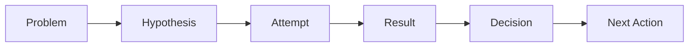
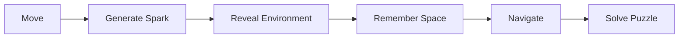
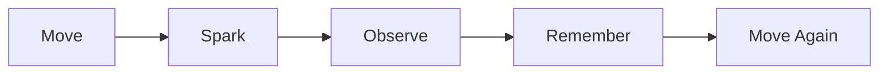
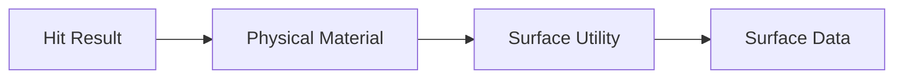
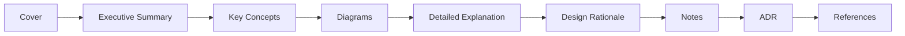
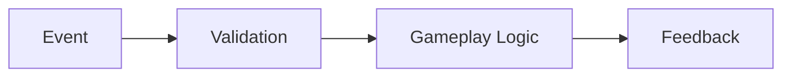

──────────────────────────────────────────────────────────────────────────────

# Spark Technical Documentation

## Volume 10

# Development Log

Version 1.0

Unreal Engine 5.5.4

──────────────────────────────────────────────────────────────────────────────

> Move to See. Remember to Survive.

본 문서는 Spark 프로젝트의 개발 과정, 기술적 판단, 문제 해결,
테스트 결과와 주요 변경 사항을 지속적으로 기록하기 위한 개발 로그이다.

Development Log는 단순한 일일 작업 기록이 아니다.

프로젝트가 어떤 과정을 거쳐 현재 구조에 도달했는지 설명하고,
잘못된 시도와 해결 과정까지 남겨 이후의 개발과 포트폴리오 제작에
활용하는 것을 목적으로 한다.

---

# Executive Summary

## 목적

본 문서는 Spark 프로젝트의 개발 이력을 관리한다.

주요 기록 범위는 다음과 같다.

- 작업 내용
- 구현 결과
- 설계 변경
- 기술적 의사결정
- 문제와 원인
- 해결 과정
- 테스트 결과
- 성능 측정
- 알려진 문제
- 다음 작업
- 마일스톤 회고
- 포트폴리오 자료

---

## Development Log Goal

Spark의 Development Log는 다음 질문에 답할 수 있어야 한다.

- 무엇을 만들었는가
- 왜 그렇게 만들었는가
- 어떤 문제가 발생했는가
- 문제의 원인은 무엇이었는가
- 어떤 방법으로 해결했는가
- 결과가 예상과 같았는가
- 다음에는 무엇을 해야 하는가

---

# Logging Philosophy

Development Log는 다음 원칙을 따른다.

## Record Decisions, Not Only Results

완성된 결과뿐 아니라
그 결과에 도달하기까지의 판단을 기록한다.



---

## Record Failures

실패한 시도도 중요한 개발 기록이다.

실패한 접근을 남기면 다음과 같은 이점이 있다.

- 같은 문제를 반복하지 않는다.
- 해결 과정의 근거를 설명할 수 있다.
- 기술적 판단 능력을 보여줄 수 있다.
- 이후 구조 변경의 이유를 이해할 수 있다.

실패한 코드를 유지할 필요는 없지만,
실패 원인과 배운 점은 기록한다.

---

## Keep Entries Actionable

로그는 감상보다 실제 개발에 도움이 되는 정보를 우선한다.

나쁜 예:

```text
오늘 Spark 시스템을 작업했다.
생각보다 어려웠지만 어느 정도 완성했다.
```

좋은 예:

```text
Landing Event에서 Physical Material을 조회하도록 구현했다.

초기에는 Character가 Surface Type을 직접 판정했으나,
이 구조에서는 Wall Slide와 Cable Interaction이 동일한 로직을
중복 구현해야 했다.

Surface 판정을 Utility로 분리하고,
SparkComponent가 결과를 조회하는 구조로 변경했다.
```

---

## Update Regularly

로그는 작업이 끝난 뒤 한꺼번에 작성하지 않는다.

권장 기록 시점:

- 작업 시작 전
- 기능 구현 후
- 구조 변경 후
- 주요 버그 해결 후
- Playtest 후
- Milestone 종료 후
- Build 또는 Release 생성 후

---

# Log Entry Structure

모든 개발 로그는 가능한 한 다음 형식을 사용한다.

```markdown
## YYYY-MM-DD — 작업 제목

### 목표

이번 작업에서 달성하려는 내용을 작성한다.

### 작업 내용

구현하거나 수정한 내용을 작성한다.

### 문제

발생한 문제와 증상을 작성한다.

### 원인

확인된 원인 또는 현재 가설을 작성한다.

### 해결

적용한 해결 방법을 작성한다.

### 결과

테스트 결과와 현재 상태를 작성한다.

### 결정

구조 또는 방향에 관한 결정을 작성한다.

### 알려진 문제

아직 해결되지 않은 문제를 작성한다.

### 다음 작업

다음 개발 단계에서 수행할 작업을 작성한다.

### 관련 자료

Commit, Screenshot, Video, Issue, 문서 링크를 작성한다.
```

모든 항목을 반드시 사용할 필요는 없지만,
`목표`, `작업 내용`, `결과`, `다음 작업`은 기본적으로 포함한다.

---

# Entry Metadata

각 로그에는 필요에 따라 다음 정보를 추가한다.

| 항목 | 설명 |
|------|------|
| Date | 작업 날짜 |
| Author | 작성자 |
| Milestone | 현재 개발 단계 |
| Category | 작업 종류 |
| Status | 완료 상태 |
| Branch | Git Branch |
| Commit | 관련 Commit |
| Build | 테스트한 Build |
| Engine | Unreal Engine Version |

---

## Metadata Example

```text
Date: YYYY-MM-DD
Milestone: Core Prototype
Category: Gameplay / Spark
Status: Completed
Branch: feature/landing-spark
Commit: Feature: Add landing spark event
Engine: Unreal Engine 5.5.4
```

---

# Log Categories

Development Log는 다음 Category를 사용한다.

| Category | 설명 |
|----------|------|
| Planning | 기획 및 범위 |
| Architecture | 시스템 구조 |
| Gameplay | 이동과 게임 규칙 |
| Character | Character 구현 |
| Spark | Spark System |
| Surface | Surface 판정 |
| Interaction | 상호작용 |
| Checkpoint | Checkpoint와 Respawn |
| Save | 저장과 불러오기 |
| Puzzle | 퍼즐 |
| Level | 레벨 제작 |
| Art | 환경 및 Character Art |
| Lighting | 조명 |
| VFX | Niagara와 시각 효과 |
| Animation | 애니메이션 |
| Audio | 사운드 |
| UI / UX | HUD와 Menu |
| Accessibility | 접근성 |
| Optimization | 성능 개선 |
| Testing | 테스트 |
| Bug Fix | 버그 수정 |
| Documentation | 문서 |
| Build | Packaging과 Build |
| Release | 배포 및 제출 |

하나의 로그에 여러 Category를 사용할 수 있다.

---

# Status Convention

| 상태 | 의미 |
|------|------|
| Planned | 작업 예정 |
| In Progress | 진행 중 |
| Blocked | 문제로 중단 |
| Review | 검토 또는 테스트 중 |
| Completed | 완료 |
| Reopened | 완료 후 문제 발견 |
| Deprecated | 더 이상 사용하지 않음 |

---

# Severity Convention

버그를 기록할 때 다음 Severity를 사용한다.

| 등급 | 의미 |
|------|------|
| Blocker | 실행 또는 진행 불가능 |
| Critical | 핵심 기능 실패 |
| Major | 플레이 경험에 큰 영향 |
| Minor | 제한적인 기능 또는 표현 문제 |
| Trivial | 작은 시각적 문제 |

---

# Development Snapshot

## Project Information

| 항목 | 내용 |
|------|------|
| Project Name | Spark |
| Engine | Unreal Engine 5.5.4 |
| Genre | 3D Puzzle Platformer |
| Core Mechanic | 움직임으로 발생하는 일시적인 Spark |
| Theme | 어두운 산업 시설 |
| Player Character | 유지보수 로봇 |
| Architecture | C++와 Blueprint의 Hybrid 구조 |
| Current Phase | Pre-Production |
| Current Documentation Version | 1.0 |

---

## Core Gameplay



---

## Current Core Features

| 기능 | 상태 |
|------|------|
| Move | Completed |
| Jump | Completed |
| Air Control | Completed |
| Wall Slide | Planned |
| Wall Jump | Planned |
| Landing Spark | Planned |
| Wall Slide Spark | Planned |
| Wall Jump Spark | Planned |
| Cable Spark | Planned |
| Metal Surface | Planned |
| Rubber Surface | Planned |
| Cable Surface | Planned |
| Interaction | Planned |
| Checkpoint | Planned |
| Respawn | Planned |
| Save / Load | Planned |
| Puzzle Framework | Planned |

---

# Documentation Development Log

## Initial Documentation Set

Spark의 기술 문서는 다음 순서로 구성했다.

```text
01_GDD.md
02_Architecture.md
03_Gameplay_Framework.md
04_Level_Design.md
05_Art_Direction.md
06_UI_UX.md
07_Coding_Convention.md
08_Roadmap.md
09_Asset_List.md
10_Dev_Log.md
```

---

## Documentation Rules

문서 작성 과정에서 다음 기준을 적용했다.

- Epic Games 기술 문서와 유사한 구조 사용
- Executive Summary 우선
- Diagram과 Table 중심 설명
- 구현 방법보다 설계 이유를 함께 기록
- 중요한 구조 변경은 ADR로 관리
- GitHub에서 읽기 쉬운 Markdown 사용
- 문서 이름과 전체 구조를 고정
- 모든 문서 작성 후 최종 일관성 검토 진행

---

# Initial Planning Records

아래 항목은 실제 구현 완료 로그가 아니라, Pre-Production 단계에서 확정한 초기 설계 기록이다. 실제 구현 결과는 이후 날짜별 Development Log에 별도로 기록한다.

기록 상태는 `Planned`, `Proposed`, `Verified`를 구분한다. 실제 테스트를 통과하지 않은 설계는 `Verified`로 표시하지 않는다.

## Entry 001 — Project Concept Definition

**Milestone:** Pre-Production  
**Category:** Planning  
**Status:** Completed

### 목표

Spark의 핵심 콘셉트와 프로젝트 범위를 정의한다.

### 작업 내용

다음 핵심 콘셉트를 확정했다.

> 움직일 때 발생하는 Spark로 어두운 공간을 잠시 확인하고,  
> 본 공간을 기억하며 앞으로 이동한다.

프로젝트의 기본 방향을 다음과 같이 정의했다.

- 3D Puzzle Platformer
- 어두운 산업 시설
- 유지보수 로봇
- 전투 없음
- 이동과 공간 기억 중심
- Metal, Rubber, Cable 기반 Surface 규칙

### 결과

프로젝트의 핵심 경험을 다음 문장으로 정리했다.

> Move to See. Remember to Survive.

### 결정

전투, 인벤토리, 스킬 트리, 멀티플레이는 현재 범위에서 제외한다.

### 다음 작업

- GDD 작성
- 핵심 이동 정의
- Spark 발생 조건 정의
- 시스템 책임 분리

---

## Entry 002 — Gameplay Ability Definition

**Milestone:** Pre-Production  
**Category:** Gameplay  
**Status:** Completed

### 목표

플레이어의 핵심 이동 능력을 정의한다.

### 작업 내용

다음 능력을 핵심 이동으로 선정했다.

- Move
- Jump
- Wall Slide
- Wall Jump

Spark 발생 Event를 다음과 같이 정의했다.

- Landing
- Wall Slide
- Wall Jump
- Cable Interaction

### 설계 이유

이동 자체가 시야를 만드는 게임이므로,
Spark는 별도의 탐색 버튼보다 이동 Event에 연결하는 것이 적합하다고 판단했다.

이를 통해 플레이어는 이동과 관찰을 별개의 행동으로 수행하지 않고,
하나의 행동으로 공간을 탐색하게 된다.

### 결과

기본 Gameplay Loop를 다음과 같이 정의했다.



### 다음 작업

- Character Movement Prototype
- Event별 Spark 강도 정의
- 이동과 Spark의 타이밍 테스트

---

## Entry 003 — Surface Rule Definition

**Milestone:** Pre-Production  
**Category:** Surface / Spark  
**Status:** Completed

### 목표

Surface별 Spark 반응을 정의한다.

### 작업 내용

다음 세 가지 Surface 규칙을 설정했다.

| Surface | 반응 |
|---------|------|
| Metal | 기본 Spark |
| Rubber | Spark 없음 |
| Cable | 강한 Spark |

### 설계 이유

Surface 차이는 단순한 시각적 변화가 아니라
퍼즐과 이동 판단에 영향을 주는 게임 규칙이어야 한다.

Metal은 기본 피드백을 제공하고,
Rubber는 정보를 차단하며,
Cable은 강한 빛과 전력 상호작용을 제공한다.

### 결정

Surface는 색상만으로 구분하지 않는다.

다음 요소를 함께 사용한다.

- Material
- Roughness
- Shape
- Pattern
- Sound
- Spark Response

### 다음 작업

- Physical Material 설정
- Surface Type 정의
- Surface Data Asset 설계
- Graybox 비교 테스트 제작

---

## Entry 004 — Hybrid Architecture Definition

**Milestone:** Pre-Production  
**Category:** Architecture  
**Status:** Completed

### 목표

C++와 Blueprint의 책임을 분리한다.

### 작업 내용

다음 Hybrid 구조를 정의했다.

#### C++

- Character
- Component
- Gameplay Framework
- Save
- Camera Manager
- Core Gameplay Rule
- Surface Query

#### Blueprint

- Puzzle Assembly
- UI
- Niagara Presentation
- Animation
- Level Script
- Environment Interaction Presentation

### 설계 이유

C++는 재사용성과 안정성이 필요한 핵심 규칙에 적합하다.

Blueprint는 빠른 반복 작업과 시각적 조립이 필요한
퍼즐, 레벨, 연출 작업에 적합하다.

### 결정

Gameplay Rule은 C++에 두고,
Blueprint는 Data 설정과 Presentation을 담당한다.

### 알려진 문제

실제 구현 과정에서 일부 기능의 책임 경계가 달라질 수 있다.

구조 변경 시 Architecture 문서와 ADR을 함께 갱신한다.

### 다음 작업

- Core Class 생성
- Component Interface 설계
- Event 통신 방식 검증

---

## Entry 005 — Character Component Revision

**Milestone:** Pre-Production  
**Category:** Architecture / Character  
**Status:** Completed

### 목표

Character가 소유할 Component를 확정한다.

### 초기 계획

```text
ASparkCharacter

├── USparkComponent
└── USurfaceComponent
```

### 문제

`USurfaceComponent`의 책임이 불명확했다.

Surface는 Character가 지속적으로 소유해야 하는 상태라기보다,
충돌이 발생한 시점에 조회해야 하는 환경 정보에 가까웠다.

또한 Checkpoint와 Interaction 기능이 Character 내부에 직접 구현될 가능성이 있었다.

### 해결

구조를 다음과 같이 변경했다.

```text
ASparkCharacter

├── USparkComponent
├── UCheckpointComponent
└── UInteractionComponent
```

Surface는 다음 흐름으로 조회한다.



### 결과

각 Component의 책임이 명확해졌다.

| Component | 책임 |
|-----------|------|
| SparkComponent | Spark 요청과 Event 발생 |
| CheckpointComponent | Checkpoint와 복원 정보 |
| InteractionComponent | 대상 탐지와 상호작용 요청 |

### 결정

Surface 상태를 저장하는 전용 Component는 현재 구조에서 사용하지 않는다.

### 다음 작업

- 실제 C++ Class Skeleton 작성
- Component 간 통신 방식 구현
- Surface Utility 테스트

---

## Entry 006 — Documentation Architecture Established

**Milestone:** Pre-Production  
**Category:** Documentation  
**Status:** Completed

### 목표

프로젝트 전체 기술 문서 구조를 확정한다.

### 작업 내용

11개의 문서로 전체 구조를 구성했다.

각 문서는 다음 공통 구조를 사용한다.



### 결정

문서 작성 중에는 다음 작업을 진행하지 않는다.

- 파일 이름 변경
- 문서 순서 변경
- 전체 구조 재설계
- 대규모 문체 수정
- Diagram 스타일 통일
- 중복 내용 정리

모든 문서 작성이 끝난 후 최종 검토 단계에서 수행한다.

### 결과

다음 문서가 작성되었다.

- GDD
- Architecture Overview
- Architecture Systems
- Gameplay Framework
- Level Design
- Art Direction
- UI / UX
- Coding Convention
- Roadmap
- Asset List
- Development Log

### 다음 작업

전체 문서 간 용어와 시스템 구조의 일관성을 검토한다.

---

# Core Prototype Development Log

## 2026-08-06 — Phase 1 Core Prototype: 이동, 점프, 공중 제어 구현

**Milestone:** Phase 1 — Core Prototype  
**Category:** Character / Gameplay / Input  
**Status:** Completed  
**Branch:** feature/movement  
**Issues:** SPARK-9, SPARK-10, SPARK-11  

### 목표

- Enhanced Input 기반 3D 이동(Move, Look) 및 점프(Jump) 로직 구현
- 3D 퍼즐 플랫폼 메커니즘에 맞춘 캐릭터 조작감 및 공중 제어력(Air Control) 튜닝
- Spark 아키텍처 규칙(PlayerController -> Character)을 만족하는 생명주기 안정적 입력 바인딩 구축

### 작업 내용

1. **`ASparkCharacter` 구현**:
   - `USpringArmComponent` 및 `UCameraComponent` 캡슐화 및 생성자 세팅
   - `bOrientRotationToMovement = true` 및 시점 기반 지면 수평 이동 벡터 계산(`FRotationMatrix(YawRotation)`)
   - 캐릭터 키 100cm 스펙에 맞춘 점프 높이(`JumpZVelocity = 450.0f`), 중력 스케일(`1.2f`), 반응형 가속도(`MaxAcceleration = 4096.0f`) 및 공중 제어력(`AirControl = 0.85f`) 튜닝
2. **`ASparkPlayerController` 구현**:
   - `BeginPlay()` 시점 `UEnhancedInputLocalPlayerSubsystem`을 통한 `IMC_Default` 등록
   - `OnPossess(APawn* InPawn)` 타이밍에 빙의된 캐릭터 캐스팅 및 안전한 Input Action (`IA_Move`, `IA_Look`, `IA_Jump`) 바인딩 연결
   - `OnUnPossess()` 시점에 액션 바인딩 해제(`ClearActionBindings`) 처리
3. **`ASparkGameMode` 구현**:
   - C++ 생성자에서 기본 `DefaultPawnClass`(`ASparkCharacter`) 및 `PlayerControllerClass`(`ASparkPlayerController`) 타입 지정

### 문제 및 해결 (Troubleshooting)

- **문제 1: `SetupInputComponent()`에서 입력 바인딩 시 `GetPawn()`이 `nullptr`을 반환하여 바인딩 스킵 및 조작 불가**
  - **원인**: PlayerController 생성 직후 실행되는 `SetupInputComponent()` 타이밍에는 아직 컨트롤러가 캐릭터 Pawn에 빙의(Possess)되지 않은 상태임.
  - **해결**: 캐릭터 빙의가 확정되는 생명주기 시점인 `OnPossess(InPawn)`으로 바인딩 로직을 이관하여 타이밍 이슈 해결.
- **문제 2: 마우스 좌우 회전 반대 및 W/A/S/D 90도 틀어짐**
  - **원인**: `IMC_Default` 에셋의 Modifiers 축 설정 불일치 (W/S가 X축, D/A가 Y축으로 들어가며 90도 회전) 및 마우스 Negate의 X축 수직/수평 반전 문제.
  - **해결**: `IMC_Default` 매핑 정정
    - `W`: `Swizzle Input Axis Values` 추가 (Y축 전진)
    - `S`: `Swizzle Input Axis Values` + `Negate` 추가 (Y축 후진)
    - `D`: Modifiers 없음 (X축 우측)
    - `A`: `Negate` 추가 (X축 좌측)
    - `IA_Look`: `Negate` Modifier 중 `X`축 체크 해제하여 정상 좌우 시점 회전 확보

### 결과

- 3D 퍼즐 플랫폼 조작감 검증 완료 (즉각적인 가속, 가변 점프, 정교한 공중 위치 수정 가능)
- C++ 뼈대 및 블루프린트 연동 에셋 세팅 완료

### 관련 Commit 및 Issue

- **Commit**: `SPARK-9 기본 이동 및 카메라 조작 구현 및 EOL(CRLF) 적용`, `SPARK-10 점프 구현 및 3D 플랫폼 조작감/가속도 튜닝`, `SPARK-11 공중 제어 구현 (AirControl 0.85f 설정)`
- **Jira Issues**: [SPARK-9](https://dalyeou.atlassian.net/browse/SPARK-9), [SPARK-10](https://dalyeou.atlassian.net/browse/SPARK-10), [SPARK-11](https://dalyeou.atlassian.net/browse/SPARK-11) (전부 완료 처리)

---

# Daily Log Template

아래 Template을 복사하여 일일 개발 기록에 사용한다.

```markdown
## YYYY-MM-DD — 작업 제목

**Milestone:**  
**Category:**  
**Status:**  
**Branch:**  
**Commit:**  
**Engine:** Unreal Engine 5.5.4

### 목표

-

### 작업 내용

-

### 문제

-

### 원인

-

### 시도한 방법

1.
2.
3.

### 해결

-

### 결과

-

### 테스트

| 테스트 | 결과 | 비고 |
|--------|------|------|
| Editor | Pass / Fail | |
| Packaged Build | Pass / Fail | |
| Keyboard | Pass / Fail | |
| Gamepad | Pass / Fail | |

### 결정

-

### 알려진 문제

-

### 다음 작업

-

### 관련 자료

- Commit:
- Issue:
- Screenshot:
- Video:
- Related Document:
```

---

# Feature Implementation Log Template

기능 구현에는 다음 Template을 사용한다.

```markdown
## Feature — 기능 이름

**Status:** Planned / In Progress / Review / Completed  
**Priority:** P0 / P1 / P2 / P3  
**Related System:**  

### 목적

기능이 필요한 이유를 작성한다.

### 요구사항

- [ ]
- [ ]
- [ ]

### 구현 구조



### 주요 Class

| Class | 책임 |
|-------|------|
| | |

### 구현 내용

-

### Edge Cases

- [ ]
- [ ]
- [ ]

### 테스트 결과

-

### 알려진 문제

-

### 완료 조건

- [ ]
- [ ]
- [ ]
```

---

# Bug Log Template

```markdown
## BUG-000 — 버그 제목

**Date:**  
**Severity:** Blocker / Critical / Major / Minor / Trivial  
**Status:** Open / In Progress / Fixed / Closed / Reopened  
**Affected Build:**  
**Category:**  

### 증상

버그가 어떻게 나타나는지 작성한다.

### 재현 방법

1.
2.
3.

### 예상 결과

-

### 실제 결과

-

### 발생 빈도

Always / Frequent / Intermittent / Rare

### 원인

-

### 해결

-

### 변경 파일

-

### Regression Test

- [ ] 기존 상황
- [ ] 경계 상황
- [ ] Save / Load
- [ ] Respawn
- [ ] Packaged Build

### 결과

-

### 관련 자료

- Issue:
- Commit:
- Screenshot:
- Video:
```

---

# Playtest Log Template

```markdown
## Playtest — YYYY-MM-DD

**Build:**  
**Milestone:**  
**Tester:**  
**Playtime:**  
**Input Device:**  

### 테스트 목적

-

### 테스트 구간

-

### 관찰 결과

| 구간 | 행동 | 문제 | Severity |
|------|------|------|----------|
| | | | |

### 이해 여부

| 질문 | 결과 |
|------|------|
| 이동 방법을 이해했는가 | |
| Spark의 역할을 이해했는가 | |
| Surface 차이를 이해했는가 | |
| 진행 방향을 찾았는가 | |
| Checkpoint를 인식했는가 | |
| 실패 원인을 이해했는가 | |

### 정량 데이터

| 항목 | 결과 |
|------|------|
| 전체 플레이 시간 | |
| 실패 횟수 | |
| 퍼즐별 시도 횟수 | |
| 길을 잃은 횟수 | |
| Respawn 횟수 | |

### 주요 피드백

-

### 변경 계획

- [ ]
- [ ]
- [ ]

### 유지할 요소

-

### 제거 또는 수정할 요소

-
```

---

# Performance Log Template

```markdown
## Performance Test — YYYY-MM-DD

**Build:**  
**Level:**  
**Platform:**  
**Resolution:**  
**Graphics Preset:**  

### 테스트 환경

| 항목 | 정보 |
|------|------|
| CPU | |
| GPU | |
| RAM | |
| Storage | |
| Operating System | |

### 측정 결과

| 항목 | 결과 | 목표 |
|------|------|------|
| Average FPS | | |
| Minimum FPS | | |
| Game Thread | | |
| GPU Time | | |
| Memory | | |
| Load Time | | |

### 주요 비용

- Lighting:
- Niagara:
- Shadow:
- Material:
- Blueprint:
- Collision:

### 문제 구간

-

### 개선 작업

- [ ]
- [ ]
- [ ]

### 개선 결과

-

### 다음 측정

-
```

---

# Milestone Review Template

```markdown
## Milestone Review — 단계 이름

**Period:**  
**Build:**  
**Status:** Completed / Incomplete  

### 목표

-

### 완료된 작업

- [ ]
- [ ]
- [ ]

### 미완료 작업

- [ ]
- [ ]
- [ ]

### 주요 결과

-

### 잘된 점

-

### 문제점

-

### 기술적 결정

-

### 제거된 기능

-

### 새로 발견된 리스크

-

### 다음 Milestone

-

### 관련 자료

- Build:
- Video:
- Screenshot:
- Documents:
```

---

# ADR Log

Architecture Decision Record의 목록을 관리한다.

| ADR | 제목 | 상태 | 관련 문서 |
|-----|------|------|-----------|
| ADR-001 | Hybrid C++ / Blueprint Architecture | Accepted | [11_ADR.md](./11_ADR.md) |
| ADR-002 | Remove SurfaceComponent | Accepted | [11_ADR.md](./11_ADR.md) |
| ADR-003 | Event-Driven Gameplay | Accepted | [11_ADR.md](./11_ADR.md) |
| ADR-004 | Physical Material Based Surface Detection | Accepted | [11_ADR.md](./11_ADR.md) |
| ADR-005 | Data Asset Driven Spark Configuration | Accepted | [11_ADR.md](./11_ADR.md) |
| ADR-006 | Camera Selection Strategy | Accepted | [11_ADR.md](./11_ADR.md) |

---

## ADR Status

| 상태 | 의미 |
|------|------|
| Proposed | 검토 중 |
| Accepted | 채택 |
| Rejected | 거절 |
| Superseded | 새로운 ADR로 대체 |
| Deprecated | 더 이상 적용되지 않음 |

---

# Decision Log Template

```markdown
## ADR-000 — 결정 제목

**Date:**  
**Status:** Proposed / Accepted / Rejected / Superseded  
**Related Systems:**  

### Context

결정이 필요한 배경을 작성한다.

### Problem

해결해야 하는 문제를 작성한다.

### Options

#### Option A

장점:

- 

단점:

- 

#### Option B

장점:

- 

단점:

- 

### Decision

선택한 방식을 작성한다.

### Rationale

선택한 이유를 작성한다.

### Consequences

#### Positive

-

#### Negative

-

### Follow-Up

-
```

---

# Known Issues

현재 확인되었거나 구현 과정에서 검증해야 하는 항목을 관리한다.

| ID | 문제 | Severity | Status |
|----|------|----------|--------|
| KI-001 | 카메라 방식 → Third Person 결정 (ADR-006), 실제 구현 검증 필요 | Major | In Progress |
| KI-002 | Spark 지속 시간 0.8~1.2초로 결정, 밝기 값은 Prototype에서 검증 필요 | Major | In Progress |
| KI-003 | Wall Slide 판정 방식 → Wall Contact Trace(제안), 구현 후 검증 | Major | Open |
| KI-004 | Wall Jump 입력 방식 → 이동 방향키 + Jump 버튼 조합(별도 입력 없음, 제안) | Major | Open |
| KI-005 | Surface Utility 구현 전 | Major | Open |
| KI-006 | Save 데이터 구조 → Chapter/Checkpoint ID 기반 단일 슬롯(제안), 구현 후 검증 | Major | Open |
| KI-007 | Target Performance 미측정 | Major | Open |
| KI-008 | 접근성 설정 범위 → Flash Reduction(스파크 강도 감소) 1개로 최소화(제안) | Minor | Open |
| KI-009 | 최종 플레이 시간 → GDD 목표치 15~20분(MVP) 유지, 실측은 Chapter 완성 후 | Minor | Open |
| KI-010 | Character Asset 제작 방식 → Marketplace 등 기존 에셋 활용 우선, 커스텀 모델링은 지양 | Minor | In Progress |

---

# Experiment Backlog

확정되지 않은 기술과 Gameplay 아이디어를 관리한다.

| Experiment | 목적 | Priority | Status |
|------------|------|----------|--------|
| Third Person Camera | 이동 가독성 검증 | P0 | Planned |
| First Person Camera | 몰입도와 공간 기억 검증 | P1 | Planned |
| Fixed Camera | 퍼즐 구도와 연출 검증 | P1 | Planned |
| Dynamic Spark Light | 실시간 조명 비용 확인 | P0 | Planned |
| Emissive-only Spark | 저비용 표현 비교 | P1 | Planned |
| Spark Afterimage | 기억 보조 가능성 확인 | P2 | Planned |
| Wall Contact Trace | Wall Slide 판정 검증 | P0 | Planned |
| Physical Material Query | Surface 판정 검증 | P0 | Planned |
| Cable Spline | Cable 제작 방식 검증 | P1 | Planned |
| Flash Reduction | 접근성 효과 검증 | P1 | Planned |

실험 결과가 채택되면 정식 기능 Task 또는 ADR로 전환한다.

---

# Backlog

## P0 — Core Gameplay

- [ ] Unreal Engine 5.5.4 C++ 프로젝트 생성
- [ ] Enhanced Input 설정
- [ ] `ASparkCharacter` 생성
- [ ] 기본 이동 구현
- [ ] Jump 구현
- [ ] Landing Event 처리
- [ ] Wall Slide Prototype
- [ ] Wall Jump Prototype
- [ ] `USparkComponent` 생성
- [ ] Physical Material Surface 판정
- [ ] Metal Spark
- [ ] Rubber No-Spark
- [ ] Cable Strong Spark
- [ ] 기본 Graybox Level
- [ ] 실패 영역
- [ ] 빠른 Respawn

---

## P1 — Playable Progression

- [ ] `UInteractionComponent` 생성
- [ ] `IInteractable` 생성
- [ ] Interaction Prompt
- [ ] `UCheckpointComponent` 생성
- [ ] Checkpoint Actor
- [ ] Checkpoint Respawn
- [ ] SaveGame Class
- [ ] Save / Load
- [ ] Continue
- [ ] 기본 Puzzle Framework
- [ ] Cable Interaction
- [ ] Door Activation
- [ ] Pause Menu

---

## P2 — Presentation

- [ ] Character Model
- [ ] Animation Blueprint
- [ ] Landing VFX
- [ ] Wall Slide VFX
- [ ] Wall Jump VFX
- [ ] Cable VFX
- [ ] Surface Sound
- [ ] Checkpoint Effect
- [ ] Modular Environment
- [ ] Master Material
- [ ] Lighting Pass
- [ ] Main Menu
- [ ] Settings
- [ ] Audio Mix

---

## P3 — Polish

- [ ] Camera Feedback
- [ ] Character Secondary Motion
- [ ] Environmental Storytelling
- [ ] UI Animation
- [ ] Additional Puzzle Variation
- [ ] Additional Ambient VFX
- [ ] Accessibility Polish
- [ ] Performance Optimization
- [ ] Portfolio Capture
- [ ] Trailer

---

# Weekly Review

매주 다음 항목을 점검한다.

```markdown
## Weekly Review — YYYY Week 00

### 이번 주 목표

-

### 완료한 작업

-

### 완료하지 못한 작업

-

### 발생한 문제

-

### 주요 결정

-

### 다음 주 최우선 작업

1.
2.
3.

### 현재 리스크

-

### 문서 갱신 여부

- [ ] GDD
- [ ] Architecture
- [ ] Gameplay Framework
- [ ] Roadmap
- [ ] Asset List
- [ ] Dev Log

### Build 상태

Editor:
Packaged Build:
Known Blocker:
```

---

# Monthly Review

월간 Review에서는 개별 작업보다
프로젝트 전체 방향을 검토한다.

확인 항목:

- 핵심 경험이 여전히 명확한가
- Scope가 증가하지 않았는가
- 현재 일정이 현실적인가
- 제거해야 할 기능이 있는가
- Architecture가 실제 구현과 일치하는가
- 테스트가 충분히 진행되고 있는가
- Asset 제작량이 감당 가능한가
- 포트폴리오 자료가 기록되고 있는가
- 다음 Milestone 진입 조건을 만족하는가

---

# Documentation Update Log

문서 수정 이력을 관리한다.

| Version | Date | Document | Change |
|---------|------|----------|--------|
| 1.0 | Initial | 01_GDD | Initial Draft |
| 1.0 | Initial | 02_Architecture_Overview | Initial Draft |
| 1.0 | Initial | 03_Architecture_Systems | Initial Draft |
| 1.0 | Initial | 04_Gameplay_Framework | Initial Draft |
| 1.0 | Initial | 05_Level_Design | Initial Draft |
| 1.0 | Initial | 06_Art_Direction | Initial Draft |
| 1.0 | Initial | 07_UI_UX | Initial Draft |
| 1.0 | Initial | 08_Coding_Convention | Initial Draft |
| 1.0 | Initial | 09_Roadmap | Initial Draft |
| 1.0 | Initial | 10_Asset_List | Initial Draft |
| 1.0 | Initial | 11_Dev_Log | Initial Draft |

---

# Version Convention

문서 Version은 다음 형식을 사용한다.

```text
Major.Minor
```

예시:

```text
1.0
1.1
2.0
```

---

## Minor Version

다음 변경에는 Minor Version을 증가시킨다.

- 내용 추가
- 작은 설계 수정
- 설명 보완
- 표 또는 Diagram 추가
- 구현 결과 반영

---

## Major Version

다음 변경에는 Major Version을 증가시킨다.

- 핵심 구조 변경
- Gameplay Loop 변경
- 주요 시스템 책임 변경
- 전체 개발 범위 변경
- 문서 목적 변경

---

# Portfolio Case Study Template

주요 문제 해결 과정은 포트폴리오용 Case Study로 정리한다.

```markdown
## Case Study — 문제 제목

### Context

어떤 기능을 개발하고 있었는가

### Problem

어떤 문제가 발생했는가

### Constraints

어떤 제한이 있었는가

### Initial Approach

처음에는 어떻게 접근했는가

### Failure

왜 동작하지 않았는가

### Investigation

어떤 방법으로 원인을 확인했는가

### Solution

최종적으로 어떻게 해결했는가

### Result

성능, 구조 또는 사용자 경험이 어떻게 개선되었는가

### Lessons Learned

무엇을 배웠는가

### Visual Evidence

- Before
- After
- Diagram
- Profiling Result
- Gameplay Video
```

---

# Capture Log

개발 과정의 Screenshot과 Video를 관리한다.

| Date | Milestone | Content | File |
|------|-----------|---------|------|
| | Prototype | Basic Movement | |
| | Prototype | Landing Spark | |
| | Prototype | Surface Comparison | |
| | Gameplay Prototype | First Puzzle | |
| | Vertical Slice | Before Art Pass | |
| | Vertical Slice | Final Lighting | |
| | Alpha | Full Playthrough | |
| | Beta | Performance Comparison | |
| | Release | Final Gameplay | |

---

# Build Log

| Build | Date | Phase | Result | Notes |
|-------|------|-------|--------|-------|
| 0.0.1 | | Prototype | | |
| 0.1.0 | | Core Prototype | | |
| 0.2.0 | | Gameplay Prototype | | |
| 0.3.0 | | Vertical Slice | | |
| 0.5.0 | | Production | | |
| 0.7.0 | | Alpha | | |
| 0.9.0 | | Beta | | |
| 1.0.0-RC | | Release Candidate | | |
| 1.0.0 | | Release | | |

---

# Build Entry Template

```markdown
## Build 0.0.0

**Date:**  
**Phase:**  
**Configuration:** Development / Shipping  
**Platform:**  

### Included Features

-

### Fixed Issues

-

### Known Issues

-

### Test Result

| Test | Result |
|------|--------|
| Launch | |
| New Game | |
| Save / Load | |
| Respawn | |
| Full Playthrough | |
| Exit | |

### Build Location

-

### Notes

-
```

---

# Final Review Checklist

프로젝트 완료 시 Development Log에서 다음 항목을 확인한다.

## Development History

- [ ] 주요 기능 구현 과정이 기록되어 있는가
- [ ] 핵심 Architecture 변경이 기록되어 있는가
- [ ] 실패한 접근과 원인이 기록되어 있는가
- [ ] 중요한 버그 해결 과정이 기록되어 있는가
- [ ] Milestone Review가 존재하는가

## Testing

- [ ] Playtest 결과가 기록되어 있는가
- [ ] 주요 버그의 재현과 해결 과정이 존재하는가
- [ ] Performance 측정 결과가 존재하는가
- [ ] Packaged Build 테스트가 기록되어 있는가
- [ ] Target Platform 결과가 기록되어 있는가

## Documentation

- [ ] 실제 구현과 문서가 일치하는가
- [ ] ADR 상태가 최신인가
- [ ] Known Issues가 정리되어 있는가
- [ ] Deprecated 결정이 표시되어 있는가
- [ ] 최종 Version이 적용되어 있는가

## Portfolio

- [ ] 핵심 Gameplay Video가 있는가
- [ ] Before / After 자료가 있는가
- [ ] Architecture Diagram이 있는가
- [ ] 문제 해결 Case Study가 있는가
- [ ] 성능 개선 자료가 있는가
- [ ] 최종 Screenshot이 있는가

---

# Development Log Rules

Spark의 Development Log는 다음 규칙을 따른다.

- 결과뿐 아니라 결정 과정도 기록한다.
- 실패한 시도와 원인을 숨기지 않는다.
- 로그에는 실제로 확인한 사실을 작성한다.
- 확인하지 않은 내용은 가설로 표시한다.
- 작업 완료 후 가능한 한 빠르게 기록한다.
- 기능마다 목표와 완료 조건을 명확히 작성한다.
- 버그에는 재현 방법을 포함한다.
- 테스트 환경과 Build를 함께 기록한다.
- 구조 변경은 관련 문서와 ADR에 반영한다.
- 알려진 문제를 해결된 것처럼 표시하지 않는다.
- Screenshot과 Video를 개발 과정에서 지속적으로 남긴다.
- 로그를 감상문이나 단순 작업 목록으로 만들지 않는다.
- 다음 작업을 구체적인 실행 단위로 작성한다.
- Release 전에 미해결 로그와 Known Issues를 검토한다.
- 민감한 정보와 로컬 경로는 공개 문서에 기록하지 않는다.

---

# Related Documents

- [01_GDD.md](./01_GDD.md)
- [02_Architecture.md](./02_Architecture.md)
- [03_Gameplay_Framework.md](./03_Gameplay_Framework.md)
- [04_Level_Design.md](./04_Level_Design.md)
- [05_Art_Direction.md](./05_Art_Direction.md)
- [06_UI_UX.md](./06_UI_UX.md)
- [07_Coding_Convention.md](./07_Coding_Convention.md)
- [08_Roadmap.md](./08_Roadmap.md)
- [09_Asset_List.md](./09_Asset_List.md)
- [11_ADR.md](./11_ADR.md)

---

# Summary

Spark의 Development Log는
프로젝트가 어떤 과정과 판단을 거쳐 완성되는지를 기록하는 문서다.

로그에는 구현 결과뿐 아니라
발생한 문제, 원인, 시도한 방법, 해결 과정,
테스트 결과와 다음 작업을 함께 작성한다.

주요 Architecture 변경은 ADR로 관리하고,
버그, Playtest, 성능 측정, Build와 Milestone 결과는
각각의 Template을 사용하여 일관되게 기록한다.

Development Log는 개발 과정에서 같은 실수를 반복하지 않도록 돕고,
최종적으로는 Spark의 기술적 문제 해결 과정과 성장 과정을 보여주는
포트폴리오 자료로 활용한다.
