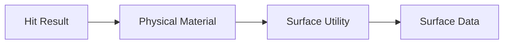
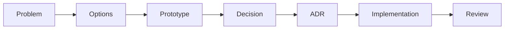

──────────────────────────────────────────────────────────────────────────────

# Spark Technical Documentation

## Volume 11

# Architecture Decision Records

Version 1.0

Unreal Engine 5.5.4

──────────────────────────────────────────────────────────────────────────────

> Move to See. Remember to Survive.

본 문서는 Spark 프로젝트에서 이루어진 주요 아키텍처 및 설계 결정을
기록하기 위한 Architecture Decision Record(ADR)를 정의한다.

ADR은 "무엇을 구현했는가"가 아니라,
"왜 이러한 구조를 선택했는가"를 기록하는 것을 목적으로 한다.

---

# Executive Summary

## 목적

본 문서는 Spark 프로젝트의 핵심 설계 결정을 관리한다.

포함 범위는 다음과 같다.

- Architecture
- Gameplay Framework
- Component Design
- Data Flow
- Surface Detection
- Spark System
- Camera Strategy

ADR은 프로젝트가 진행되면서 변경될 수 있으며,
새로운 결정이 이루어질 경우 기존 ADR을 수정하는 것이 아니라
새로운 ADR을 추가하거나 기존 ADR을 Superseded 상태로 변경한다.

---

# ADR Philosophy

Architecture Decision Record는 다음 원칙을 따른다.

- 중요한 설계 결정만 기록한다.
- 구현 세부사항은 기록하지 않는다.
- 문제와 선택지를 함께 기록한다.
- 선택하지 않은 이유도 남긴다.
- 변경 이력을 보존한다.
- 문서와 실제 구현이 다를 경우 ADR을 우선 검토한다.

---

# ADR Status

| Status | 의미 |
|---------|------|
| Proposed | 검토 중 |
| Accepted | 채택 |
| Rejected | 기각 |
| Superseded | 다른 ADR로 대체 |
| Deprecated | 더 이상 적용되지 않음 |

---

# ADR Index

| ADR | 제목 | 상태 |
|------|------|------|
| ADR-001 | Hybrid C++ / Blueprint Architecture | Accepted |
| ADR-002 | Remove SurfaceComponent | Accepted |
| ADR-003 | Event-Driven Gameplay | Accepted |
| ADR-004 | Physical Material Based Surface Detection | Accepted |
| ADR-005 | Data Asset Driven Spark Configuration | Accepted |
| ADR-006 | Camera Selection Strategy | Accepted |

---

# ADR-001 — Hybrid C++ / Blueprint Architecture

## Status

Accepted

---

## Context

Spark는 Unreal Engine 프로젝트이며,
Gameplay Rule과 Presentation이 명확히 분리될 필요가 있었다.

모든 시스템을 Blueprint로 구현하면 유지보수성과 재사용성이 떨어질 수 있고,
모든 시스템을 C++로 구현하면 반복 작업과 레벨 제작 속도가 크게 감소한다.

---

## Problem

Gameplay와 Presentation의 책임을 어떻게 나눌 것인가?

---

## Options

### Option A

모든 시스템을 Blueprint로 구현한다.

#### 장점

- 빠른 제작
- 쉬운 수정

#### 단점

- 규모가 커질수록 관리가 어려움
- Gameplay Rule 분산

---

### Option B

모든 시스템을 C++로 구현한다.

#### 장점

- 높은 유지보수성
- 명확한 구조

#### 단점

- 반복 제작 비용 증가
- 디자이너 작업 속도 감소

---

### Option C

Hybrid Architecture

Gameplay Rule은 C++

Presentation과 조립은 Blueprint

---

## Decision

Hybrid Architecture를 채택한다.

---

## Rationale

Gameplay Rule은 변경 빈도가 낮고
안정성이 중요하다.

반면 퍼즐, UI, 연출은
반복적인 수정이 많으므로 Blueprint가 적합하다.

---

## Consequences

### Positive

- 책임 분리
- 높은 재사용성
- Blueprint 반복 작업 감소
- Gameplay Rule 일관성

### Negative

- C++와 Blueprint 경계 관리 필요
- 인터페이스 설계 중요

---

## Related Documents

- [Architecture](./02_Architecture.md)
- [Gameplay Framework](./03_Gameplay_Framework.md)

---

# ADR-002 — Remove SurfaceComponent

## Status

Accepted

---

## Context

초기 설계에서는 Character가
USurfaceComponent를 통해 현재 Surface를 관리하도록 계획했다.

---

## Problem

Surface 정보를 Character의 상태로 저장해야 하는가?

---

## Options

### Option A

USurfaceComponent 유지

#### 장점

- 현재 Surface 접근이 쉬움

#### 단점

- 상태 동기화 필요
- Component 책임 증가
- 실제 충돌 결과와 불일치 가능

---

### Option B

필요 시 Surface를 조회한다.

---

## Decision

USurfaceComponent를 제거한다.

---

## Rationale

Surface는 Character의 상태가 아니라
환경의 속성이다.

Character는 Surface를 소유하지 않고,
필요한 시점에 조회하는 것이 책임 분리에 적합하다.

---

## Consequences

### Positive

- Component 감소
- 상태 동기화 제거
- 책임 명확화
- Surface 확장 용이

### Negative

- 충돌 조회 비용 발생
- Surface Utility 필요

---

## Related Documents

- [Architecture](./02_Architecture.md)
- [Gameplay Framework](./03_Gameplay_Framework.md)

---

# ADR-003 — Event-Driven Gameplay

## Status

Accepted

---

## Context

Spark, UI, Audio, Animation은
동일한 Gameplay Event를 기반으로 동작한다.

---

## Problem

시스템 간 직접 호출을 사용할 것인가,
Event를 사용할 것인가?

---

## Options

### Option A

직접 함수 호출

### Option B

Gameplay Event 기반 구조

---

## Decision

Gameplay Event를 중심으로 시스템을 연결한다.

---

## Rationale

동일한 Landing Event가

- Spark
- Sound
- Animation
- Camera Shake
- UI

를 동시에 실행할 수 있다.

새로운 기능도 기존 Gameplay를 수정하지 않고
Event를 구독하여 추가할 수 있다.

---

## Consequences

### Positive

- 낮은 결합도
- 높은 확장성
- 테스트 용이

### Negative

- Event 흐름 추적 필요

---

## Related Documents

- [Gameplay Framework](./03_Gameplay_Framework.md)
- [UI / UX](./06_UI_UX.md)

---

# ADR-004 — Physical Material Based Surface Detection

## Status

Accepted

---

## Context

Spark는 Surface 종류에 따라
다른 반응을 보여야 한다.

---

## Problem

Surface를 어떻게 구분할 것인가?

---

## Options

### Option A

Actor Tag

### Option B

Blueprint Class

### Option C

Physical Material

---

## Decision

Physical Material 기반 Surface Detection을 채택한다.

---

## Rationale

Physical Material은

- 충돌 시스템과 자연스럽게 연결되고
- Material 단위 재사용이 가능하며
- Surface Type과 연동하기 쉽다.

---

## Consequences

### Positive

- Unreal 기본 기능 활용
- Surface 확장 용이
- Collision 기반 판정 가능

### Negative

- Material 관리 필요

---

## Related Documents

- [Architecture](./02_Architecture.md)
- [Gameplay Framework](./03_Gameplay_Framework.md)

---

# ADR-005 — Data Asset Driven Spark Configuration

## Status

Accepted

---

## Context

Surface별 Spark 효과는
Particle, Sound, Light 등이 함께 변경된다.

---

## Problem

Surface별 데이터를 어디에 저장할 것인가?

---

## Options

### Option A

Switch 문

### Option B

Blueprint 설정

### Option C

Data Asset

---

## Decision

Data Asset을 사용한다.

---

## Rationale

새로운 Surface를 추가할 때
Gameplay Code를 수정하지 않아도 된다.

Surface Data만 추가하면 된다.

---

## Consequences

### Positive

- 데이터 중심 설계
- 확장성 향상
- 디자이너 친화적

### Negative

- Asset 관리 필요

---

## Related Documents

- [Architecture](./02_Architecture.md)
- [Coding Convention](./07_Coding_Convention.md)

---

# ADR-006 — Camera Selection Strategy

## Status

Accepted

---

## Context

Spark는 공간 인지가 핵심인 게임이다.

카메라는 Gameplay 전체에 영향을 준다.

---

## Problem

어떤 카메라 방식을 사용할 것인가?

---

## Options

### Option A

Third Person

#### 장점

- 이동 가독성
- 공간 인지
- Character 표현

#### 단점

- 좁은 공간 처리 필요

---

### Option B

First Person

#### 장점

- 높은 몰입감

#### 단점

- 점프 거리 판단 어려움
- Spark 표현 제한

---

### Option C

Fixed Camera

#### 장점

- 연출 우수
- 퍼즐 구도 제어

#### 단점

- 자유도 감소

---

## Decision

Option A, Third Person으로 결정한다.

---

## Rationale

플랫폼 액션의 조작감과 Wall Slide / Wall Jump 가독성을 우선한다.

First Person은 점프 거리 판단이 어렵고 Spark 표현이 제한되며,
Fixed Camera는 자유도가 낮아 이동 중심 게임플레이와 맞지 않는다.

다만 최종 확정은 Prototype에서 다음을 검증한 뒤 유지한다.

- 이동
- 점프
- Wall Slide
- Spark 가독성

---

## Consequences

### Positive

- 개발 초기부터 Character 애니메이션 / 카메라 리그 작업 방향을 확정할 수 있음

### Negative

- Prototype 검증 결과에 따라 재논의될 가능성은 남아 있음

---

## Related Documents

- [Gameplay Framework](./03_Gameplay_Framework.md)
- [Level Design](./04_Level_Design.md)

---

# ADR Lifecycle

새로운 설계 결정은 다음 과정을 따른다.

---

# When to Create a New ADR

다음 상황에서는 새로운 ADR을 작성한다.

- 새로운 핵심 시스템 추가
- 기존 Architecture 변경
- Gameplay Rule 변경
- Component 책임 변경
- Save 구조 변경
- Camera 변경
- Data Flow 변경
- Plugin 도입
- 외부 시스템 도입

---

# When Not to Create an ADR

다음 변경에는 ADR를 작성하지 않는다.

- 변수명 변경
- 함수 분리
- 버그 수정
- UI 색상 변경
- Asset 교체
- 오탈자 수정
- 성능 미세 조정

---

# ADR Review Checklist

새로운 ADR 작성 시 다음 항목을 확인한다.

- [ ] 해결하려는 문제가 명확한가
- [ ] 최소 두 가지 이상의 선택지를 비교했는가
- [ ] 선택 이유가 기록되었는가
- [ ] 장점과 단점을 모두 작성했는가
- [ ] 관련 문서를 연결했는가
- [ ] 실제 구현과 일치하는가

---

# Related Documents

- [01_GDD.md](./01_GDD.md)
- [02_Architecture.md](./02_Architecture.md)
- [03_Gameplay_Framework.md](./03_Gameplay_Framework.md)
- [07_Coding_Convention.md](./07_Coding_Convention.md)
- [10_Dev_Log.md](./10_Dev_Log.md)

---

# Summary

Architecture Decision Records는 Spark 프로젝트의
중요한 설계 결정을 기록하기 위한 문서이다.

ADR은 구현 방법이 아니라 설계 의도를 보존하며,
문제가 무엇이었는지, 어떤 선택지가 있었는지,
왜 현재 구조를 채택했는지를 기록한다.

새로운 구조 변경이 발생하면 기존 ADR을 수정하기보다
새로운 ADR을 추가하거나 상태를 변경하여
프로젝트의 설계 이력을 지속적으로 관리한다.
