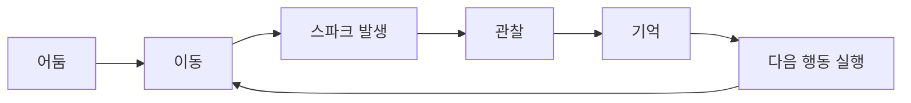

# Spark

> **Move to See. Remember to Survive.**

**정전으로 모든 조명이 꺼진 자동화 산업 시설.** 플레이어는 재가동된 유지보수 로봇이 되어,
움직일 때마다 순간적으로 튀는 스파크 불빛에 의지해 어둠 속 공간을 기억하고,
시설 중심부의 메인 코어를 복구하러 나아간다.

Unreal Engine 5로 개발 중인 **1인 개발 3D 퍼즐 플랫포머**이자, 부트캠프 최종 프로젝트 겸
취업 포트폴리오 프로젝트다.

---

## 한 줄 소개

**빛이 영구히 존재하지 않는 플랫포머.** 캐릭터는 손전등이나 광원을 들고 있지 않다.
오직 움직임(착지, 벽 슬라이드, 벽 점프) 그 자체가 짧은 스파크를 만들어내고,
플레이어는 그 짧은 순간에 본 지형을 **기억**해서 어둠 속을 계속 나아가야 한다.

## 이 게임이 재미있는 이유 (Design Pillars)

| Pillar | 설명 |
|---|---|
| **Movement Creates Vision** | 가만히 있으면 아무것도 안 보인다. 움직여야 시야가 생긴다 — 이동과 관찰이 분리되지 않는다 |
| **Memory Is Gameplay** | 스파크는 0.8~1.2초 만에 사라진다. 플레이어는 순간적으로 본 공간 구조를 머릿속에 남겨야 한다 |
| **Simplicity Over Complexity** | 규칙 자체는 몇 개 되지 않는다. 대신 그 규칙들의 조합으로 난이도를 쌓는다 |
| **Darkness Is Part of the Game** | 어둠은 시각적 제약이 아니라, 게임을 성립시키는 핵심 메커닉이다 |

## Core Loop

## Core Systems

| 항목 | 결정 |
|---|---|
| 시점 | 3인칭 (Third Person) — 이동 가독성과 벽 슬라이드/벽 점프 조작감 우선 |
| Spark 지속 시간 | 약 0.8 ~ 1.2초 |
| 발생 조건 | 착지(Landing) / 벽 슬라이드 / 벽 점프 / 케이블 접촉 |
| 재질(Surface) 규칙 | Metal = 일반 스파크 · Rubber = 스파크 없음 · Cable = 강한 스파크 |
| 체크포인트 | 퍼즐 구간마다 촘촘하게 배치 — 실패 손실을 낮춰 학습 곡선 유지 |
| 진행 구성 | Tutorial → Chapter 1(움직이는 기어) → Chapter 2(Rubber/Cable) → Chapter 3(규칙 조합) → Ending |

## 설계 방향

- **Physical Material 기반 Surface 판정** — Surface 상태를 Character가 직접 들고 있지 않고, 충돌 결과에서 그때그때 조회하는 구조
- **Event-Driven Gameplay** — 하나의 Landing Event가 Spark / Sound / Animation / Camera Shake / UI를 동시에 구독·실행, 새 기능 추가 시 기존 로직을 건드리지 않도록 설계
- **Data Asset 기반 Spark 설정** — Surface별 Particle/Sound/Light 조합을 코드 수정 없이 데이터만 추가해 확장 가능
- **Hybrid C++ / Blueprint 아키텍처** — 안정성이 중요한 Gameplay Rule은 C++, 반복 수정이 잦은 연출·조립은 Blueprint로 역할 분리

## MVP Scope

- **포함**: 이동/스파크 시스템, 재질 규칙, 체크포인트, 3개 챕터 + 엔딩
- **제외**: 전투, 적 AI, 인벤토리, 스킬 트리, 멀티플레이어

## Tech Stack

- Unreal Engine 5.5.4 · Windows (PC)
- C++ / Blueprint (Hybrid)
- Enhanced Input
- Niagara (VFX)
- Physical Material / Surface Type
- Data Asset

## Project Status

🚧 In Development — 기획 문서 확정, 구현 진행 중.

## 대용량 에셋 다운로드

Git LFS를 사용할 수 없어 대용량 에셋은 Google Drive로 관리합니다.

[Google Drive 에셋 폴더](https://drive.google.com/drive/folders/17hMg9nc95p2RM80jxRy6xg5npcK4xQmn?usp=sharing)
